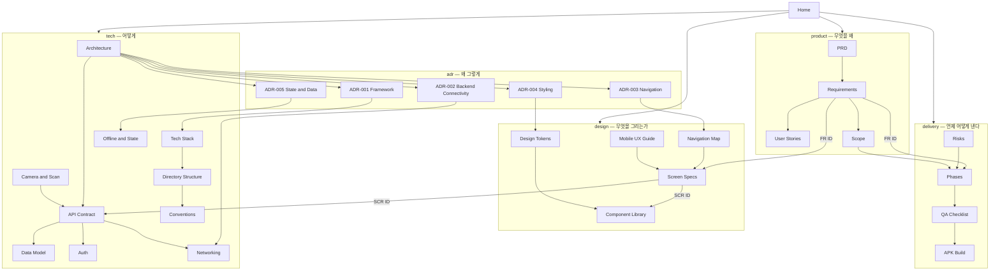

# Home — MORA 모바일 위키

종이 기록(명함·포스터·영수증·티켓)을 카메라로 찍는 즉시 AI가 읽고 분류·저장·검색 가능한 데이터로 바꿔 주는 **Android 앱**. 기존 MORA 웹 서비스와 백엔드·DB를 100% 공유한다.

관련: [[PRD]] · [[Requirements]] · [[Scope]] · [[Phases]] · [[Architecture]] · [[Screen Specs]]

---

## 0. 확정 의사결정 3줄

| # | 결정 | 근거 문서 |
|---|---|---|
| D-1 | **Expo(React Native) + TypeScript**, EAS Build로 서명된 `.apk` 산출. Flutter/Capacitor/Bare RN 기각 | [[ADR-001 Framework]] |
| D-2 | **백엔드 무수정 + 개발 PC LAN IP 평문 HTTP 직결** (`:8080` Spring / `:8000` OCR). 클라우드 배포는 v1 이후 선택 페이즈 | [[ADR-002 Backend Connectivity]] · [[Scope]] |
| D-3 | **원본 웹 9화면 전부 이식.** 9화면을 모바일 관례로 분해·재구성해 **제품 30화면 + 개발 전용 1화면 = SCR-01~31** 로 확정 | [[Screen Specs]] · [[Navigation Map]] |

**현재 상태 — 요구사항 정의 완료, Phase 0 착수 전.** 코드는 아직 한 줄도 없다. 이 위키는 착수 직전의 설계 확정본이다.

> **2026-07-27 개정 반영** — 사용자 결정으로 **다크모드가 v1 In scope로 편입**되었다(종전 "v1 라이트 고정" 폐기, [[ADR-004 Styling]] §4 / [[Scope]] §3-1). 같은 날 검색 문서유형 기본값이 확정됐다. 이 문서의 모든 집계·확정 사양은 그 개정 이후 값이다.

---

## 1. 집계 (문서를 세어 확정한 실측치)

| 항목 | 수 | 범위 | 정본 |
|---|---|---|---|
| 기능 요구사항 FR | **130** | FR-001 ~ FR-130 | [[Requirements]] |
| 비기능 요구사항 NFR | **29** | NFR-001 ~ NFR-029 | [[Requirements]] |
| 화면 SCR | **31** | SCR-01 ~ SCR-31 (제품 30 + 개발 전용 SCR-31) | [[Screen Specs]] |
| 컴포넌트 CMP | **52** | CMP-01 ~ CMP-52 (기존 50 + 테마 신규 2) | [[Component Library]] |
| API 엔드포인트 | **67** | API-01~62 (Spring) · API-63~67 (OCR 직결) | [[API Contract]] |
| 유저스토리 US | **40** | US-01 ~ US-40 (에픽 EP-1~8) | [[User Stories]] |
| 딥링크 DL | **10** | DL-01 ~ DL-10 | [[Navigation Map]] |
| ADR | **5** | ADR-001 ~ ADR-005 (전부 Accepted · ADR-004는 2026-07-27 Amended) | `adr/` |
| 페이즈 | **9** | Phase 0 ~ Phase 8 | [[Phases]] |
| 위키 문서 | **29** | 이 문서 포함 | — |

FR 우선순위 분포: **P0 81 · P1 42 · P2 7**. 총 작업량 추정 **146 UoW ≈ 73 person-day** ([[Phases]] §1).

2026-07-27 개정으로 늘어난 것만 따로 적는다: FR +8(다크 7건 FR-123~FR-129 + 검색 `전체` 1건 FR-130) · NFR +1(NFR-029 다크 대비) · US +2(US-39 테마 3택 / US-40 `전체` 검색) · CMP +2(CMP-51 `ThemeModeSegment` / CMP-52 `ThemeScope`) · UoW +10(Phase 1 12→18, Phase 7 16→20). SCR·API·DL·ADR·페이즈 수는 변동 없다.

앱이 실제로 호출하는 엔드포인트는 67개 중 **57개**다. 미호출 10개(단건 조회 4종, 브라우저 전용 콜백, 앱 미사용 OCR 경로 2종 등)는 [[Requirements]] §3-2에 사유와 함께 목록화되어 있다.

---

## 2. 읽는 순서 — 처음 오는 사람·LLM은 이 순서대로

**1단계. 무엇을 왜 만드는가 (30분)**
1. [[PRD]] — 문제 6개(P-1~P-6), 페르소나 3명, KPI 10개. **P-6("웹은 데스크톱 전용이라 종이를 만나는 그 순간 쓸 수 없다")이 이 프로젝트의 존재 이유다.**
2. [[Scope]] — v1에 넣는 것 / 명시적으로 빼는 것 / 미루는 것(D-1~D-18, 이 중 D-17은 다크모드 승격으로 해소). 범위 논쟁이 생기면 여기서 끝낸다.
3. [[Requirements]] — FR·NFR 전수와 추적 매트릭스. **이 위키의 ID 레지스트리.**

**2단계. 어떤 판단으로 만드는가 (20분)**
4. [[ADR-001 Framework]] → [[ADR-002 Backend Connectivity]] → [[ADR-003 Navigation]] → [[ADR-004 Styling]] → [[ADR-005 State and Data]] — 5개를 번호순으로. 기각된 대안과 그 이유가 이후 모든 문서의 전제다.
5. [[Architecture]] — 시스템 경계, 앱 내부 레이어, 데이터 흐름 3종.

**3단계. 무엇을 그리는가 (60분)**
6. [[Navigation Map]] — 라우트 트리와 탭 구성. 화면 이름이 먼저 머리에 들어와야 나머지가 읽힌다.
7. [[Screen Specs]] — 31화면 정의서. 통독하지 말고 **§0-4 화면 인덱스만 먼저** 보고, 작업할 화면만 펼친다.
8. [[Design Tokens]] → [[Component Library]] → [[Mobile UX Guide]] — 색/타이포(**라이트·다크 2벌**) → 부품 52종 → 상호작용 규범.

**4단계. 어떻게 붙이는가 (구현 직전)**
9. [[API Contract]] — 엔드포인트 67개 + **§2 응답 래퍼 함정**. 이걸 안 읽고 짜면 반드시 이중 래핑에서 깨진다.
10. [[Data Model]] · [[Auth]] · [[Camera and Scan]] · [[Networking]] · [[Offline and State]] — 담당 영역만.
11. [[Tech Stack]] · [[Directory Structure]] · [[Conventions]] — 첫 커밋 전에 반드시.

**5단계. 실행 (착수 시점)**
12. [[Phases]] — Phase 0부터 순서대로. 각 페이즈의 DoD를 그대로 체크리스트로 쓴다.
13. [[Risks]] — 착수 전 1회 통독. **원본 코드에서 이미 확인된 결함**이 절반이라 모르면 같은 함정을 다시 판다.
14. [[QA Checklist]] · [[APK Build]] — Phase 7~8에서.

> **급할 때의 최소 경로**: [[Requirements]] §0 → [[Screen Specs]] §0 → [[API Contract]] §2 → [[Phases]] Phase 0.

---

## 3. 문서 색인

### product/ — 무엇을 왜

| 문서 | 한 줄 |
|---|---|
| [[PRD]] | 문제 6개·페르소나 3명·웹 대비 모바일 고유 가치 9개(V-9 = 다크모드)·KPI 10개와 반지표 6개 |
| [[Requirements]] | FR-001~130 / NFR-001~029 전수 + FR↔화면↔API↔페이즈 추적 매트릭스. **FR·NFR 정본** |
| [[User Stories]] | 에픽 8개 아래 US-01~40. 스토리마다 Given/When/Then 인수조건 3개 이상 |
| [[Scope]] | In / Out / Deferred 3분류 확정표. 제외 항목마다 "왜 안 하는지"를 서버 근거로 기록 |

### design/ — 무엇을 그리는가

| 문서 | 한 줄 |
|---|---|
| [[Screen Specs]] | SCR-01~31 전 화면 정의서. 라우트·와이어프레임·7상태·정확한 문구·API 바인딩. **SCR 정본** |
| [[Component Library]] | CMP-01~52 인벤토리. props 인터페이스·variant 매트릭스·서드파티 선정 근거. **CMP 정본** |
| [[Design Tokens]] | 원본 `globals.css` 실측 HEX → NativeWind 토큰 이식 + **다크 팔레트 신규 설계(§10)**. 색·타이포·간격·반경·elevation의 정본 |
| [[Navigation Map]] | expo-router 라우트 트리(**라우트 경로 정본**), 하단 탭 5슬롯, 딥링크 DL-01~10, 인증 가드 흐름 |
| [[Mobile UX Guide]] | 웹→네이티브 변환 규칙 UX-01~. 백버튼·키보드·로딩 위계·문구·모션·햅틱·권한의 강제 기준 |

### tech/ — 어떻게 만드는가

| 문서 | 한 줄 |
|---|---|
| [[Architecture]] | 시스템 경계, 앱 4레이어, 핵심 데이터 흐름 3종, 실패 도메인 격리 |
| [[Tech Stack]] | PKG-01~ 패키지 전수와 버전 확정 규칙(VR-1~6), 채택하지 않은 것과 그 이유 |
| [[Directory Structure]] | 폴더 트리·폴더별 반입 금지 목록·네이밍 규칙·`@/` 별칭·배럴 정책 |
| [[API Contract]] | 엔드포인트 67개 전수 계약 + 응답 래퍼 함정 + HTTP 클라이언트 설계. **API 정본** |
| [[Data Model]] | 서버 엔티티 ↔ 앱 TS 타입 ↔ OCR 필드 키 ↔ 변환 규칙 ↔ 로컬 스키마 |
| [[Auth]] | 이메일 로그인·OAuth 3종 딥링크 흐름·SecureStore 토큰·401/400 처리·가드 라우팅 |
| [[Camera and Scan]] | 촬영→압축→업로드→OCR→분류→필드편집→저장 파이프라인 규격(SCAN-·IMG- 번호) |
| [[Offline and State]] | 상태 4계층 분리, 캐시 정책, 낙관적 업데이트, 오프라인 읽기 규칙 |
| [[Networking]] | LAN 연결 절차, 환경 프로파일 3종, cleartext 정책, 타임아웃·재시도 규약 |
| [[Conventions]] | CV-## 코딩 규약. PR 리뷰에서 이 번호로 지적한다 |

### delivery/ — 언제 어떻게 낸다

| 문서 | 한 줄 |
|---|---|
| [[Phases]] | Phase 0~8 실행 대본. 페이즈마다 산출물·포함 FR·DoD·데모 상태·종료 게이트. **페이즈 이름 정본** |
| [[QA Checklist]] | 수동 테스트 시나리오·기기 매트릭스·회귀 목록·비정상 경로·성능 측정 절차 |
| [[APK Build]] | EAS 프로필 3종, keystore, cleartext 설정, R8, 서명 검증, 사이드로드 배포 |
| [[Risks]] | RSK-01~ 리스크 등록부. 원본 코드의 기확인 결함 + 모바일 전환 신규 위험 |

### adr/ — 왜 그렇게 정했나

| 문서 | 결정 | 상태 |
|---|---|---|
| [[ADR-001 Framework]] | Expo(RN) 관리형 + TypeScript + EAS Build | Accepted |
| [[ADR-002 Backend Connectivity]] | LAN IP 직결 + 런타임 서버 주소 오버라이드 | Accepted |
| [[ADR-003 Navigation]] | expo-router + 탭 4개 + 중앙 스캔 액션 + 3계층 오버레이 | Accepted |
| [[ADR-004 Styling]] | NativeWind v4 + 단일 토큰 출처. **라이트/다크 두 벌을 v1에 출시**(CSS 변수 2벌 · `dark:` 색 분기 금지) | Accepted · **Amended 2026-07-27** (§4 테마 결정 교체) |
| [[ADR-005 State and Data]] | TanStack Query v5 + zustand + react-hook-form/zod | Accepted |

---

## 4. 문서 관계도

---

## 5. ID 체계

| 접두사 | 대상 | 범위 | **정본 문서** | 발번 규칙 |
|---|---|---|---|---|
| `FR-###` | 기능 요구사항 | FR-001 ~ FR-130 | [[Requirements]] | FR-001~120은 페이즈 순서대로 연속 배정. 대역이 꽉 차 신규는 최대 번호 뒤에 이어 붙이고 담당 페이즈를 표에 명시한다(현재 최대 **FR-130**, 다음 발번은 FR-131). 폐기해도 번호를 재사용하지 않는다 |
| `NFR-###` | 비기능 요구사항 | NFR-001 ~ NFR-029 | [[Requirements]] | 성능(1~8)·안정성(9~12)·보안(13~19)·접근성(20~24 + **29**)·호환성(25~28). 다음 발번은 NFR-030 |
| `SCR-##` | 화면 | SCR-01 ~ SCR-31 | [[Screen Specs]] | 사용자 여정 순(부트→인증→홈→스캔→보관함→검색→설정), SCR-31은 개발 전용 |
| `CMP-##` | 공통 컴포넌트 | CMP-01 ~ CMP-52 | [[Component Library]] | primitive → composite → screen-level 순. CMP-51/52는 다크모드 편입 신규(§1-H) |
| `API-##` | 엔드포인트 | API-01 ~ API-67 | [[API Contract]] | 01~62 Spring 컨트롤러 순, 63~67 OCR 서버 직결 |
| `ADR-###` | 아키텍처 결정 | ADR-001 ~ ADR-005 | `adr/` 각 문서 | 결정 시점 순. 번호는 영구 불변. 결정이 뒤집히면 새 번호가 아니라 해당 ADR의 개정 이력에 기록 |
| `US-##` / `EP-#` | 유저스토리 / 에픽 | US-01~40 / EP-1~8 | [[User Stories]] | 에픽은 페이즈 정렬, 스토리는 전역 연번 |
| `RSK-##` | 리스크 | RSK-01 ~ RSK-32 (개방형) | [[Risks]] | 등록 순. 현재 최대 **RSK-32**, 다음 발번은 RSK-33 |
| `DL-##` | 딥링크 | DL-01 ~ DL-10 | [[Navigation Map]] | |
| `QA-###` | 테스트 케이스 | QA-001 ~ | [[QA Checklist]] | 화면·경로별 대역 |
| `CV-##` | 코딩 규약 | CV-01 ~ | [[Conventions]] | |
| `UX-##` | 웹→네이티브 변환 규칙 | UX-01 ~ | [[Mobile UX Guide]] | |
| `PKG-##` | 채택 패키지 | PKG-01 ~ | [[Tech Stack]] | |
| `SCAN-##` / `IMG-##` | 스캔 단계 / 이미지 규격 | | [[Camera and Scan]] | |
| `KPI-#` / `GUARD-#` | 성공 지표 / 반지표 | KPI-1~10 / GUARD-1~6 | [[PRD]] | GUARD-5(대비 위반 0건) · GUARD-6(검색기록 적립 ≤1건)은 2026-07-27 신설 |

**충돌 시 규칙** — 두 문서가 같은 ID를 다르게 쓰면 위 표의 **정본 문서**가 이긴다. 정본이 아닌 문서는 ID를 *참조*만 하고 *정의*하지 않는다.

---

## 6. 한눈에 보는 확정 사양

| 축 | 값 |
|---|---|
| 플랫폼 | **Android 출시** · 최소 API 26 (8.0) · 타깃 API 35 · 세로 고정 · 320~480dp · **iOS 는 출시 안 하되 코드 호환 유지** |
| 산출물 | 개발·내부 테스트 **release APK**(사이드로드) / 스토어 제출 **AAB** — `eas.json` preview / production 분리 |
| 배포 | **Google Play Store 확정**(2026-07-28) → **백엔드 클라우드 HTTPS 배포가 선행 필수** |
| 프레임워크 | **Expo SDK 57.0.8 / React Native 0.86.0 / React 19.2.3 / TypeScript 6.0.3 strict** · New Architecture **강제**(SDK 57에서 `newArchEnabled` 키 제거) · edge-to-edge 강제 · 버전 정본 [[Tech Stack]] §2-0 |
| 라우팅 | expo-router — 탭 4개(홈·보관함·검색·설정) + 중앙 스캔 액션 = 5슬롯 |
| 스타일 | NativeWind **4.2.6** + **tailwindcss 3.4.x 고정**(Tailwind 4 불가 — [[Risks]] RSK-33) + `theme/tokens.ts` 단일 출처 · **CSS 변수 2벌**(`:root` / `.dark:root`) · 브랜드 `#15293D`(다크 `#AEC4D8`) / 액션 `#0077B6`(다크 `#4BA3DB`) |
| 상태 | TanStack Query v5(서버) + zustand(전역) + react-hook-form·zod(폼) + **MMKV v4**(영속 — `createMMKV()`/`remove()`, Nitro 기반) |
| 빌드 | **EAS 클라우드 빌드가 유일한 경로** (개발 PC에 Android SDK·JDK 없음 — RSK-35) · app config는 **`app.config.js`**(TS 6 ↔ eas-cli 충돌 — RSK-34) · `npx eas-cli@latest` · EAS 프로젝트 `@mimimiminus-team/mora-mobile` |
| 서버 | Spring `:8080` + OCR `:8000` **무수정** · LAN IP 평문 HTTP · LLM `:8001`은 Spring 경유만 |
| 인증 | JWT 24h 고정(리프레시 없음) · `expo-secure-store` · OAuth는 `openAuthSessionAsync` + `mora://` |
| 테마 | **라이트/다크 두 테마를 v1에 출시.** `시스템 따름`(기본값) / `라이트` / `다크` 3택 · 설정(SCR-25) 세그먼트 1곳에서 변경 · MMKV `theme.mode` 영속(첫 프레임 복원) · `userInterfaceStyle: "automatic"` · 색은 `className`/`useTheme()`만 통과하고 `dark:` 색 분기 금지 ([[ADR-004 Styling]] §4 · 값 정본 [[Design Tokens]] §10) |
| Android 권한 | 검증된 최종 6개: `INTERNET` · `ACCESS_NETWORK_STATE` · `CAMERA` · `READ_MEDIA_IMAGES` · `POST_NOTIFICATIONS` · `VIBRATE` (+ `maxSdkVersion="32"` 스토리지 2개는 정상). `RECORD_AUDIO`·`SYSTEM_ALERT_WINDOW` 는 `blockedPermissions` 로 제거 ([[APK Build]] §2-1) |
| 언어 | 한국어 단일 · i18n 키 추출 구조만 준비 |

---

## 7. 다음 행동

**Phase 0은 2026-07-27에 실행 완료되었다** — 프로젝트 생성 · expo-router · NativeWind 연쇄 검증(번들 1753 모듈) · `tsc --noEmit` 통과 · `app.config.js`·`eas.json` 3프로파일 · EAS 연결 · keystore 생성 · AndroidManifest 검증 · SCR-31 진단 화면 · HTTP 클라이언트·SecureStore·MMKV · `preview` APK 빌드 제출. 상세는 [[Phases]] Phase 0 "실행 결과".

1. **Phase 0 잔여 확인 3건을 닫는다**: ① 폰에 APK 설치 확인(adb가 없으므로 EAS 빌드 페이지 QR 경로) ② 진단 화면에서 두 서버 응답 확인 ③ Pretendard 폰트는 **Phase 1로 이관**. 세 항목은 실기기 + 서버 기동 + 같은 Wi-Fi가 동시에 갖춰진 시점에만 확인 가능하다.
2. [[Phases]] **Phase 1 — 디자인 시스템 & 공통 컴포넌트** 착수. 잔여 3건은 Phase 1 종료 게이트에서 함께 닫는다.
3. 신규 리스크 4건을 인지한다: [[Risks]] **RSK-33**(Tailwind 4 불가) · **RSK-34**(app config `.js` 제약) · **RSK-35**(EAS 단일 의존, **P1**) · **RSK-36**(SDK 57 최신성). RSK-35는 **Phase 7 전 Platform-Tools, Phase 8 전 Build-Tools 설치**가 선행 조건이다.
