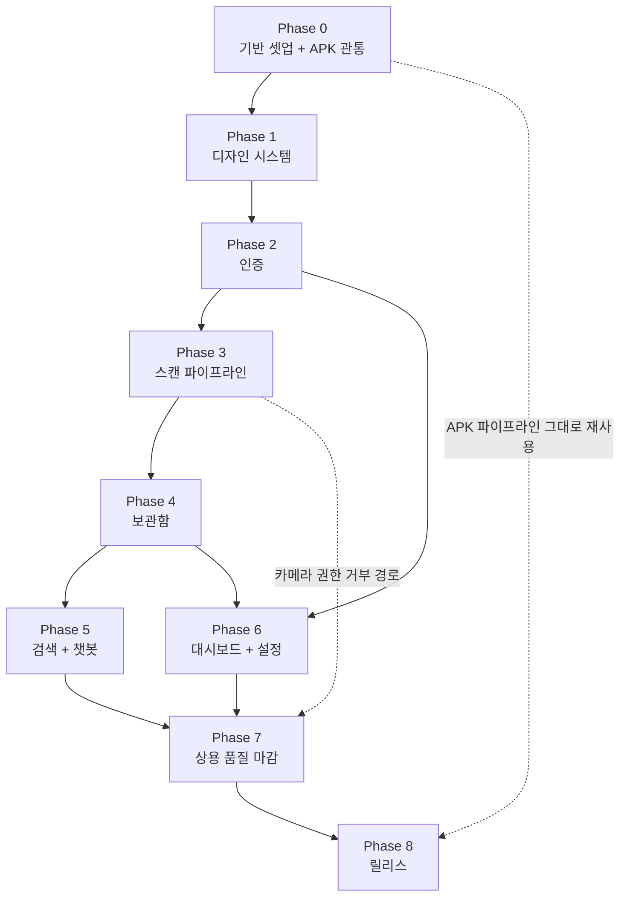
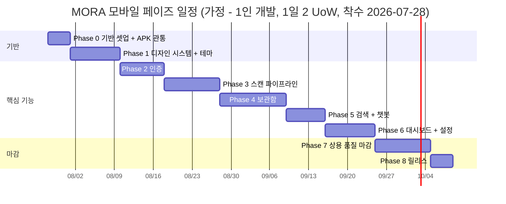

# Phases

MORA 웹 9화면을 Expo(React Native) APK로 이식하는 Phase 0~8 실행 대본. 각 페이즈는 "검증 가능한 DoD + 데모 가능한 산출물"로 닫힌다.

상위: [[Home]]
관련: [[PRD]] · [[Requirements]] · [[Scope]] · [[APK Build]] · [[QA Checklist]] · [[Risks]] · [[Architecture]] · [[Navigation Map]]

---

## 0. 이 문서의 사용법

| 규칙 | 내용 |
|---|---|
| 페이즈 번호/이름 | 이 문서가 정본. 다른 모든 위키 문서는 여기 정의된 `Phase N — 이름`을 글자 그대로 참조한다. |
| 작업 단위(UoW) | **결정:** 1 UoW = 반나절(≈4시간) 분량의, 단독으로 커밋·리뷰 가능한 조각. 인원 산정이 아니라 **분해 난이도 지표**로 쓴다. |
| DoD | 체크박스 문장은 전부 **관찰 가능한 사실**이어야 한다. "구현했다"는 DoD가 아니다. "실기기에서 X를 하면 Y가 보인다"가 DoD다. |
| 순서 변경 | Phase 0 → 1 → 2 는 고정. 3 이후는 §2 의존 그래프가 허용하는 범위에서만 재배치한다. |
| 백엔드 | **Spring(:8080) / Python OCR(:8000) / LLM(:8001) 소스는 수정하지 않는다.** 서버 결함은 앱 쪽에서 우회하거나 [[Risks]]에 등록한다. |
| 화면 ID | 화면 ID(`SCR-01~31`)의 정본은 [[Screen Specs]]. 이 문서는 주로 화면 **이름**으로 참조한다. |
| 요구사항 ID | `FR-###` / `NFR-###` 의 정본은 [[Requirements]]. 이 문서는 참조만 하고 발번하지 않는다. |

---

## 1. 전체 로드맵

| Phase | 이름 | 핵심 산출물 | DoD 요약 | 의존 | UoW |
|---|---|---|---|---|---|
| 0 | 기반 셋업 & APK 파이프라인 관통 — **실행 완료 (2026-07-27), 잔여 확인 3건** | Expo 프로젝트, expo-router, NativeWind, env, EAS 3 프로필 | **빈 껍데기 APK가 실기기에 설치되고 LAN IP의 두 서버에 도달** | — | 8 |
| 1 | 디자인 시스템 & 공통 컴포넌트 | Pretendard, **테마 시스템(라이트+다크 토큰 2벌 · `useTheme()` · `themeStore`)**, **공통 컴포넌트 21종**(전체 52종 중 primitive 부분집합, 나머지 31종은 각 기능 페이즈에서 구현 — §6), 아이콘 세트 | 컴포넌트 갤러리에서 21종이 **라이트/다크 양쪽**으로 렌더되고, 화면 코드의 HEX 리터럴이 0건이며, 재실행 시 선택 테마가 첫 프레임부터 복원된다 | 0 | **18** |
| 2 | 인증 | 온보딩, 로그인, 회원가입, OAuth 3종(인앱 브라우저), SecureStore 세션 | 앱 재실행 후 자동 로그인, 401/400 시 로그인 화면 복귀 | 1 | 16 |
| 3 | 스캔 파이프라인 | 카메라/갤러리, 크롭·압축, 업로드 진행률, 분류→필드편집→저장 | 촬영 1장이 DB 레코드 1건 + 서버 이미지 1장으로 귀결된다 | 2 | 20 |
| 4 | 보관함 | 문서 4종 목록·상세·수정·삭제, 명함 그룹, 무한 스크롤 | 4종 전부 목록→상세→수정→삭제가 실서버로 왕복한다 | 3 | 24 |
| 5 | 검색 & 챗봇 | 검색 화면, 최근 검색어, 타입 필터, 챗봇 전체화면, 출처 카드 | 4종 검색 결과가 나오고 챗봇이 출처 카드와 함께 답한다 | 4 | 14 |
| 6 | 대시보드 & 설정 | 홈(마감/일정/통계), 알림 목록·읽음, 프로필/계정, 데이터 삭제, 캘린더, **설정 테마 3택 UI** | 홈이 `GET /api/dashboard` 1콜로 그려지고 설정 액션 8종이 서버에 반영되며 테마 3택이 실제로 동작한다 | 2, 4 | 18 |
| 7 | 상용 품질 마감 | 모션/제스처/햅틱, a11y, 에러·오프라인, 가상화, 아이콘/스플래시(라이트+다크), **전 화면 라이트/다크 검수** | [[QA Checklist]]의 비정상 경로 전 항목 통과 + 성능 예산 충족 + **31화면 × 2테마 순회 완료** | 5, 6 | **20** |
| 8 | 릴리스 | keystore, release APK, R8, 서명 검증, 배포 문서 | 서명된 release APK가 3개 실기기에 설치·구동된다 | 7 | 8 |
| | **합계** | | | | **146** |

146 UoW ≈ 73 person-day. 1인 풀타임 기준 약 **15주**, 2인 병렬 시 약 **9주**(페이즈 2 이후 화면 단위 분할 가능).

**다크모드 v1 편입(2026-07-27)에 따른 추정치 개정** — 종전 136 UoW / 68 person-day / 14주에서 +10 UoW 증가했다. 두 페이즈만 늘었고 근거는 각각 한 줄이다.

| Phase | 종전 → 현재 | 증가 근거 |
|---|---|---|
| 1 | 12 → **18** (+6, ≈1.5배) | 토큰을 두 벌 정의하고 CSS 변수 2벌 · `useTheme()` · `themeStore`(MMKV) 를 배선한 뒤, **컴포넌트 21종을 두 테마에서 각각 눈으로 확인**해야 한다. 배율 근거는 [[Design Tokens]] §10-7 / [[ADR-004 Styling]] 결과 부정 6 |
| 7 | 16 → **20** (+4) | 화면 31개를 두 테마로 순회(+3)하고, 테마 전환 자체의 회귀 3케이스("전환 중 상태 유실 없음"·"OS 테마 변경 즉시 반영"·"재시작 후 선택 복원")를 추가(+1). QA 매트릭스는 2배지만 Phase 7 전체가 2배는 아니다 — 모션·성능·오프라인·i18n 작업량은 테마와 무관하다 |
| 6 | 18 → **18** (변동 없음) | 테마 3택 컨트롤(CMP-51)이 **Phase 1 산출물**이므로 Phase 6은 SCR-25에 배치하고 힌트 문구를 붙이는 작업뿐이다. 종전 계획도 이미 세그먼트를 노출(다크만 disabled)하고 있었으므로 순증이 없다 |

---

## 2. 페이즈 의존 관계

> 위 간트의 날짜는 **착수일 가정에 따른 예시**다. 팀 일정에 맞춰 통째로 평행이동해서 쓰고, 상대 길이(4:9:8:10:12:7:9:10:4)만 유지한다. 종전 `4:6:...:8:4`에서 Phase 1(6→9d)과 Phase 7(8→10d)이 늘어난 것은 다크모드 편입분이다(§1 개정표).

---

## 3. FR / NFR ID 대역 배정

**ID 정본 레지스트리는 [[Requirements]]다.** 이 문서는 FR/NFR을 *참조*만 하고 *발번하지 않는다*. 요구사항 ID는 페이즈 순서대로 연속 배정되어 있어 대역만 알면 역추적할 수 있다.

| 대역 | 영역 | Phase | 개수 |
|---|---|---|---|
| FR-001 ~ FR-008, FR-121 ~ FR-122 | 앱 셸 · 환경설정 · 진단 · APK 파이프라인 | 0 | 10 |
| FR-009 ~ FR-020, **FR-124 ~ FR-128** | 디자인 시스템 · 공통 컴포넌트 · **테마 기반** | 1 | **17** |
| FR-021 ~ FR-034 | 인증 · 온보딩 · 세션 | 2 | 14 |
| FR-035 ~ FR-052 | 스캔 · OCR · 저장 | 3 | 18 |
| FR-053 ~ FR-068 | 보관함 4종 · 그룹 · 상세편집 | 4 | 16 |
| FR-069 ~ FR-080, **FR-130** | 검색 · 검색기록 · 챗봇 | 5 | **13** |
| FR-081 ~ FR-098, **FR-123** | 대시보드 · 알림 · 설정 · 연동 · **테마 3택 UI** | 6 | **19** |
| FR-099 ~ FR-112, **FR-129** | 모션 · 접근성 · 에러/오프라인 · 성능 · **테마 전환 회귀** | 7 | **15** |
| FR-113 ~ FR-120 | 빌드 · 서명 · 배포 | 8 | 8 |
| **계** | | | **130** |
| NFR-001 ~ NFR-029 | 성능(1~8) · 안정성(9~12) · 보안(13~19) · 접근성(20~24 + **29**) · 호환성(25~28) | 전 페이즈 | **29** |

**신규 요구사항은 대역 중간에 끼워 넣지 않는다.** 페이즈 대역이 꽉 차 있으므로 최대 번호 뒤에 이어 발번하고 담당 페이즈를 표에 명시한다 — 현재 최대는 **FR-130 / NFR-029**이고 다음 발번은 FR-131 · NFR-030이다([[Requirements]] §0-1).

> **다크모드 v1 편입(2026-07-27)은 신규 ID를 만들었다 — FR-123 ~ FR-129 (7건) + NFR-029.** 종전 이 문단은 "기존 FR-011·FR-112의 범위 확장으로 흡수했다"고 적고 있었으나, [[Requirements]]가 실제로는 신규 발번을 택했으므로 위 대역표에 반영했다. FR-011(테마 프로바이더)·FR-112(전 화면 검수)는 **재작성 + P0 승격**으로 남고, 흡수되지 않는 관심사(시스템 추종·영속·시스템 크롬·이미지 규칙·CMP 검수·설정 UI·전환 회귀)가 새 번호를 받았다. 같은 날 검색 문서유형 기본값 확정으로 **FR-130**(`전체` 옵션, Phase 5)이 추가됐다. 발번 권한은 여전히 [[Requirements]]에만 있고 이 문서는 반영만 한다.

---

## Phase 0 — 기반 셋업 & APK 파이프라인 관통

> ## 상태: **실행 완료 (2026-07-27)** — 잔여 확인 3건
>
> 아래 §"실행 결과"가 실제로 통과한 항목과 남은 항목을 나눠 적는다. **이 페이즈의 서술 중 실측과 어긋났던 것은 전부 정정되었다**(SDK 버전, app config 확장자, 로컬 빌드 우회책, RSK 참조).

**목표 한 줄** — 화면이 하나도 없는 상태에서 `프로젝트 생성 → eas build → 실기기 설치 → LAN 서버 응답 확인`까지의 파이프라인을 먼저 뚫는다.

### 실행 결과 (2026-07-27)

**통과한 것 (11건)**

- [x] Expo 프로젝트 생성 — **SDK 57.0.8 / RN 0.86.0 / React 19.2.3 / TypeScript 6.0.3** ([[Tech Stack]] §2-0)
- [x] `expo-router` 파일 기반 라우팅 골격
- [x] **NativeWind 연쇄 검증** — `babel.config.js` + `metro.config.js` + `tailwind.config.js` + `global.css` 배선 후 **Android 번들 1753 모듈 성공**, 토큰이 실제로 주입되는 것까지 확인 (Hermes 바이트코드 3.79MB)
- [x] `npx tsc --noEmit` 통과
- [x] **`app.config.js`**(`.ts` 가 아니다 — [[APK Build]] §2 결정 2) + `eas.json` 3프로파일(development / preview / production)
- [x] EAS 프로젝트 연결 — `@mimimiminus-team/mora-mobile`, `projectId 27aa700a-3cf0-4ed4-98ab-b4fd2154436a`
- [x] Android keystore 생성 (EAS 클라우드 — 이 PC에 `keytool` 이 없다)
- [x] **AndroidManifest 검증** — cleartext 플래그 · 패키지명(`com.mora.app` / dev `com.mora.app.dev`) · `minSdkVersion 26` · 딥링크 `mora://` intent-filter · **권한 최종 목록 6개**([[APK Build]] §2-1)
- [x] 진단 화면 **SCR-31** 구현
- [x] HTTP 클라이언트 · SecureStore 세션 · MMKV 스토어 구현
- [x] `preview` 프로필 APK 빌드 **제출** (EAS 큐 대기 실측 약 15분)

**아직 확인하지 못한 것 (3건 — 이 페이즈의 종료 게이트가 여기에 걸려 있다)**

- [ ] **실기기에 APK 설치 확인** — `adb` 가 없어 EAS 빌드 페이지 QR → 브라우저 다운로드 경로로 해야 한다([[APK Build]] §4)
- [ ] **진단 화면에서 두 서버 응답 확인** — 실기기 + Spring·OCR 기동 + 같은 Wi-Fi가 동시에 갖춰져야 한다
- [ ] ~~Pretendard 폰트 번들~~ → **Phase 1로 이관.** Phase 0의 목표는 파이프라인 관통이고 폰트는 디자인 시스템 산출물이다([[Design Tokens]] §5-1). `expo-font` 패키지만 설치된 상태다

**실측으로 드러난 제약 (신규 리스크 등재)** — [[Risks]] **RSK-33**(Tailwind 4 불가) · **RSK-34**(app config `.js` 제약) · **RSK-35**(로컬 빌드 불가, EAS 단일 의존) · **RSK-36**(SDK 57 최신성).

### 산출물

| 종류 | 항목 |
|---|---|
| 파일 | **`app.config.js`**(`.ts` 아님 — RSK-34), `eas.json`, **`.easignore`**, `tsconfig.json`(경로 별칭 `@/*`), `babel.config.js`, `metro.config.js`, `tailwind.config.js`, `global.css`, `nativewind-env.d.ts`, `.env.example`, `src/lib/env.ts`, `src/theme/tokens.ts` |
| 화면 | `app/_layout.tsx`(루트 스택), `app/index.tsx`(SCR-01 껍데기), `app/(dev)/diagnostics.tsx`(SCR-31 서버 연결·진단, 개발 빌드 전용) |
| 컴포넌트 | 2종 — CMP-48 `SafeScreen`, CMP-50 `Logo`. **이 2종만 Phase 0인 이유**: 없으면 위 두 화면이 아예 뜨지 않는다. SCR-31이 [[Screen Specs]]에서 CMP-01/03/15/27을 참조하지만 진단 화면은 정식 컴포넌트 없이 최소 구현으로 출발하고 Phase 1 이후 교체한다 — 그러지 않으면 디자인 시스템 절반이 Phase 0으로 끌려와 이 페이즈의 목표가 무너진다([[Component Library]] §0-4 규칙 C) |
| 산출 아티팩트 | `preview` 프로필 APK 1개 (EAS 빌드 페이지 URL 포함) |
| 문서 | [[APK Build]] 절차 실검증 결과 반영 |

> **Phase 0의 `src/theme/tokens.ts`는 라이트 값만 있으면 된다.** 토큰 2벌 정의와 CSS 변수·`useTheme()`·`themeStore` 배선은 Phase 1 산출물이다([[Design Tokens]] §13). Phase 0에서 다크까지 세우려 하면 "화면이 0개일 때 파이프라인만 뚫는다"는 이 페이즈의 목표가 흐려진다.

### 포함 FR

| ID | 요구사항 |
|---|---|
| FR-001 | Expo(React Native) + TypeScript strict 프로젝트를 생성하고 경로 별칭 `@/*`를 설정한다. |
| FR-002 | `expo-router` 파일 기반 라우팅 골격을 구성한다: `(auth)` / `(tabs)` / `(modal)` 3그룹. |
| FR-003 | NativeWind v4를 설정하고 `tailwind.config.js`에 MORA 토큰을 매핑한다. |
| FR-004 | API base URL(`EXPO_PUBLIC_API_URL`)과 이미지/OCR base URL(`EXPO_PUBLIC_OCR_URL`)을 **서로 다른 두 값**으로 주입받는다. |
| FR-005 | 원본의 페이지별 로컬 팔레트 5벌을 **단일 테마 상수 1벌**로 통합한다(화면 코드 HEX 리터럴 0건). |
| FR-006 | 릴리스가 아닌 빌드에서 평문 HTTP(LAN IP) 통신이 차단되지 않는다. 릴리스 빌드는 차단한다. |
| FR-007 | EAS Build로 빈 껍데기 상태의 APK를 1회 산출한다. |
| FR-008 | 전역 ErrorBoundary와 크래시 리포터를 초기화한다. |
| FR-121 | 개발 빌드는 앱 내에서 두 base URL을 확인·임시 변경·연결 테스트할 수 있는 서버 연결/진단 화면(SCR-31)을 제공한다. |
| FR-122 | 앱은 딥링크 스킴 `mora://` 로 실행될 수 있고, 콜드스타트·웜스타트가 **같은 핸들러**를 탄다. |

> **FR-004 근거** — 원본은 문서 이미지를 Spring(:8080)이 아니라 OCR 서버(:8000)의 `/uploads/*` 정적 서빙으로 내려준다. 원본: `ocr/app.py` (`app.mount("/uploads", StaticFiles(...))`), `frontend/lib/api.ts`(`API_BASE`/`OCR_BASE` 2개 선언). base URL을 하나로 합치면 이미지가 전부 깨진다. 변수명 정본은 [[ADR-002 Backend Connectivity]] §1.
> **FR-006 근거** — Android 9(API 28)부터 `cleartextTrafficPermitted` 기본값이 false다. LAN IP는 `http://`이므로 명시 허용이 없으면 모든 요청이 즉시 실패한다. 설정 방법은 [[APK Build]] §3.
> **FR-121 근거** — `.env`에 IP를 박고 재빌드하는 순환은 팀 공유에서 무너진다. 팀원마다 PC IP가 다르므로 같은 APK를 공유하려면 런타임 오버라이드가 필수다([[ADR-002 Backend Connectivity]] §2, [[Risks]] RSK-01).

### 선행 조건

1. Node 20 LTS + npm 설치 완료. **git은 선택** — 저장소가 아니어도 `EAS_NO_VCS=1` + `EAS_PROJECT_ROOT` 로 빌드된다([[APK Build]] §1-3).
2. Expo 계정 생성 및 `npx eas-cli@latest login` 성공. **접근 계정이 2개 이상이면 app config에 `owner` 명시**(§1-2).
3. 개발 PC에서 Spring(:8080)·OCR(:8000)이 기동 중이고, **PC와 실기기가 같은 Wi-Fi**에 있다.
4. 개발 PC 방화벽에서 8080/8000 인바운드 허용.
5. ~~Android SDK / JDK~~ — **불필요하다.** 클라우드 빌드만 쓰므로 없어도 Phase 0이 닫힌다(실제로 없는 상태로 통과했다). 단 Phase 7·8에서는 필요해진다 → [[Risks]] RSK-35.

### Definition of Done

- [x] `npx expo start --dev-client` 로 개발 서버가 뜨고 번들이 성립한다 (**1753 모듈**). Expo Go는 쓸 수 없다 — New Arch 강제 + 네이티브 모듈 다수.
- [x] `npx eas-cli@latest build -p android --profile preview` 가 **큐에 제출**되고 빌드 페이지 URL이 발급된다.
- [ ] 그 APK를 실기기 1대에 설치하면 앱 아이콘이 생기고 크래시 없이 첫 화면이 뜬다. **← 잔여**
- [ ] 실기기 앱의 진단 화면에서 `GET {OCR_URL}/` (API-65) 를 호출하면 `{"service":"MORA OCR Service","version":"3.0","docs":"/docs"}` 이 화면에 출력된다. **← 잔여**
- [ ] 실기기 앱의 진단 화면에서 `GET {API_URL}/auth/me` 를 토큰 없이 호출하면 **네트워크 오류가 아니라 서버가 준 실패 응답**(HTTP 401 + 본문에 `success` 필드)이 출력된다 — 이것이 "Spring이 살아 있다"의 판정이다. **← 잔여**
- [ ] 기기 브라우저에서 `mora://` 링크를 열면 앱이 전면으로 올라온다. **← 잔여**
- [x] `npx tsc --noEmit` 이 에러 0으로 통과한다. **`npx eslint .` 는 Phase 1로 이관** — ESLint 의존성이 아직 설치되지 않았고, 화면이 2개인 상태에서 린트 규칙을 세우는 것보다 디자인 시스템과 함께 세우는 편이 낫다([[Tech Stack]] PKG-38).

### 데모 가능한 상태

"제 폰에 설치된 MORA 앱입니다. 화면은 아직 비어 있지만, 이 버튼을 누르면 지금 켜져 있는 제 노트북의 OCR 서버가 실제로 응답합니다." — **빌드·설치·네트워크 3중 리스크가 이미 죽었음을 눈으로 보여준다.** 현재 빌드 리스크는 죽었고, 설치·네트워크는 잔여 확인 2건에 걸려 있다.

### 리스크와 우회

| 리스크 | 우회 |
|---|---|
| EAS 무료 큐 대기 ([[Risks]] RSK-04) | 첫 빌드를 착수 당일 오전에 큐에 넣고, 대기 중 Phase 1 토큰 이식을 병행. **실측 대기 약 15분** |
| **로컬 빌드가 아예 불가능** ([[Risks]] **RSK-35**) | 우회책이 없다. ~~`npx expo run:android --variant release` 를 함께 검증~~ → 개발 PC에 Android SDK·JDK가 없어 **이 우회책은 성립하지 않는다.** EAS 클라우드 빌드가 유일한 경로이며, 일상 개발을 dev client 1개로 끝내 클라우드 호출 자체를 줄이는 것이 실질적 완화다. (종전 이 칸의 `RSK-19` 참조는 **오기**였다 — RSK-19는 "인증 검사가 없는 엔드포인트 5개"다) |
| Tailwind 4가 들어와 테마가 조용히 깨짐 ([[Risks]] **RSK-33**) | `tailwindcss@3.4.x` 고정([[Tech Stack]] VR-7). Phase 0에서 이미 고정된 상태로 번들 성공 |
| LAN IP 변동 ([[Risks]] RSK-01) | 진단 화면(SCR-31)에서 base URL을 런타임 변경 가능하게(FR-121) 만들어 재빌드 없이 대응 |

### 사용자 확인 (페이즈 종료 게이트)

- [ ] 내 폰에 APK가 설치되어 있고 앱이 실행된다. **← 잔여**
- [ ] 진단 화면에서 두 서버 응답을 직접 봤다. **← 잔여**
- [x] EAS 빌드 페이지 링크를 받았고, 다시 눌러 재다운로드가 된다 — `https://expo.dev/accounts/mimimiminus-team/projects/mora-mobile`

> **잔여 3건이 Phase 1 착수를 막는가** — 막지 않는다. 세 항목은 모두 **"실기기 + 서버 + 같은 Wi-Fi가 동시에 갖춰진 시점"** 에만 확인 가능하고, 그 확인의 결과가 Phase 1(디자인 시스템)의 작업 내용을 바꾸지 않는다. 다만 **Phase 1 종료 게이트에서는 반드시 함께 닫는다** — 그때까지 미확인이면 "빌드는 되는데 설치·통신이 되는지 아무도 모르는 상태"로 두 페이즈가 쌓이고, 그것이 정확히 Phase 0이 막으려던 실패다.

---

## Phase 1 — 디자인 시스템 & 공통 컴포넌트

**목표 한 줄** — 이후 모든 화면이 색·간격·폰트·**테마**를 다시 고민하지 않도록, 토큰 두 벌과 컴포넌트를 먼저 고정한다.

### 산출물

| 종류 | 항목 |
|---|---|
| 파일 | `src/theme/tokens.ts`(**light/dark 두 객체 + `ThemeTokens` 타입**), `src/theme/typography.ts`, `src/theme/ThemeProvider.tsx`(OS 리스너 + `useTheme()`), **`src/store/themeStore.ts`**(3택 소유 + MMKV `theme.mode` 영속 + NativeWind 동기화), **`global.css`**(CSS 변수 2벌 — 생성물), **`scripts/gen-theme-css.ts`** + `npm run theme:css`, `src/services/kv.ts`(MMKV 인스턴스 2개), `assets/fonts/Pretendard-*.ttf`(5웨이트), `assets/fonts/PatuaOne-Regular.ttf` |
| 컴포넌트 | **21종** — CMP-01~04(Button·IconButton·TextField·PasswordField), CMP-06~09(Chip·Badge·Surface·Divider), CMP-12~21(SegmentedControl·Skeleton·EmptyState·ErrorState·Toast·BottomSheet·ConfirmDialog·ActionSheet·AppHeader·TabBar), CMP-47·CMP-49, **CMP-51 `ThemeModeSegment`** — ID 정본은 [[Component Library]] §1-I, 구현 순서는 §6-2 |
| 화면 | `app/(dev)/gallery.tsx` (컴포넌트 갤러리, 개발 빌드 전용 — **상단에 테마 3택 토글을 달아 21종을 한 화면에서 두 테마로 비교**) |
| 문서 | [[Design Tokens]] §10/§13 · [[Component Library]] 실제 코드와 대조 완료 · [[ADR-004 Styling]] §4 배선 확정 |

> **왜 테마 시스템이 Phase 1인가** — 다크모드가 v1 In scope가 되면서(2026-07-27) 테마는 "나중에 추가할 스킨"이 아니라 **토큰의 첫 소비자**가 되었다. 컴포넌트를 라이트로만 21종 만들고 나중에 테마를 끼우면 21종을 다시 순회해야 한다. 반대로 테마를 0번 작업으로 세우면 각 컴포넌트가 만들어지는 순간 두 테마로 검수되어 재작업이 0이다([[Component Library]] §6-2, [[Offline and State]] 페이즈 배정표).

### 포함 FR

| ID | 요구사항 |
|---|---|
| FR-009 | 하단 내비게이션 셸을 구성한다: 탭 4개(홈·보관함·검색·설정) + 중앙 스캔 액션 = **5슬롯**. |
| FR-010 | 본문 폰트 Pretendard(5웨이트), 로고 폰트 Patua One을 `.ttf`로 번들 로드한다. |
| FR-011 | 테마 프로바이더를 구성한다. **v1은 라이트/다크 두 테마를 모두 출시**하며 선택은 `시스템 따름`(기본값)/`라이트`/`다크` 3택이다. 선택값은 MMKV `theme.mode`에 영속되어 재시작 시 첫 프레임에 복원되고, `시스템 따름`이면 OS 테마를 실시간 추종한다. 색 분기는 CSS 변수 2벌이 흡수하고 컴포넌트는 테마를 알지 않는다. |
| FR-012 | Button은 primary/secondary/ghost/danger 4종과 loading·disabled 상태를 가진다. |
| FR-013 | TextInput은 라벨·에러·헬퍼·비밀번호 표시 토글·멀티라인을 지원한다. |
| FR-014 | Card / ListRow는 썸네일 + 제목 + 부제 + 메타 + 우측 액션 구조다. |
| FR-015 | BottomSheet는 스냅포인트·backdrop·아래로 드래그 닫기·하드웨어 뒤로가기 닫기·키보드 회피를 지원한다. |
| FR-016 | Toast는 성공/경고/오류 3종이며 하단 세이프에어리어 위에 뜬다(원본 `window.alert` 12곳 대체). |
| FR-017 | Skeleton은 리스트 행/카드/상세 3가지 프리셋을 제공한다. |
| FR-018 | EmptyState는 아이콘 + 제목 + 설명 + 선택적 CTA 구조다. |
| FR-019 | Chip / Badge는 선택 상태와 문서 유형 색상 4종을 갖는다. |
| FR-020 | 아이콘 세트(`lucide-react-native`)와 앱 로고·챗봇 로고 에셋을 이식한다. |

> **FR-011 근거 (개정)** — 종전 문구는 "v1은 라이트 단일 테마"였고 그 근거는 전부 **"원본에 다크 자산이 없다"는 공급 측 사실**이었다. 2026-07-27 사용자가 다크를 v1 필수로 확정했으므로 그 근거는 성립하지 않는다. 원본에 자산이 없다는 사실 자체는 여전히 참이며, 그것은 "안 한다"의 이유가 아니라 **"신규 설계라 작업량 ≈1.5배 + 디자인 리스크가 있다"**의 이유로 §1 개정표와 아래 리스크 표에 기록했다. 폐기 경위 전문은 [[ADR-004 Styling]] 개정 이력.
> **FR-019 근거** — 원본: `frontend/app/dashboard/page.tsx` `TYPE_COLORS`. 배경은 원본 그대로(POSTER `#E8EDF3` / TICKET `#E9E5FA` / RECEIPT `#CFE5D0` / BUSINESS_CARD `#E8EDF3`), **배지 텍스트 색은 대비 4.5:1을 넘도록 보정한 값**을 쓴다(POSTER `#0069A0`, RECEIPT `#166534`, DEADLINE `#B45309`). 라이트 값 정본은 [[Design Tokens]] §9, **다크 대응값은 §10-4**이며 문서 4종 색은 타입 모듈이 아니라 테마에서 나온다([[Component Library]] §0-3 결정).
> **터치 타깃 44dp** 는 FR이 아니라 NFR-020이다. Phase 1 갤러리 화면에서 최초 측정한다.
> **결정** — 원본 웹은 페이지마다 로컬 팔레트 상수(`const C = {...}`)를 따로 두어 값이 어긋나 있다(원본: `01-screens.md` §0-7). 앱은 이 파편화를 이식하지 않고 [[Design Tokens]] 단일 소스로 통합한다. **다크가 들어온 뒤에는 이 규율이 선택이 아니라 전제다** — 색이 컴포넌트에 하드코딩되면 다크에서 즉시 드러나므로, `dark:` variant로 색을 분기하는 것도 금지한다([[ADR-004 Styling]] §5-5).

### 선행 조건

Phase 0 DoD 전 항목 통과. NativeWind v4 프리셋이 `tailwind.config.js`에 연결되어 있을 것.

### Definition of Done

- [ ] 컴포넌트 갤러리 화면에서 **21종**이 전부 렌더되며, 각각 default/pressed/disabled/loading 상태를 눈으로 확인할 수 있다.
- [ ] 갤러리 상단 테마 3택(CMP-51)으로 전환하면 **21종이 한 화면에서 동시에** 라이트↔다크로 바뀐다(하드코딩 색이 남아 있으면 이 순간 흰/검은 블록으로 드러난다).
- [ ] **두 테마 모두**에서 갤러리의 모든 텍스트/배경 조합 대비비가 본문 4.5:1 · 큰 텍스트·비텍스트 경계 3:1 이상이다([[Design Tokens]] §10-3 / §11-2 표의 계산값과 대조).
- [ ] `시스템 따름` 상태에서 OS 다크모드를 켜면 앱이 **즉시** 다크로 바뀐다. `라이트`를 선택한 상태에서는 OS를 다크로 바꿔도 앱이 라이트로 남는다(3택 오버라이드 확인).
- [ ] 앱을 완전 종료 후 재실행하면 선택한 테마가 **첫 프레임부터** 적용된다 — 다크 선택 상태에서 흰 화면 섬광이 1프레임도 없다(MMKV 동기 읽기 확인).
- [ ] 네이티브 요소(액션시트·날짜 피커·키보드·StatusBar·내비게이션 바)가 앱 테마와 같은 방향이다(`userInterfaceStyle: "automatic"`).
- [ ] Pretendard가 실기기에서 적용된다(시스템 기본 폰트와 육안 구분 가능하며, `fontFamily` 미적용 시의 폴백 렌더가 아니다).
- [ ] BottomSheet를 열고 하드웨어 뒤로가기를 누르면 앱이 종료되지 않고 시트만 닫힌다. 다크에서 시트 표면이 뒷배경과 분리되어 보인다(scrim 0.6 + `surface.alt`).
- [ ] 갤러리 화면에서 `grep -rn "#[0-9A-Fa-f]\{6\}" app/ src/` 결과가 `src/theme/tokens.ts`·`global.css` 외 0건이다.
- [ ] `npm run theme:css` 재실행 후 `global.css` diff가 0이다(생성물과 토큰이 어긋나지 않음).
- [ ] **OLED 실기기 1대에서 갤러리 다크를 육안 검수했다** — 순수 검정 미사용(`#0F1621`), 브랜드색 할레이션 없음, 표면 5단이 구분된다([[ADR-004 Styling]] 결과 부정 8의 완화 조건).
- [ ] 접근성 검사 도구(Android TalkBack)로 Button 전량을 순회하면 전부 라벨이 읽히고, CMP-51은 `radiogroup` + 선택 상태로 읽힌다.

### 데모 가능한 상태

컴포넌트 갤러리 1화면 + 상단 테마 토글. "앞으로 만들 모든 화면의 부품이 여기 다 있고, 이 스위치 하나로 앱 전체가 다크로 바뀝니다."

### 리스크와 우회

| 리스크 | 우회 |
|---|---|
| Pretendard 전 웨이트 번들 시 APK 용량 증가 | **결정:** Regular/Medium/SemiBold/Bold/ExtraBold **5웨이트를 `.ttf`로** 번들한다([[Design Tokens]] §5-1). Android는 `fontWeight`로 커스텀 폰트 굵기를 합성하지 못해 웨이트별 정적 파일이 유일한 방법이다. 용량은 한글 서브셋으로 흡수 |
| NativeWind v4 + Reanimated 버전 충돌 | Expo SDK가 고정한 버전 조합만 사용(`npx expo install`), `npx expo-doctor` 통과를 게이트로 |
| **다크 팔레트에 참조할 원본이 없다 — "브랜드처럼 보이는가"가 미검증** | 대비비는 계산으로 보증되지만 인상은 계산으로 보증되지 않는다. 완화: ① 브랜드 두 색의 hue를 고정 제약으로 삼아 자유도를 좁혔고 ② 새 HEX를 최소화해 라이트 값의 역할을 재사용했고(DK-09) ③ **OLED 실기기 1회 검수를 DoD에 넣었다.** 어긋나면 고칠 지점은 `tokens.ts` 한 곳이다 |
| **컴포넌트를 한 테마로만 검수하고 머지** | 색 하드코딩은 라이트에서 보이지 않는다. 완화: 컴포넌트 PR마다 **두 테마 스크린샷 첨부를 필수**로 한다([[ADR-004 Styling]] §5-7). 갤러리 토글이 그 스크린샷을 30초에 만들 수 있게 하는 장치다 |
| `global.css`(생성물)와 `tokens.ts`가 어긋남 | HEX가 두 곳에 있으면 반드시 어긋난다. `global.css`는 **손으로 고치지 않고** `npm run theme:css`로만 만들며, CI에서 diff가 나면 실패로 취급한다([[Design Tokens]] §13-0) |
| 다크 스플래시 에셋 1장 추가로 APK 증가 | 스플래시는 단색 배경 + 로고라 다크 판 추가분이 수백 KB 수준이다. **NFR-028(80MB)은 그대로 유지**하며 Phase 8 크기 비교표에서 실측 확인한다 |

### 사용자 확인 (페이즈 종료 게이트)

- [ ] 갤러리 화면 스크린샷을 **라이트/다크 2장** 받았다.
- [ ] 버튼·입력·시트를 직접 눌러 보고 반응 속도가 어색하지 않다.
- [ ] 테마를 `다크`로 바꾸고 앱을 껐다 켰을 때 다크로 복원되며, `시스템 따름`에서는 폰 설정을 따라간다.
- [ ] **Phase 0 잔여 3건을 함께 닫았다**: 실기기 APK 설치 확인 · 진단 화면에서 두 서버 응답 확인 · Pretendard 폰트 번들(Phase 0에서 이관된 항목). 미확인 상태로 Phase 2로 넘어가지 않는다.

---

## Phase 2 — 인증

**목표 한 줄** — 앱을 켜면 로그인 상태가 복원되고, 만료되면 조용히 로그인 화면으로 되돌아온다.

### 산출물

| 종류 | 항목 |
|---|---|
| 화면 | SCR-01 스플래시/세션 부트, SCR-02 온보딩(4장 페이저), SCR-03 로그인, SCR-04 회원가입, SCR-05 OAuth 콜백 브리지 |
| 파일 | `src/auth/session.ts`(SecureStore), `src/auth/AuthProvider.tsx`, `src/api/client.ts`(401/400 인터셉터), `app/(auth)/*`, `app/(tabs)/_layout.tsx` 골격 |
| 컴포넌트 | 2종 — CMP-24 `DocImage`(SCR-02 온보딩 목업이 첫 소비 → `expo-image` 도입도 이 페이즈), CMP-37 `SocialLoginButton` (§6) |
| 문서 | [[Auth]] · [[Networking]] · [[ADR-002 Backend Connectivity]] 확정 |

### 포함 FR

| ID | 요구사항 |
|---|---|
| FR-021 | 최초 실행 시에만 온보딩 4장 페이저를 보여주고, 이후에는 건너뛴다. |
| FR-022 | 이메일·비밀번호로 로그인한다 (`POST /auth/login`). |
| FR-023 | 이메일·비밀번호로 가입한다 (`POST /auth/signup`). |
| FR-024 | 가입 직후 닉네임 설정 단계를 제공한다(건너뛰기 가능). 저장은 `PATCH /auth/me`. |
| FR-025 | 소셜 로그인 3종(구글·카카오·네이버)을 **인앱 브라우저**(Custom Tabs)로 연다. |
| FR-026 | OAuth 결과를 딥링크 `mora://` 로 수신해 `token/userId/email/name` 4개를 파싱한다. |
| FR-027 | OAuth 취소·실패·타임아웃(90초)을 처리한다. |
| FR-028 | JWT와 사용자 정보를 `expo-secure-store`에 저장한다(평문 저장 금지). 회수한 URL은 즉시 폐기한다. |
| FR-029 | 앱 시작 시 저장된 토큰으로 `GET /auth/me` 를 호출해 세션을 복원한다. |
| FR-030 | 모든 API 응답이 401 **또는 400**이면 세션을 파기하고 로그인 화면으로 이동한다. |
| FR-031 | 백그라운드 5분 초과 후 포그라운드 복귀 시 세션을 1회 재검증한다. |
| FR-032 | 로그아웃은 확인 다이얼로그 → SecureStore 파기 → 온보딩/로그인 이동으로 처리한다. |
| FR-033 | 인증이 필요한 `(tabs)` 그룹에 미인증 상태로 진입하면 `(auth)` 로 리다이렉트한다. |
| FR-034 | 인증 폼 클라이언트 검증(이메일 형식, 비밀번호 8자 이상). 무효 입력 시 서버 왕복 0회. |

> **FR-024 근거** — `SignupRequest` DTO에는 `name` 필드가 없고 서버가 `email.split("@")[0]` 로 자체 생성한다. 원본: `backend/.../AuthService.signup()`. 프론트가 보내는 `name`은 조용히 무시된다. 닉네임을 받으려면 가입 직후 `PATCH /auth/me`(API-04) 추가 호출이 유일한 경로다. **가입 요청 자체에는 `name`을 보내지 않고**, 성공 후 별도 단계로 분리해 실패해도 가입이 롤백되지 않게 한다.
> **FR-030 근거** — AuthController는 `UnauthorizedException`을 401로, 그 외 `RuntimeException`을 **400**으로 내린다. 원본 프론트도 `if (res.status === 401 || res.status === 400)` 로 둘 다 세션만료 취급한다(원본: `frontend/app/dashboard/layout.tsx`).
> **FR-032 근거** — `/auth/logout` 엔드포인트가 백엔드에 존재하지 않는다(원본: `05-domain.md` §7.3-26). 서버 호출 없는 로컬 폐기가 유일한 구현이다.
> **결정 (OAuth 방식)** — **`expo-web-browser`의 `openAuthSessionAsync(startUrl, 'mora://oauth')` 를 쓴다.** 임베디드 `react-native-webview` 는 채택하지 않는다 — 구글이 임베디드 웹뷰 OAuth를 차단하고([[Risks]] RSK-03), Custom Tabs는 브라우저 세션 쿠키를 공유해 이미 로그인된 사용자의 재입력을 없앤다. 백엔드 무수정 조건은 **자바 코드가 아니라 설정값**으로 만족한다: `app.frontend-url` 을 `mora://oauth` 로 지정한 **모바일 개발 프로파일**로 Spring을 기동하면, 콜백 HTML의 `window.location.replace({FRONTEND_URL}/dashboard?token=...)` 이 `mora://oauth/dashboard?token=...` 로 착지하고 `openAuthSessionAsync` 가 그 URL 문자열을 그대로 반환한다. 상세·대안 비교는 [[Navigation Map]] §5-2, [[Auth]]. 대가: 그 프로파일이 켜진 동안 웹 프론트의 소셜 로그인이 동작하지 않는다 → [[Risks]] 등재.

### 선행 조건

Phase 1 완료. 백엔드 `.env`에 `GOOGLE_CLIENT_ID/SECRET`, `KAKAO_CLIENT_ID`, `NAVER_CLIENT_ID/SECRET`, `JWT_SECRET` 이 채워져 있고 각 provider 콘솔의 redirect_uri가 `http://<LAN_IP>:8080/auth/{provider}/callback` 으로 등록되어 있을 것.

### Definition of Done

- [ ] 실기기에서 이메일·비밀번호로 로그인하면 3초 내에 홈 탭으로 진입한다.
- [ ] 앱을 완전 종료(최근앱에서 스와이프 제거) 후 재실행하면 로그인 화면을 거치지 않고 홈 탭이 뜬다.
- [ ] SecureStore를 강제로 비운 뒤 재실행하면 랜딩 화면이 뜬다.
- [ ] 백엔드에서 `JWT_EXPIRATION`을 60초로 줄여 재기동하면, 만료 후 첫 API 호출에서 로그인 화면으로 자동 복귀하고 `로그인 세션이 만료되었습니다. 다시 로그인해 주세요.` 토스트가 뜬다.
- [ ] 카카오 로그인 버튼 → 카카오 동의 화면 → 앱 복귀 → 홈 탭 진입이 한 흐름으로 끊김 없이 완료된다.
- [ ] 네이버 로그인도 동일하게 완료된다.
- [ ] 구글 로그인이 완료되거나, 실패한다면 그 원인이 [[Risks]] RSK-03에 기록되고 대체 경로가 확정되어 있다.
- [ ] OAuth 성공 후 `adb logcat` 에서 JWT 문자열이 검색되지 않는다.
- [ ] 가입 화면에서 닉네임 `테스트유저` 로 가입하면, 설정 화면의 프로필 이름이 `테스트유저` 다(이메일 로컬파트가 아니다).
- [ ] 기내모드에서 로그인 시도 시 `서버와 연결할 수 없습니다` 와 재시도 버튼이 뜬다.
- [ ] 온보딩 4장 페이저가 첫 실행에만 뜨고, 앱 재실행 시 다시 뜨지 않는다.

### 데모 가능한 상태

"앱 켜기 → 로그인 → 홈. 앱을 껐다 켜도 바로 홈. 카카오로도 됩니다." 이후 모든 페이즈가 이 세션 위에서 돌아간다.

### 리스크와 우회

| 리스크 | 우회 |
|---|---|
| 구글이 `mora://` 착지를 거부 (RSK-03) | 전 provider를 `expo-web-browser` Custom Tabs로 통일해 임베디드 웹뷰 차단을 애초에 회피. 그래도 실패하면 백엔드에 앱 전용 JSON 콜백 1개 추가(예외적 백엔드 수정)를 Phase 6 이전에 결정 |
| JWT 24h 만료 + 리프레시 토큰 없음 (RSK-13) | v1은 재로그인 수용. 만료 감지 UX(토스트 + 로그인 화면 복귀)를 명시적으로 구현해 "앱이 고장난 것처럼 보이지 않게" 한다 |
| 소셜 계정 이메일이 `kakao_<id>@kakao.local` 가짜 도메인 | 설정 화면에서 이메일을 읽기 전용으로만 노출(원본과 동일) |

### 사용자 확인 (페이즈 종료 게이트)

- [ ] 내 계정으로 실제 로그인해 봤다.
- [ ] 소셜 로그인 3종 중 최소 2종이 내 폰에서 성공했다.
- [ ] 앱을 껐다 켜도 로그인이 유지된다.

---

## Phase 3 — 스캔 파이프라인

**목표 한 줄** — 사진 1장이 서버 DB의 레코드 1건과 서버 디스크의 이미지 1장으로 정확히 귀결된다.

### 산출물

| 종류 | 항목 |
|---|---|
| 화면 | 스캔 진입(카메라 프리뷰), 크롭/보정, 업로드 진행, 결과 확인·필드 편집, 저장 완료 |
| 파일 | `src/scan/pipeline.ts`, `src/scan/fieldSchema.ts`, `src/api/ocr.ts`(scan/commit), `src/api/documents.ts`(4종 save 매핑), `src/lib/image.ts`(압축) |
| 컴포넌트 | 5종 — CMP-23 `ProgressBar`, CMP-25 `ZoomableImage`(bbox 오버레이. 핀치줌·스와이프 닫기는 Phase 4), CMP-26 `OcrBlockList`, CMP-28 `FieldEditor`, CMP-52 `ThemeScope`(SCR-12 이미지 영역을 다크에서도 라이트로 고정 — [[Design Tokens]] §10-5) (§6) |
| 문서 | [[Camera and Scan]] · [[API Contract]] 스캔 절 확정 |

### 포함 FR

| ID | 요구사항 |
|---|---|
| FR-035 | 카메라 권한 요청 흐름(요청 전 설명 → 요청 → 거부 → 영구거부 시 설정 유도). |
| FR-036 | `expo-camera` 촬영 화면: 프리뷰·셔터·플래시·전후면 전환·문서 가이드 프레임. |
| FR-037 | 갤러리에서 이미지를 선택한다(`expo-image-picker`, 미디어 권한 포함). |
| FR-038 | 촬영/선택 후 사각형 크롭과 90° 단위 회전을 적용할 수 있다. |
| FR-039 | 업로드 전 이미지를 **전송 장변 1280px / JPEG q0.85 / 목표 ≤1.2MB / EXIF 제거** 로 압축하고, 초과 시 재압축 사다리로 낮춘다. |
| FR-040 | 업로드/스캔 진행률과 단계(`업로드 중`→`텍스트 인식 중`→`정보 구조화 중`)를 표시한다. |
| FR-041 | 업로드/스캔 취소 버튼을 제공한다(요청 abort). |
| FR-042 | `POST {API}/api/scan` 응답의 **이중 래핑**(`data.data`)을 언랩한다. |
| FR-043 | 분류 결과(type, confidence)를 표시한다. 티켓은 "키워드 감지"를 병기한다. |
| FR-044 | 사용자가 문서 유형을 수동 변경할 수 있고, 변경 시 공통 필드 값을 승계한다. |
| FR-045 | 필드는 문서 유형별 스키마(명함 12 / 포스터 8 / 영수증 3 / 티켓 7)로 렌더한다. |
| FR-046 | OCR 원문 블록 목록을 제공하고, 탭하면 이미지 위 bbox가 하이라이트된다. |
| FR-047 | 저장 시 `POST {OCR}/api/commit` 으로 이미지를 확정 저장하고 `image_url` 을 받는다. **실패 시 저장 중단**. |
| FR-048 | 저장 시 문서 유형별 Spring 엔드포인트로 필드를 저장한다(명함만 스키마 계열이 다름). |
| FR-049 | 저장 응답에 `message` 가 있으면 부분 성공 경고 배너로 노출한다. |
| FR-050 | `ETC` 로 분류되면 저장 버튼을 비활성화하고 유형 수동 선택을 유도한다. |
| FR-051 | 저장 완료 후 카메라로 즉시 복귀하고 세션 저장 건수를 표시한다(연속 스캔). |
| FR-052 | Android 공유 시트(`ACTION_SEND`, `image/*`)에서 이미지를 수신해 스캔 흐름으로 진입한다. |

> **FR-039 근거** — Spring `spring.servlet.multipart.max-file-size: 10MB`. 초과 시 `MaxUploadSizeExceededException` 이 `@ControllerAdvice` 없이 새어나가 **`ApiResponse` 포맷이 아닌 Spring 기본 에러 JSON**이 오므로 앱의 공통 파서가 깨진다(원본: `04-api.md` §5 함정 12). 폰 원본 사진은 4~12MB이므로 압축이 필수다. OCR 서버가 어차피 `MAX_IMAGE_SIDE=1280`으로 재축소하므로 **1280 초과 전송은 정확도 이득이 정확히 0**이다. 캡처는 장변 1600~2400으로 넉넉히 찍고 전송 직전에 1280으로 줄인다. 수치 정본은 [[Camera and Scan]] IMG-01~07.
> **FR-042 근거** — Spring이 Python 응답 Map을 그대로 `ApiResponse`로 감싸 `{success, data:{success, data:{...}}}` 가 된다. 원본 프론트도 `json.data?.data || json.data` 로 언랩한다.
> **FR-047 근거** — 스캔 단계에서는 서버가 이미지를 **저장하지 않는다**(`/api/scan` 의 `image_url` 은 항상 `""`). 영구 저장은 저장 확정 시 `/api/commit` 이 담당하며, 이 호출은 **Spring을 거치지 않고 OCR 서버로 직행**한다(인증 헤더 없음).
> **FR-048 근거** — 명함은 `{imageUrl, rawOcrText, name, company, position, phone, email}` 만 보내고 `docType/classificationConfidence/parsedJson/rawJson` 을 보내지 않는다. 티켓/포스터/영수증은 그 5종 세트를 공통으로 보낸다. 원본: `frontend/lib/api.ts` `saveCard()`.
> **결정 (영수증 품목)** — OCR이 `items` 를 채우지 않고(`_build_receipt_items` 함수 부재) 프론트도 `items: []` 를 하드코딩한다. v1도 `items: []` 를 그대로 보낸다. 앱에서 품목 수기 입력 UI를 만드는 것은 [[Scope]] 밖으로 명시한다.
> **결정 (이미지 2회 전송)** — 스캔 1회 + 커밋 1회로 같은 이미지가 두 번 올라간다. 백엔드 무수정 제약상 회피 불가. 대신 앱은 **압축본 1개를 메모리에 재사용**해 두 번째 전송에서 재압축하지 않는다.

### 선행 조건

Phase 2 완료. OCR 서버가 최초 요청 시 PaddleOCR + ResNet18을 지연 로드하므로, 데모 전에 워밍업 요청 1회를 미리 보낼 것.

### Definition of Done

- [ ] 실기기 카메라로 명함을 촬영하면 **촬영 → 결과 화면 표시까지 P50 5초 / P95 12초 이내**다(개발 PC CPU 추론, LAN, 워밍업 후 5회 측정 중앙값).
- [ ] 업로드 중 진행률이 0%에서 100%까지 증가하고, 취소를 누르면 요청이 중단되며 카메라 화면으로 돌아온다.
- [ ] 명함 이미지 1장을 저장하면 `GET /api/cards` 응답의 `totalElements` 가 정확히 1 증가한다.
- [ ] 저장된 명함의 `imageUrl` 이 빈 문자열이 아니고, 그 URL을 브라우저로 열면 이미지가 보인다.
- [ ] **저장 1회당 `ocr/uploads/{TYPE}/` 에 생성되는 파일이 정확히 1개다** (RSK-08 회귀 확인).
- [ ] 티켓/포스터/영수증 각 1장씩 저장하면 해당 목록 API에서 각각 1건씩 증가한다.
- [ ] 문서 유형을 명함 → 포스터로 바꾸면 `mobile_phone` 값이 `contact_phone` 으로 승계된다.
- [ ] 12MB 원본 사진을 선택해도 업로드가 성공한다(압축이 동작한다).
- [ ] 카메라 권한을 거부한 상태에서 스캔 탭에 들어가면 크래시 없이 "설정에서 권한 허용" 안내와 설정 앱 열기 버튼이 뜬다.
- [ ] `ETC` 로 분류된 이미지에서 저장 버튼이 비활성이고, 유형을 명함으로 바꾸면 활성화된다.
- [ ] OCR 블록 칩을 탭하면 이미지 위 해당 위치에 파란 사각형이 그려진다.

### 데모 가능한 상태

명함 한 장을 폰으로 찍어서 → 인식된 이름·회사·전화를 손으로 고치고 → 저장 → 보관함(아직 목록만) 에서 확인. **제품의 핵심 가치가 처음으로 온전히 동작하는 시점.**

### 리스크와 우회

| 리스크 | 우회 |
|---|---|
| RN `FormData` 파일 파트 형식 차이로 400/500 (RSK-06) | Phase 3 첫 UoW를 "명함 1장 업로드 성공"에 배정하고, 실패 시 `expo-file-system` `uploadAsync(MULTIPART)` 로 즉시 전환 |
| PaddleOCR 콜드스타트 20초+ (RSK-02) | 앱 진입 시 백그라운드 워밍업 1회 + 스캔 화면에 "AI가 읽는 중" 스켈레톤 + 45초 타임아웃 |
| 저사양 기기 카메라 OOM (RSK-10) | 프리뷰 해상도 제한, 촬영 즉시 원본 해제, `expo-image-manipulator` 로 디스크 경유 압축 |
| 커밋 실패가 무시되어 `imageUrl=""` 레코드 생성 (RSK-16) | 앱은 원본과 달리 **커밋 실패 시 저장을 중단**하고 사용자에게 재시도를 요구한다 |

### 사용자 확인 (페이즈 종료 게이트)

- [ ] 내 명함을 직접 찍어서 저장해 봤다.
- [ ] 저장 후 서버 `ocr/uploads/BUSINESS_CARD/` 폴더에 파일이 **1개만** 늘었다.
- [ ] 인식 속도가 참을 만하다(또는 참을 수 없다면 그 수치를 기록했다).

---

## Phase 4 — 보관함

**목표 한 줄** — 저장한 문서 4종을 앱에서 찾고, 고치고, 지울 수 있다.

### 산출물

| 종류 | 항목 |
|---|---|
| 화면 | 보관함(유형 필터 칩 + 그리드/리스트 토글), 문서 상세 바텀시트, 인라인 편집, 명함 그룹 관리 |
| 파일 | `src/api/documents.ts`(list/get/update/delete 4종), `src/lib/page.ts`(Spring `Page<>` 언랩), `src/lib/imageUrl.ts`(parsedJson 추출 + OCR base 결합), `src/query/*`(캐시·낙관적 업데이트) |
| 컴포넌트 | 6종 — CMP-27 `FieldRow`, CMP-29 `DocumentListItem`, CMP-30 `DocumentGridCard`, CMP-43 `SortSheet`, CMP-45 `GroupChipRail`, CMP-46 `SwipeableRow` (+ CMP-25에 핀치줌·더블탭·스와이프 닫기 추가 — FR-068) (§6) |
| 문서 | [[Data Model]] · [[Offline and State]] 확정 |

### 포함 FR

| ID | 요구사항 |
|---|---|
| FR-053 | 보관함 허브(SCR-14)에서 상단 가로 스크롤 칩(전체/명함/포스터/영수증/티켓)으로 유형을 전환한다. |
| FR-054 | 명함 목록을 조회한다 (API-14). |
| FR-055 | 포스터 목록을 조회한다 (API-43). |
| FR-056 | **영수증 목록을 실제 API로 조회한다** (API-49). 원본 웹은 목업 3건 하드코딩이었다. |
| FR-057 | 티켓 목록을 조회한다 (API-57). |
| FR-058 | 무한 스크롤 — `page` 증가, `last` 플래그로 종료 판정, 페이지 크기 20. |
| FR-059 | pull-to-refresh로 목록을 갱신한다. |
| FR-060 | 그리드/리스트 표시 모드를 토글하고 선택을 영속화한다. |
| FR-061 | 문서 상세(SCR-19) — 이미지 + 필드 목록 + 액션. 라벨 불일치를 단일 사전으로 통일한다. |
| FR-062 | 상세에서 인라인 편집 후 저장한다. **영수증 편집이 실제로 동작한다**(원본은 무한 로딩). |
| FR-063 | 문서를 삭제한다(스와이프 또는 상세 액션 → 확인 → 낙관적 제거 → 실패 시 롤백). |
| FR-064 | 명함 그룹(명함첩)을 조회·생성·이름 변경·삭제한다. 이름 변경(API-22)은 웹에 없던 신규 기능. |
| FR-065 | 명함을 다른 그룹으로 이동한다(`groupId: null` 이면 미분류). |
| FR-066 | 이미지 URL 해석 규칙과 디스크 캐시. `http` 로 시작하면 그대로, 아니면 `OCR_BASE` prefix. 실패 시 `이미지가 없습니다` 폴백. |
| FR-067 | 목록 정렬(등록일 최신순 / 오래된순)을 클라이언트에서 전환한다. |
| FR-068 | 문서 원본 이미지 뷰어(SCR-21) — 핀치줌·더블탭 줌·스와이프 닫기. |

> **FR-056 근거** — 원본 웹의 `/dashboard/storage/receipts` 는 **전체가 목데이터**이고 `MOCK_ROWS` 3건이 하드코딩되어 있다(파일 주석: `TODO: replace mock arrays with real API once /receipts endpoint ships`). 그런데 `GET /api/receipts`(API-49)는 **이미 구현되어 정상 동작한다**. 앱은 목업을 이식하지 않고 실 API에 붙인다. 원본 UI의 `INCOME`/`EXPENSE` 개념은 **DB 스키마에 없는 UI 전용 개념**이므로 이식하지 않는다.
> **FR-066 근거** — 티켓/포스터/영수증은 `imageUrl` 정규 컬럼이 없다. `parsedJson` JSON 문자열 안의 `imageUrl` 키가 유일한 저장 위치이며, 파싱 실패 시 `""` 가 된다(원본: `04-api.md` §1-10, `05-domain.md` §7.2-17). 폴백이 없으면 화면이 깨진 이미지로 도배된다.
> **id 타입 근거**([[Requirements]] NFR §2-6) — 명함/명함그룹/알림은 UUID PK, 포스터/영수증/티켓은 Integer IDENTITY PK. 잘못된 타입을 보내면 Spring이 `MethodArgumentTypeMismatchException` 을 던지고 `ApiResponse` 가 아닌 기본 에러 JSON이 온다.
> **결정 (보관함 IA)** — 웹은 보관함이 4개 라우트로 갈라져 있지만, 앱은 **1화면 + 가로 필터 칩**으로 통합한다. 근거: 원본 랜딩의 폰 목업 `ListScreen` 이 이미 `전체/명함/티켓/영수증/포스터` 칩 구조를 제시하고 있어 팀 디자인 의도와 일치한다(원본: `frontend/app/page.tsx`).

### 선행 조건

Phase 3 완료 및 4종 각 최소 3건 이상 시드 데이터 저장.

### Definition of Done

- [ ] 보관함 진입 후 1.5초 이내(LAN) 첫 화면 데이터가 보이고, 그 전까지 스켈레톤이 표시된다.
- [ ] 칩을 명함 → 티켓 → 포스터 → 영수증으로 전환하면 각각 실서버 데이터가 나온다(목데이터 0건).
- [ ] 50건 이상인 유형에서 아래로 스크롤하면 20건 단위로 추가 로드되고, 로딩 인디케이터가 하단에 뜬다.
- [ ] pull-to-refresh 후 서버에서 방금 삭제한 항목이 목록에서 사라진다.
- [ ] 명함 상세에서 이름을 수정하고 저장하면 **목록이 즉시 갱신**되고, 앱 재실행 후에도 수정값이 유지된다.
- [ ] 서버를 내린 상태로 수정 저장하면 값이 원래대로 롤백되고 오류 토스트가 뜬다.
- [ ] 항목 삭제 시 네이티브 확인 다이얼로그가 뜨고, 확인하면 목록에서 사라지며 `GET` 재조회에도 없다.
- [ ] 명함 그룹 `영업팀` 을 만들고 명함 2장을 이동시키면, 그룹 필터에서 2건만 보인다.
- [ ] 그룹을 삭제하면 그 2장이 `미분류` 로 이동해 있다.
- [ ] 기내모드로 전환 후 이미 본 목록에 재진입하면 캐시된 이미지가 그대로 보인다.
- [ ] `imageUrl` 이 없는 포스터에서 유형 아이콘 폴백이 뜨고 앱이 죽지 않는다.
- [ ] 4종 전부에서 목록→상세→수정→삭제 왕복이 성공한다(총 16개 조작).

### 데모 가능한 상태

"찍어서 넣은 문서들이 여기 다 있고, 여기서 고치고 지울 수 있습니다." — 앱이 처음으로 "쓸 수 있는 도구"가 된다.

### 리스크와 우회

| 리스크 | 우회 |
|---|---|
| 영수증 벡터 임베딩 미생성 (RSK-14) | Phase 4에서는 무관(목록은 정상). Phase 5 검색 품질 저하로 이월해 명시 |
| `parsedJson` 파싱 실패로 이미지 유실 (RSK-15) | 파싱을 try/catch로 감싸고 실패 시 폴백 아이콘. 절대 throw 금지 |
| 대량 목록에서 이미지 메모리 압박 | `expo-image` + `recyclingKey` + `FlashList`(또는 `FlatList` + `removeClippedSubviews`) |

### 사용자 확인 (페이즈 종료 게이트)

- [ ] 4종 문서를 앱에서 직접 열어 보고 고쳐 봤다.
- [ ] 명함첩(그룹) 기능을 써 봤다.
- [ ] 스크롤이 버벅이지 않는다.

---

## Phase 5 — 검색 & 챗봇

**목표 한 줄** — "기억나는 표현"으로 문서를 찾고, 찾은 문서를 근거로 대화한다.

### 산출물

| 종류 | 항목 |
|---|---|
| 화면 | 검색(최근 검색어 → 결과), 검색 결과 상세(보관함 상세 재사용), 챗봇 전체화면, 출처 카드 |
| 파일 | `src/api/search.ts`(4종 + 병렬 머지), `src/api/chat.ts`, `src/search/recent.ts`(MMKV `search.lastDocType` 복원 포함) |
| 컴포넌트 | 7종 — CMP-05 `SearchBar`, CMP-22 `ChatFab`, CMP-38 `ChatBubble`, CMP-39 `ChatComposer`, CMP-40 `SourceCard`, CMP-41 `SearchResultCard`, CMP-42 `RecentQueryList` (§6) |
| 문서 | [[Screen Specs]] 검색/챗봇 절, [[API Contract]] 검색 절 |

### 포함 FR

| ID | 요구사항 |
|---|---|
| FR-069 | 검색 화면 — 상단 검색바 + 문서 유형 세그먼트(전체/명함/포스터/영수증/티켓). |
| FR-070 | 유형별 검색을 실행한다(`topK=50`). 유형이 `전체` 면 4종 API를 병렬 호출해 머지한다. **영수증 검색이 실제로 동작한다**. |
| FR-071 | **자동 검색(디바운스) 금지** — 명시적 제출(엔터/버튼)로만 검색한다. |
| FR-072 | 결과 카드 — 유형 배지·썸네일·제목·부제·핵심 필드·원문 프리뷰·검색어 하이라이트. 0건이면 EmptyState. |
| FR-073 | 결과 정렬(관련도순 `similarity` / 최신순 `createdAt`)을 재요청 없이 클라이언트에서 전환한다. |
| FR-074 | 최근 검색어를 최대 10건 노출하고 탭하면 재검색한다 (API-54). |
| FR-075 | 검색 기록을 전체 삭제한다 (API-55). |
| FR-076 | 챗봇은 하단 탭바 위 FAB로 진입하고 전체화면 모달로 열린다. |
| FR-077 | 챗봇은 문서 유형을 먼저 선택해야 전송이 가능하다(미선택 placeholder + 전송 비활성). |
| FR-078 | 챗봇 메시지 전송과 응답 표시(`답변 작성 중...` 인디케이터, 자동 스크롤, 타임아웃 60초). |
| FR-079 | 챗봇 응답의 `sources` 를 출처 카드로 렌더하고, 탭하면 해당 문서 상세로 이동한다. |
| FR-080 | 챗봇 대화 초기화(네이티브 destructive Alert)와 도움말 5항목 시트. |

> **FR-071 근거 (중요)** — 검색 API 4종은 실행 **전에** 무조건 `searchHistoryService.record(...)` 를 호출한다. 즉 **호출 1회 = 검색기록 1건 적립**이다. 앱에서 타이핑 debounce 자동검색을 걸면 서버 `search_histories` 테이블이 폭증한다(원본: `04-api.md` §5 함정 16). 웹은 URL 파라미터 기반이라 이 문제를 겪지 않았다.
> **FR-070 근거 (전체 검색)** — 서버에는 통합 검색 엔드포인트가 없다. `document_type` 별 4개 엔드포인트만 존재하며 크로스 도메인 질의가 불가하다. "통합 검색"은 **클라이언트 병렬 호출 + 머지**로만 구현 가능하다. 대가로 `전체` 검색 1회당 **요청 4배 + 검색기록 4건**이 적립된다.
> **결정 (문서 유형 기본값, 2026-07-27 확정)** — **마지막에 사용한 유형을 MMKV `search.lastDocType`에 기억해 복원하고, 최초 실행 시 기본값은 `BUSINESS_CARD`(명함)다** ([[Offline and State]] §1-4 / 검색 상태 특례). 근거: ① 명함이 이 앱의 핵심 도메인이고 데이터가 가장 많다 ② `전체`를 기본값으로 두면 앱을 켤 때마다 사용자가 의도하지 않은 4배 요청과 기록 4건이 쌓인다. `전체` 옵션 자체는 유지하되 **사용자가 명시적으로 선택했을 때만** 동작한다. 그 경우 서버 `search_histories`에는 구조상 4건이 적립되지만(백엔드 무수정 제약), 앱은 **최근 검색어 목록을 질의 문자열 기준으로 병합해 1건으로 노출**한다 — 사용자가 보는 기록은 1건이다.
> **FR-079 근거** — `sources` 는 백엔드 검색 API가 반환한 문서 DTO 배열 **그대로**다(가공 없음). 유형별 DTO 형태가 다르므로 카드 렌더러를 4종으로 분기해야 한다.
> **결정 (영수증 검색)** — 원본 웹은 검색 화면에 RECEIPT 분기가 아예 없어 **항상 0건**이다(원본: `frontend/app/dashboard/search/page.tsx` 500~535행). 백엔드 API-52는 정상 동작하므로 **앱에서는 연결만 하면 되는 무상 기능**이다. 단 영수증은 임베딩이 저장되지 않아 fuzzy 검색만 동작한다(RSK-14) — 결과 품질 기대치를 UI 문구로 낮추지는 않되, [[QA Checklist]]에서 별도 항목으로 검증한다.

### 선행 조건

Phase 4 완료. 백엔드 `OPENAI_API_KEY` 설정(미설정 시 임베딩·챗봇 모두 실패). LLM 서버(:8001) 기동.

### Definition of Done

- [ ] 명함 유형에서 실제 저장된 이름의 일부(예: `김`)로 검색하면 해당 명함이 결과에 나온다.
- [ ] 티켓/포스터/**영수증** 각각에서 최소 1건 이상의 유효한 결과를 반환한다(영수증 포함 = 웹 대비 신규 기능).
- [ ] `전체` 유형 검색 시 4종 결과가 하나의 목록에 유형 배지와 함께 섞여 나온다.
- [ ] 검색어 입력 중에는 네트워크 요청이 발생하지 않는다(`adb logcat` 또는 서버 액세스 로그로 확인).
- [ ] 단일 유형 검색 1회 후 `GET /api/search-histories` 의 건수가 정확히 1 증가한다. `전체` 검색 시 서버에는 4건이 적립되지만 **앱의 최근 검색어 목록에는 같은 질의가 1건으로 합쳐져** 보인다.
- [ ] 앱을 완전 종료 후 재실행하면 검색 화면의 문서 유형이 **마지막에 사용한 유형**으로 복원된다. 앱을 새로 설치한 직후 첫 진입은 `명함`이다(`전체`가 아니다).
- [ ] 최근 검색어를 탭하면 그 조건으로 재검색된다.
- [ ] 관련도순/최신순 전환 시 결과 순서가 실제로 바뀐다.
- [ ] 챗봇 FAB → 전체화면 → 유형 미선택 상태에서 전송 버튼이 비활성이다.
- [ ] `명함` 선택 후 자연어 질문을 보내면 10초 이내 답변이 오고, 출처 카드가 1개 이상 표시된다.
- [ ] 출처 카드를 탭하면 해당 문서 상세가 열린다.
- [ ] 검색 결과가 없는 질의에 대해 `관련된 데이터를 찾을 수 없어 답변하기 어렵습니다. 다른 키워드로 검색해 보세요.` 가 표시된다.
- [ ] 챗봇 대화 초기화 후 초기 인사 메시지 1건만 남는다.

### 데모 가능한 상태

"이름이 기억 안 나도 '삼성전자 다니는 사람' 이라고 물어보면 챗봇이 찾아서 답합니다. 근거가 된 명함도 같이 보여줍니다."

### 리스크와 우회

| 리스크 | 우회 |
|---|---|
| LLM httpx 타임아웃 10초 (RSK-21) | 앱 타임아웃을 15초로 두고, 초과 시 "잠시 후 다시 시도" + 재전송 버튼 |
| OpenAI 키 미설정/쿼터 소진 | 임베딩 실패 시 서버가 `message` 로 알려주므로 배너 노출(FR-099). 챗봇은 오류 말풍선으로 degrade |
| `전체` 검색 4콜로 인한 검색기록 폭증 | 기본 유형을 단일 유형으로. 설정에 "검색 기록 전체 삭제"(Phase 6) 제공 |

### 사용자 확인 (페이즈 종료 게이트)

- [ ] 내가 저장한 문서를 검색으로 찾아냈다.
- [ ] 챗봇에 질문해서 쓸 만한 답을 받았다.
- [ ] 영수증 검색이 (웹과 달리) 결과를 반환한다.

---

## Phase 6 — 대시보드 & 설정

**목표 한 줄** — 홈에서 오늘 할 일이 보이고, 설정에서 계정과 데이터를 스스로 통제할 수 있다.

### 산출물

| 종류 | 항목 |
|---|---|
| 화면 | 홈 대시보드, 알림 목록, 설정(프로필/계정/연동/데이터/알림/**화면(테마 3택)**/지원), 약관, 개인정보 처리방침 |
| 파일 | `src/api/dashboard.ts`, `src/api/notifications.ts`, `src/api/account.ts`, `src/api/calendar.ts`, `assets/legal/*.md` |
| 컴포넌트 | 9종 — CMP-10 `Avatar`, CMP-11 `Toggle`, CMP-31 `DeadlineCard`, CMP-32 `StatTile`, CMP-33 `Calendar`, CMP-34 `ScheduleListItem`, CMP-35 `SettingsRow`, CMP-36 `SettingsSection`, CMP-44 `NotificationItem` ([[Component Library]] §1-I) |
| 문서 | [[Screen Specs]] 홈/설정 절 |

> **설정 > 화면 > 테마 3택 UI** — SCR-25의 `화면` 섹션에 CMP-51 `ThemeModeSegment`를 배치한다. `시스템 따름`(기본값) / `라이트` / `다크` 3칸이며 **컨트롤 자체는 Phase 1 산출물**이므로 이 페이즈는 배치 + 힌트 문구 + 섹션 순서만 담당한다(그래서 UoW가 늘지 않는다 — §1 개정표). 종전 계획의 `다크` disabled 처리와 힌트 `다크 모드는 준비 중입니다.`는 **폐기**한다.

### 포함 FR

| ID | 요구사항 |
|---|---|
| FR-081 | 홈은 `GET /api/dashboard` **1콜**로 오늘 일정 수·마감 임박 수·보관 문서 수를 표시한다. |
| FR-082 | 홈에 마감 임박 카드를 가로 캐러셀로 표시하고, 탭하면 해당 문서 상세로 이동한다. |
| FR-083 | 홈에 오늘 일정 목록(티켓 출발 / 포스터 기간 내)을 표시한다. |
| FR-084 | 월간 캘린더(SCR-07) — 좌우 스와이프 월 이동, 날짜 탭 → 그 날 일정 시트. |
| FR-085 | 알림 목록 화면(SCR-08) — 무한 스크롤, 읽음/미읽음 구분, `linkUrl` → 앱 라우트 매핑. |
| FR-086 | 미읽음 개수 배지(홈 헤더 벨). 응답 `data.count` 파싱. |
| FR-087 | 알림 읽음 처리(단건 탭 / 전체 읽음). |
| FR-088 | 알림 삭제(스와이프 단건 / 전체 삭제). |
| FR-089 | 알림 설정(마감 리마인더 일수, 마감 알림 on/off, 일정 알림 on/off)을 **서버에** 저장한다. |
| FR-090 | 프로필 조회(닉네임·이메일·가입일·provider). **하드코딩 fallback 금지**. |
| FR-091 | 닉네임을 변경한다(2~20자, `[a-zA-Z0-9가-힣_.-]`). |
| FR-092 | 비밀번호를 변경한다(소셜 계정은 진입 차단 + 안내). **429 rate limit 처리**. |
| FR-093 | 회원 탈퇴한다(로컬 계정은 비밀번호 확인, 소셜은 `탈퇴` 문구 입력). |
| FR-094 | 내 문서 데이터를 전체 삭제한다(확인 문구 `전체삭제` 입력 필수). |
| FR-095 | 구글 캘린더 연동 — 연동 URL 취득 → 인앱 브라우저 → 딥링크 복귀. |
| FR-096 | 구글 캘린더 연동을 해제한다(중복 탭 방지). |
| FR-097 | 이용약관·개인정보 처리방침·문의하기를 앱 내 화면으로 제공한다. |
| FR-098 | 앱 정보 — 버전·빌드번호를 **런타임 조회**(`expo-application`)해 표시한다. 하드코딩 금지. |

> 검색 기록 전체 삭제는 Phase 5의 FR-075다(설정 화면에도 진입점을 둔다).

> **FR-081 근거** — `GET /api/dashboard`(API-24)는 서버에서 3-way 조립을 이미 해준다. 웹은 이 API를 쓰지 않고 `getMyCards/getMyTickets/getMyPosters` 3콜을 직접 조립하지만, 앱은 1콜이 명백히 유리하다(모바일 네트워크·배터리). API는 살아 있다.
> **FR-085~089 근거** — 알림 API 7종과 알림 설정 API 2종은 백엔드에 완비되어 있으나 **웹에 알림 UI가 존재하지 않는다**(api.ts 래퍼는 있는데 어떤 컴포넌트도 import하지 않음). 앱의 신규 가치 영역이다.
> **FR-098 근거** — 원본 설정 화면은 `v1.2.3 (build 248)` 을 하드코딩하고 있다. 앱은 `expo-application` / `expo-constants` 에서 실제 값을 읽는다.
> **결정 (푸시 알림)** — 서버에 FCM/APNs 토큰 저장 컬럼이 **전혀 없고**, 알림 생성은 매일 09:00 KST 배치 1회 + 중복 방지 5-튜플로 **1건만** 생성된다(원본: `DeadlineNotificationScheduler`). 따라서 **v1은 서버 푸시를 구현하지 않는다.** 앱 포그라운드 진입 시 `unread-count` 폴링으로 배지를 갱신한다. `POST_NOTIFICATIONS` 권한은 Phase 7의 로컬 알림(예: 업로드 완료)용으로만 요청한다.
> **결정 (구글 캘린더)** — 연동 상태 조회/해제 엔드포인트(API-27/29)는 **인증 검사가 없고 userId만 알면 누구나 호출 가능**하다(RSK-19). 앱은 이 사실을 알고도 사용하되, `userId` 를 로그·화면에 노출하지 않고 [[Risks]]에 보안 부채로 등록한다.
> **결정 (아바타·연락처 토글)** — 아바타 업로드 엔드포인트(`/me/avatar`)가 없으므로 v1은 아바타 변경 기능을 **넣지 않는다**(원본은 localStorage에만 저장하는 가짜 기능). `연락처` 연동 토글도 대응 API가 없어 제외.
> **결정 (테마 — 2026-07-27 개정)** — 테마 세그먼트는 **3칸 전부 활성**이다: `시스템 따름`(기본값) / `라이트` / `다크`. 종전 결정("`라이트`만 활성 + `다크` disabled + 힌트 `다크 모드는 준비 중입니다.`")은 **폐기**되었다 — 그 근거는 "원본에 다크 스타일 자산이 없다"였고, 사용자가 다크를 v1 필수로 확정한 뒤에는 성립하지 않는다. 선택은 서버가 아니라 **로컬(MMKV `theme.mode`)에만** 저장한다 — 서버에 테마 저장 컬럼이 없고, 기기별로 다른 값을 갖는 것이 오히려 자연스럽다. 값 정본 [[Design Tokens]] §10, 수단 [[ADR-004 Styling]] §4. [[Scope]] Deferred **D-17**(다크 팔레트 확정)은 이 결정으로 해소된다.

### 선행 조건

Phase 2(세션) 및 Phase 4(문서 상세 화면) 완료. 홈의 마감 카드 탭 → 상세 이동이 Phase 4 상세 컴포넌트를 재사용한다.

### Definition of Done

- [ ] 홈 진입 시 네트워크 요청이 `GET /api/dashboard` **1건**이다(액세스 로그로 확인).
- [ ] 마감 임박 티켓/포스터가 있으면 카드가 표시되고, D-Day 계산이 서버 값과 일치한다.
- [ ] 마감 카드를 탭하면 해당 문서 상세가 열린다(원본 웹은 onClick이 없어 아무 일도 일어나지 않는다 — 신규 구현).
- [ ] 백엔드 스케줄러를 수동 실행해 알림을 생성한 뒤 앱을 포그라운드로 올리면 배지 숫자가 증가한다.
- [ ] 알림 1건을 읽음 처리하면 배지가 1 감소하고, 재진입해도 읽음 상태가 유지된다.
- [ ] `전체 읽음` 후 배지가 0이 된다.
- [ ] 닉네임을 변경하면 홈/설정 프로필 이름이 즉시 바뀌고, 앱 재실행 후에도 유지된다.
- [ ] 비밀번호를 6회 연속 변경 시도하면 6번째에 `Too many requests, try again later` 안내가 뜬다(HTTP 429 처리 확인).
- [ ] 소셜 계정으로 로그인한 상태에서 비밀번호 변경 항목이 비활성이고 안내 문구가 뜬다.
- [ ] `내 데이터 전체 삭제` 에서 확인 문구를 틀리게 입력하면 삭제 버튼이 비활성이다.
- [ ] 전체 삭제 실행 후 보관함 4종이 모두 0건이 되고, 삭제 건수 합계가 토스트로 표시된다.
- [ ] 구글 캘린더 연동 토글 ON → 구글 동의 → 앱 복귀 후 상태가 `연동됨` 으로 바뀐다.
- [ ] 이용약관·개인정보 처리방침 화면이 열리고 스크롤된다.
- [ ] 설정 하단 버전 표기가 APK의 `versionName (versionCode)` 와 일치한다.
- [ ] 설정 > 화면 > 테마에서 3칸이 **전부 활성**이고 `다크`를 누르면 설정 화면 자체가 즉시 다크로 바뀐다(disabled 칸·`준비 중` 문구가 없다).
- [ ] 테마를 바꾼 뒤 홈·보관함·검색·챗봇 탭을 순회해도 라이트 잔재(흰 카드·흰 말풍선·검은 글씨)가 보이지 않는다.
- [ ] 테마 선택은 로그아웃 후에도 기기에 남는다(서버 저장이 아니라 로컬 저장임을 확인).

### 데모 가능한 상태

"앱을 켜면 오늘 뭐가 마감인지 바로 보이고, 알림도 여기서 관리하고, 내 데이터도 여기서 통째로 지울 수 있습니다." — 앱이 처음으로 **완결된 제품** 형태를 갖춘다.

### 리스크와 우회

| 리스크 | 우회 |
|---|---|
| 알림 메시지 문법 오류 `3일 남았습니다입니다.` (서버 결함) | 백엔드 무수정. 앱에서 표시 직전 `남았습니다입니다` → `남았습니다` 로 정규화 후 표시 |
| 캘린더 콜백이 `{FRONTEND_URL}/dashboard/settings?calendar=...` 로 302 | Phase 2와 동일하게 `openAuthSessionAsync` + `mora://oauth` 착지(DL-02)를 재사용 |
| 회원 탈퇴 후 서버 상태와 로컬 세션 불일치 | 탈퇴 성공 시 SecureStore 전 키 삭제 + 앱 상태 초기화 후 랜딩으로 replace |

### 사용자 확인 (페이즈 종료 게이트)

- [ ] 홈 화면이 내 실제 데이터로 채워져 있다.
- [ ] 알림을 읽고 지워 봤다.
- [ ] 닉네임 변경, 검색기록 삭제를 직접 해 봤다.

---

## Phase 7 — 상용 품질 마감

**목표 한 줄** — "동작한다"를 "잘 만들었다"로 바꾼다. 정상 경로가 아니라 **비정상 경로**를 전부 닫는다.

### 산출물

| 종류 | 항목 |
|---|---|
| 파일 | `src/ui/motion.ts`(공통 트랜지션), `src/ui/haptics.ts`, `src/net/retry.ts`, `src/net/offline.ts`, `src/i18n/*`(ko 기본 + 키 추출), `assets/icon.png`, `assets/adaptive-icon.png`, **`assets/splash.png` + `assets/splash-dark.png`** |
| 화면 | 전역 오류 화면, 오프라인 배너, 업데이트 안내 |
| 검수 | **전 화면 라이트/다크 검수 매트릭스** — 31화면 × 2테마 순회 기록 + 테마 전환 회귀 3케이스 |
| 문서 | [[Mobile UX Guide]] 실구현 반영, [[QA Checklist]] 전 항목 1회 통과 기록(**테마 축 포함**) |

> **신규 컴포넌트는 0종이다.** Phase 7은 이미 만든 52종에 상태·모션·a11y·**다크 검수**를 얹는 페이즈다(§6). 다크에서 새 컴포넌트가 필요해지면 그것은 Phase 1~6에서 예외를 놓친 것이므로 [[Component Library]] §3-0 예외 표를 먼저 고친다.

### 포함 FR / NFR

| ID | 요구사항 |
|---|---|
| FR-099 | Android 하드웨어 뒤로가기 처리 규칙(모달 닫기 / 스택 pop / 홈 탭 / 2회 연속 종료). |
| FR-100 | 세이프에어리어(노치·제스처바) + 키보드 회피를 전 화면에 적용한다. |
| FR-101 | 오프라인 감지 배너 + 캐시 데이터 열람. 쓰기 액션은 비활성 + 사유 표시. |
| FR-102 | 네트워크 재시도 정책 — GET만 지수 백오프 2회(1s, 3s), 변경 요청은 사용자 트리거만. |
| FR-103 | 서버 에러 문구를 **HTTP status 기반 앱 문구로 매핑**한다(서버 `error` 문자열 직접 노출 금지). |
| FR-104 | 햅틱 피드백 5지점(셔터·저장·삭제·새로고침·탭 전환). 설정에서 끌 수 있다. |
| FR-105 | 제스처 — 스와이프-투-딜리트, pan-down-to-close, 스와이프 백. 스크롤과 충돌 금지. |
| FR-106 | 화면 전환·리스트 진입 모션. OS `reduce motion` 시 자동 축소. |
| FR-107 | 접근성 — 스크린리더 라벨, 포커스 순서, 역할(role) 부여. |
| FR-108 | 리스트 가상화 및 성능 예산 준수(500건 기준). |
| FR-109 | 모든 비동기 화면에 로딩·빈 상태·에러·재시도 4상태를 구현한다. |
| FR-110 | 앱 아이콘 · 스플래시(**라이트/다크 2장**) · Adaptive Icon · 알림 아이콘. |
| FR-111 | 다국어 준비 — 하드코딩 한국어 문자열을 i18n 키로 추출한다(ko 단일 제공). |
| FR-112 | **라이트/다크 두 테마로 전 화면(31개)을 검수**하고, 테마 전환 자체의 회귀 3케이스(전환 중 상태 유실 없음 · OS 테마 변경 즉시 반영 · 재시작 후 선택 복원)를 통과한다. 네이티브 컴포넌트가 앱 테마와 어긋나지 않음도 함께 확인한다. **누적 CMP 52종이 두 테마 검수 완료·갤러리 등재 상태인지 확인한다**(FR-128 산출 시점 검수의 최종 게이트 — 이 페이즈에서 52종을 새로 순회하는 것이 아니다). |
| NFR-001 | 콜드스타트 P50 ≤ 1.8s / **P90 ≤ 2.5s** (저사양 기준기기). |
| NFR-003 | 리스트 스크롤 60fps 유지, 드롭 프레임 ≤ 1% (500건 기준). |
| NFR-008 | 핵심 루프 30분 사용 시 피크 ≤ 350MB, 반복 30회 후 baseline +80MB 이내. |
| NFR-020 | 모든 인터랙티브 요소 터치 타깃 ≥ 44dp. |
| NFR-023 | OS 글꼴 확대 130%까지 레이아웃이 깨지지 않는다. |
| NFR-028 | release APK 크기 ≤ 80MB. |

> **NFR 번호는 [[Requirements]] §2가 정본이다.** 위 6개는 Phase 7이 최종 게이트로 삼는 항목만 옮긴 것이다. 보안 NFR-013~019(토큰을 SecureStore 외에 기록하지 않음 포함)는 Phase 2에서 최초 측정하고 Phase 8에서 최종 확인한다.
> **FR-112 근거 (개정)** — 종전 문구는 "라이트 테마 전 화면 검수 + OS 다크모드에서 네이티브 컴포넌트 색 어긋남 점검"이었다. 다크가 v1 In scope가 되면서 **점검 대상이 "네이티브 컴포넌트"에서 "앱 화면 전체"로 확대**되었다. 매트릭스는 화면 31개 × 2테마 = 62이며 **기기 매트릭스와는 곱하지 않는다** — 테마는 OS 버전·기기와 독립이므로 1대에서 두 테마를 돌리면 충분하다. 케이스 정본은 [[QA Checklist]]. 여기에 **누적 CMP 52종 검수 완료 게이트**가 함께 붙는다 — 컴포넌트 검수 자체는 산출 페이즈가 수행하므로(FR-128) 이 페이즈의 작업은 "미검수 0종"의 확인이고, UoW +4에 컴포넌트 52종 재순회는 포함되지 않는다.

### 선행 조건

Phase 5, 6 완료. 저사양 실기기 1대 확보(RAM 3GB 이하, Android 8~10).

### Definition of Done

- [ ] [[QA Checklist]] §4 비정상 경로 전 항목이 통과 표시되어 있다.
- [ ] 카메라 권한 거부 / 갤러리 권한 거부 / 알림 권한 거부 3가지 상태에서 앱이 크래시하지 않고 각각 안내 화면이 뜬다.
- [ ] 기내모드에서 앱을 켜면 오프라인 배너가 뜨고, 캐시된 보관함이 보이며, Wi-Fi를 켜면 5초 내 배너가 사라지고 데이터가 갱신된다.
- [ ] 백엔드를 내린 상태에서 모든 탭을 순회해도 크래시가 0건이고 각 화면에 오류 상태 UI가 뜬다.
- [ ] 저장공간이 거의 없는 상태에서 촬영하면 명확한 오류 메시지가 뜬다(무반응 금지).
- [ ] `adb shell am start -W` 5회 측정에서 저사양 기준기기 P90 ≤ 2500ms 다 (NFR-001).
- [ ] 500건 목록을 끝까지 스크롤하는 동안 `dumpsys gfxinfo` 의 janky frames 비율이 1% 미만이다 (NFR-003).
- [ ] `dumpsys meminfo` TOTAL PSS 피크가 350MB 이하이고, 스캔→저장 30회 반복 후 baseline 대비 +80MB 이내다 (NFR-008).
- [ ] TalkBack을 켜고 로그인 → 스캔 → 저장을 완주할 수 있다.
- [ ] OS 글꼴 크기를 130%로 올려 30개 화면을 순회해도 잘림·겹침이 0건이다 (NFR-023).
- [ ] **화면 31개를 다크로 순회해 라이트 잔재가 0건이다** — 흰 카드·흰 말풍선·검은 글씨·보이지 않는 보더·번쩍이는 스켈레톤이 없다 (FR-112, 매트릭스는 [[QA Checklist]]).
- [ ] **누적 CMP 52종 전부가 두 테마 검수 완료·갤러리 등재 상태다** — 각 페이즈가 자기 산출분을 검수했으므로(FR-128 산출 시점 검수) 이 페이즈는 갤러리에서 미등재·미검수 컴포넌트가 0종인지만 확인한다. 1종이라도 남으면 여기서 검수하고 원인을 [[Risks]] RSK-31로 기록한다 (FR-112).
- [ ] **테마 전환 중 화면 상태가 유실되지 않는다** — 목록 스크롤 위치·입력 중인 텍스트·열려 있는 바텀시트가 전환 후에도 그대로다.
- [ ] `시스템 따름` 상태에서 알림 그늘의 OS 다크 토글을 누르면 앱이 즉시 따라 바뀐다(앱 재시작 불필요).
- [ ] 스캔 리뷰(SCR-12) 이미지 영역이 다크에서도 **라이트 표면을 유지**하고, 문서 이미지에 밝기 필터가 걸려 있지 않다([[Design Tokens]] §10-5, CMP-52).
- [ ] 카메라·크롭·뷰어 크롬은 **양 테마 모두 어둡다**(라이트 테마에서 오버레이 아이콘이 사라지지 않는다).
- [ ] 소셜 로그인 3버튼이 다크에서도 브랜드색을 유지하고, 배경과 붙지 않는다(컨테이너 보더 1px 확인).
- [ ] 앱 아이콘이 홈 화면에서 브랜드 아이콘으로 보이고, 스플래시에 로고가 표시된다. **OS 다크에서는 다크 스플래시가** 뜬다.
- [ ] `grep -rn "['\"][가-힣]" src/ app/` 결과가 i18n 리소스 파일 외에는 0건이다.
- [ ] 의도적으로 예외를 던지는 개발 버튼을 눌러도 백색 화면이 아니라 오류 화면이 뜬다.

### 데모 가능한 상태

"Wi-Fi를 꺼도, 권한을 거부해도, 서버를 내려도 앱이 죽지 않고 사용자에게 무슨 일인지 설명합니다." — **상용 앱과 습작의 차이가 여기서 갈린다.**

### 리스크와 우회

| 리스크 | 우회 |
|---|---|
| 저사양 기기에서 성능 예산 미달 | 목록 이미지 썸네일 크기 축소, 애니메이션 `reduceMotion` 대응, `InteractionManager` 로 무거운 작업 지연 |
| i18n 전환 중 문자열 누락 | 키 추출 스크립트 + 누락 키 콘솔 경고를 개발 빌드에 활성화 |
| 접근성 작업 범위 팽창 | v1 범위를 "TalkBack으로 핵심 3플로우 완주 + 터치 타깃 44dp + 대비 4.5:1(**양 테마**)"로 고정 |
| **다크 순회에서 대량 수정 발생** | 이 페이즈에서 다크 결함이 쏟아지면 Phase 1의 두 테마 검수 게이트가 실제로는 지켜지지 않았다는 뜻이다. 완화: Phase 2~6 각 페이즈 종료 시 **그 페이즈가 만든 화면만** 다크로 1회 훑는다(페이즈당 5분). Phase 7은 회귀 확인이어야 하고 최초 발견이어서는 안 된다 |
| 다크 스플래시가 사용자 선택과 어긋남 | 스플래시는 네이티브 리소스라 `theme.mode`를 못 읽고 **OS 테마만 따른다.** "OS=다크 + 선택=라이트"에서 1프레임 점프는 **의도된 수용**이다([[ADR-004 Styling]] §4) — QA에서 결함으로 올리지 않는다 |
| 테마 전환 애니메이션이 저사양에서 끊김 | 전환은 200ms crossfade 하나로 제한하고, `reduce motion`이면 즉시 교체한다. 화면 전체를 재마운트하지 않는다(상태 유실 방지 DoD와 같은 요구) |

### 사용자 확인 (페이즈 종료 게이트)

- [ ] 비행기 모드로 앱을 써 봤고 이상하지 않았다.
- [ ] 저사양 폰에서도 쓸 만하다.
- [ ] **다크 모드로 앱 전체를 한 바퀴 써 봤고 어색한 화면이 없다.**
- [ ] 앱 아이콘과 스플래시가 마음에 든다.

---

## Phase 8 — 릴리스

**목표 한 줄** — 서명된 release APK를 만들고, 그 APK를 다시 만들 수 있는 문서를 남긴다.

### 산출물

| 종류 | 항목 |
|---|---|
| 아티팩트 | `mora-v1.0.0-release.apk`, keystore 백업(암호화 보관), 서명 검증 로그 |
| 파일 | `eas.json` production 프로필 확정, `CHANGELOG.md`, `docs/release-runbook.md` |
| 문서 | [[APK Build]] 최종본, [[QA Checklist]] 회귀 통과 기록 |

### 포함 FR

| ID | 요구사항 |
|---|---|
| FR-113 | 릴리스 keystore를 생성하고 안전한 장소 2곳 이상에 백업·문서화한다. 저장소 커밋 금지. |
| FR-114 | production 프로필로 서명된 release **APK**를 생성한다(AAB 아님). |
| FR-115 | R8/ProGuard 코드 축소·리소스 축소를 활성화하고 전후 크기 비교표를 남긴다. |
| FR-116 | `apksigner verify --verbose` 로 v2/v3 서명 유효를 검증하고 지문을 기록한다. |
| FR-117 | 실기기 최소 3기종(Android 8 / 12 / 14 이상 각 1대)에 설치·구동·핵심 루프를 확인한다. |
| FR-118 | 배포 문서(설치 절차, "출처를 알 수 없는 앱" 허용, LAN IP 설정법, 트러블슈팅)를 작성한다. |
| FR-119 | [[QA Checklist]] 항목을 100% 통과하거나 미통과마다 사유와 후속 계획을 기록한다. |
| FR-120 | 버전·빌드번호 관리 규칙(semver + `versionCode` 단조 증가)을 정하고 SCR-30에 반영한다. |

### 선행 조건

Phase 7 DoD 전 항목 통과 + [[QA Checklist]] §3 회귀 목록 100% 통과.

### Definition of Done

- [ ] `eas build -p android --profile production` 이 성공하고 `.apk` 가 다운로드된다.
- [ ] `apksigner verify --print-certs mora-v1.0.0-release.apk` 가 성공하고 인증서 SHA-256 지문이 문서에 기록되어 있다.
- [ ] release APK가 debug 빌드보다 작다(R8·리소스 축소가 실제로 동작했다).
- [ ] APK 크기가 80MB 이하다 (NFR-028).
- [ ] 실기기 3대에 설치되고, 각 기기에서 로그인 → 스캔 → 저장 → 검색이 완주된다.
- [ ] release 빌드에서 개발 전용 화면(진단·갤러리)이 노출되지 않는다.
- [ ] release 빌드에서 `console.log` 출력이 `adb logcat` 에 나타나지 않는다.
- [ ] keystore가 두 곳(EAS 서버 + 오프라인 암호화 백업)에 존재하고, 복구 절차를 다른 팀원이 문서만 보고 재현했다.
- [ ] 같은 커밋에서 다시 빌드하면 동일 동작의 APK가 나온다(빌드 재현 확인).
- [ ] `docs/release-runbook.md` 만 보고 팀원이 처음부터 APK를 만들어 냈다.

### 데모 가능한 상태

"이 링크에서 받아서 설치하시면 됩니다." — 배포 가능한 v1.

### 리스크와 우회

| 리스크 | 우회 |
|---|---|
| keystore 분실 (RSK-05) | Phase 8 첫 UoW를 keystore 백업에 배정. 백업 완료 전에는 release 빌드를 만들지 않는다 |
| R8 활성화로 런타임 크래시 | production 빌드 후 3기기 스모크 테스트를 필수 게이트로. 실패 시 `proguard-rules.pro` 에 keep 규칙 추가 |
| EAS 빌드 쿼터 소진 | 로컬 release 경로(`npx expo run:android --variant release`)를 대안으로 검증해 둔다 |

### 사용자 확인 (페이즈 종료 게이트)

- [ ] APK 파일을 받았고 내 폰에 설치했다.
- [ ] keystore 백업 위치를 알고 있고 접근할 수 있다.
- [ ] 릴리스 노트를 읽었고 알려진 제약을 이해했다.

---

## 4. Phase 0을 왜 "APK 빌드 관통"으로 잡았는가

이 프로젝트에서 **가장 늦게 발견되면 가장 비싼 실패**는 기능 버그가 아니라 **파이프라인 실패**다. 구체적으로 네 가지가 서로 독립적으로 존재한다.

1. **빌드 실패** — Expo 플러그인 충돌, Gradle/JDK 버전, `expo-doctor` 경고가 실제 빌드에서만 터지는 경우. 이건 코드를 아무리 잘 짜도 발생하며, 화면 9개를 다 만든 뒤 처음 빌드하면 원인이 9개 화면 중 어디인지 이분 탐색해야 한다.
2. **서명/설치 실패** — keystore, `package` 충돌, "출처를 알 수 없는 앱" 차단. 데모 30분 전에 처음 마주치면 데모가 취소된다.
3. **네트워크 도달 실패** — LAN IP, 방화벽, **Android 9+ 평문 HTTP 차단**. 이 프로젝트는 백엔드가 `http://<LAN_IP>:8080` 이므로 `usesCleartextTraffic` 미설정 시 **모든 API가 실패**한다. 시뮬레이터/Expo Go에서는 안 드러나고 **APK에서만** 드러나는 종류의 실패다.
4. **EAS 대기 리스크** — 무료 티어 빌드 큐가 30~60분 걸릴 수 있다. 이걸 마지막 주에 처음 겪으면 반복 수정 사이클이 하루 2~3회로 제한된다.

Phase 0은 이 네 가지를 **화면이 0개일 때** 전부 죽인다. 화면이 없으니 실패 원인의 탐색 공간이 "설정 파일 5개"로 축소되고, 한 번 뚫린 파이프라인은 Phase 8까지 그대로 재사용된다. 반대로 Phase 0을 "프로젝트 생성 + 로그인 화면"으로 잡으면, 첫 빌드 실패 시 원인이 설정인지 화면 코드인지 구분되지 않는다.

부수 효과도 크다. Phase 0이 끝나는 순간 팀은 **매일 실기기에 최신 앱을 설치할 수 있는 상태**가 되고, 이후 모든 페이즈의 DoD를 "에뮬레이터에서"가 아니라 "실기기에서"로 쓸 수 있다. 이 문서의 DoD가 전부 실기기 기준인 것은 Phase 0이 그것을 가능하게 만들기 때문이다.

**반대 근거에 대한 답** — "빈 앱을 빌드하는 데 8 UoW는 낭비 아닌가?" 실제로 순수 빌드는 2 UoW다. 나머지 6 UoW는 환경변수 주입 구조, 서버 연결/진단 화면(FR-121), 평문 HTTP 설정, 딥링크 스킴(FR-122), TS 경로 별칭, 디자인 토큰 이식이며 **어차피 만들어야 하는 것들**이다. Phase 0은 이것들을 "빌드가 성공하는가"라는 하나의 검증 문장 아래로 묶었을 뿐이다.

---

## 5. 페이즈 종료 게이트 요약

| Phase | 사용자가 직접 확인할 것 (3가지) |
|---|---|
| 0 | ① 폰에 APK 설치됨 ② 진단 화면에서 두 서버 응답 확인 ③ EAS 빌드 링크 수령 |
| 1 | ① 갤러리 스크린샷 **라이트/다크 2장** ② 버튼·시트 조작감 ③ 테마 3택 전환 + 재시작 복원 |
| 2 | ① 내 계정 로그인 ② 소셜 2종 이상 성공 ③ 앱 재실행 시 로그인 유지 |
| 3 | ① 내 명함 촬영·저장 ② 서버 uploads 폴더에 파일 1개만 증가 ③ 인식 속도 체감 |
| 4 | ① 4종 열람·수정 ② 명함첩 사용 ③ 스크롤 부드러움 |
| 5 | ① 검색으로 문서 찾기 ② 챗봇 답변 수령 ③ 영수증 검색 결과 존재 |
| 6 | ① 홈이 실데이터로 채워짐 ② 알림 읽음·삭제 ③ 닉네임 변경·검색기록 삭제 · **테마 3택 동작** |
| 7 | ① 기내모드 사용 ② 저사양 폰 사용 ③ 아이콘·스플래시 · **다크 전 화면 순회** |
| 8 | ① APK 수령·설치 ② keystore 백업 위치 인지 ③ 릴리스 노트 확인 |

각 게이트에서 하나라도 통과하지 못하면 **다음 페이즈를 시작하지 않는다.** 미통과 항목은 [[Risks]]에 등록하고 이월 근거를 남긴다.

---

## 6. 페이즈별 신규 컴포넌트 (CMP 52종 배정)

**컴포넌트 ID·props·variant의 정본은 [[Component Library]]다.** 이 표는 "어느 페이즈에서 몇 개를 새로 만드는가"만 말하며, [[Component Library]] §1-I 집계표와 **같은 수를 말해야 한다**(한쪽만 고치는 PR은 반려).

배정 원칙은 단 두 줄이다 — ① 그 컴포넌트를 **처음 필요로 하는 화면이 속한 페이즈**에 만든다. ② 단, **여러 페이즈가 공유하는 primitive는 Phase 1**에 만든다. 판정 규칙 전문과 예외(개발 전용 화면 제외, 테마 컨트롤 특례)는 [[Component Library]] §0-4.

**두 테마 검수도 이 배정을 따른다(산출 시점 검수).** 각 페이즈는 위 표에서 자기 몫인 CMP를 라이트/다크 양쪽에서 검수하고 `(dev)/gallery`에 등재한다 — 그래서 Phase 1의 검수 분모는 **21종**(+ 테마 시스템 이전에 만든 Phase 0 2종 소급 = 23종)이고, **누적 52종 전체의 검수 완료 확인은 Phase 7 게이트**다([[Requirements]] FR-128 · FR-112). Phase 1에 52종을 요구하면 아직 존재하지 않는 31종이 분모에 들어간다.

| Phase | 이름 | 신규 CMP 수 | CMP ID |
|---|---|---|---|
| 0 | 기반 셋업 & APK 파이프라인 관통 | 2 | CMP-48 `SafeScreen`, CMP-50 `Logo` |
| 1 | 디자인 시스템 & 공통 컴포넌트 | **21** | CMP-01~04, CMP-06~09, CMP-12~21, CMP-47, CMP-49, CMP-51 `ThemeModeSegment` |
| 2 | 인증 | 2 | CMP-24 `DocImage`, CMP-37 `SocialLoginButton` |
| 3 | 스캔 파이프라인 | 5 | CMP-23 `ProgressBar`, CMP-25 `ZoomableImage`, CMP-26 `OcrBlockList`, CMP-28 `FieldEditor`, CMP-52 `ThemeScope` |
| 4 | 보관함 | 6 | CMP-27 `FieldRow`, CMP-29 `DocumentListItem`, CMP-30 `DocumentGridCard`, CMP-43 `SortSheet`, CMP-45 `GroupChipRail`, CMP-46 `SwipeableRow` |
| 5 | 검색 & 챗봇 | 7 | CMP-05 `SearchBar`, CMP-22 `ChatFab`, CMP-38 `ChatBubble`, CMP-39 `ChatComposer`, CMP-40 `SourceCard`, CMP-41 `SearchResultCard`, CMP-42 `RecentQueryList` |
| 6 | 대시보드 & 설정 | 9 | CMP-10 `Avatar`, CMP-11 `Toggle`, CMP-31 `DeadlineCard`, CMP-32 `StatTile`, CMP-33 `Calendar`, CMP-34 `ScheduleListItem`, CMP-35 `SettingsRow`, CMP-36 `SettingsSection`, CMP-44 `NotificationItem` |
| 7 | 상용 품질 마감 | 0 | — (기존 52종에 상태·모션·a11y·다크 검수만 얹는다) |
| 8 | 릴리스 | 0 | — |
| | **합계** | **52** | 기존 50종(CMP-01~50) + 다크모드 편입 신규 2종(CMP-51/52) |

**검산** — 2 + 21 + 2 + 5 + 6 + 7 + 9 + 0 + 0 = **52**. 신규 2종을 제외하면 **50**이며 이는 [[Component Library]] 인벤토리 §1-A~1-G의 행 수와 정확히 일치한다. 미배정 0건 · 중복 배정 0건.

**읽는 법**

| 관찰 | 의미 |
|---|---|
| Phase 1이 21종으로 가장 크다 | 여러 페이즈가 공유하는 primitive를 전부 앞으로 모은 결과다. 이것이 Phase 1의 UoW가 18로 큰 이유이며, 동시에 Phase 2~6의 화면 작업이 부품 만들기에 시간을 쓰지 않는 이유다 |
| Phase 6이 9종으로 두 번째다 | 대시보드·캘린더·설정이 각각 고유한 표현 컴포넌트를 요구한다. `Avatar`·`Toggle`은 종전 Phase 1에 있었으나 소비 화면이 전부 Phase 6이어서 내려왔다([[Component Library]] §1-I) |
| Phase 7이 0종이다 | 마감 페이즈에서 새 컴포넌트가 필요해지면 앞 페이즈가 무언가를 놓친 것이다. 이 0이 깨지는 순간을 신호로 본다 |
| 다크모드 신규가 2종뿐이다 | 색 대응은 토큰이 흡수하므로 컴포넌트가 늘지 않는다([[Component Library]] §3-0). 새로 필요해진 것은 **테마를 바꾸는 컨트롤**(CMP-51)과 **테마를 국소적으로 고정하는 래퍼**(CMP-52) 둘뿐이며, 후자는 스캔 리뷰의 흰 문서 이미지 예외 하나 때문에 존재한다 |
