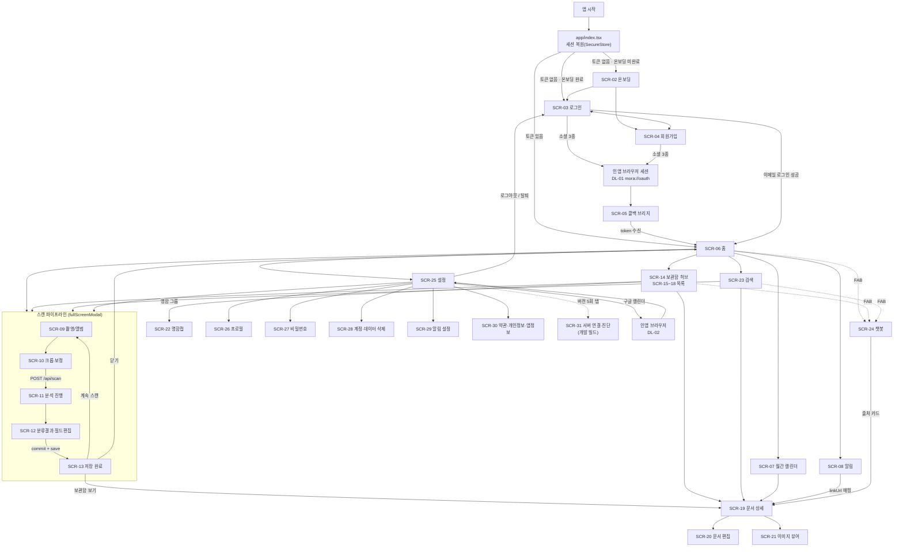
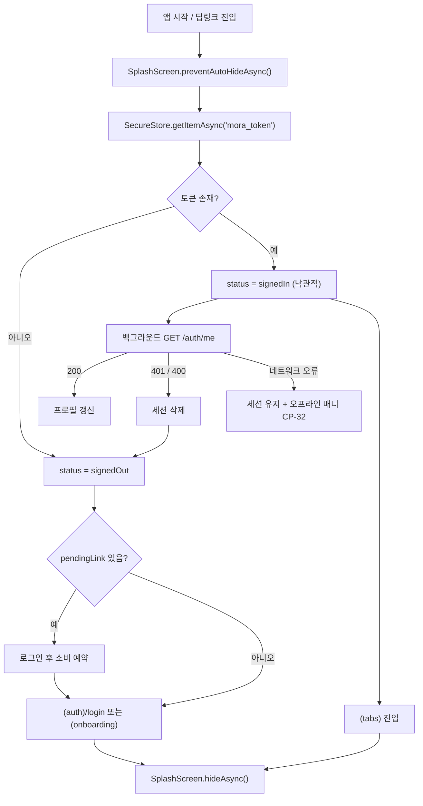

# Navigation Map

expo-router 파일 라우트 트리, 원본 웹 11개 경로 → SCR-01~31 대응, 하단 탭 4개 + 중앙 스캔 액션(5슬롯), 딥링크 DL-01~10, 인증 가드 흐름.

상위: [[Home]]
관련: [[Screen Specs]] · [[Mobile UX Guide]] · [[Auth]] · [[Architecture]] · [[Directory Structure]] · [[ADR-003 Navigation]]

---

## 0. ID 규칙

- **화면 ID `SCR-01~31`의 정본은 [[Screen Specs]] §0-4다.** 이 문서는 참조만 하고 발번하지 않는다. 번호는 사용자 여정 순(부트 → 인증 → 홈 → 스캔 → 보관함 → 검색 → 설정)이다.
- **라우트 경로의 정본은 이 문서 §1이다.** [[Screen Specs]]의 각 화면 헤더 `라우트` 칸은 여기와 글자 단위로 일치해야 한다.
- 딥링크는 이 문서 로컬 ID `DL-##`.
- 보관함 4종(SCR-15~18)은 **허브 화면 1개(SCR-14) + 유형 세그먼트**로 실현되지만, 유형별 목록 컬럼·필드·빈 상태 스펙이 달라 ID는 4개를 유지한다.

---

## 1. expo-router 라우트 트리

```text
app/
├─ _layout.tsx                  # Root Stack. Providers(Query/Session/SafeArea/BottomSheet/Toast)
│                               #  + expo-font 로드 + 스플래시 유지 + 딥링크 초기 URL 처리
├─ +not-found.tsx               # 알 수 없는 딥링크 착지 → 홈으로 유도
├─ index.tsx                    # 부팅 라우터: 세션 판정 후 (tabs) 또는 (auth)로 Redirect (UI 없음)
│
├─ (onboarding)/                # ── 최초 1회 온보딩
│  └─ index.tsx                 #    SCR-02 온보딩 4장 페이저 (가치 제안 + 시작 CTA 흡수)
│
├─ (auth)/                      # ── 미인증 전용 그룹 (토큰 있으면 (tabs)로 리다이렉트)
│  ├─ _layout.tsx               #    Stack, headerShown:false
│  ├─ login.tsx                 #    SCR-03 로그인
│  ├─ signup.tsx                #    SCR-04 회원가입
│  └─ callback.tsx              #    SCR-05 OAuth 콜백 브리지 (콜드스타트 딥링크 착지)
│
├─ (tabs)/                      # ── 인증 필수 그룹 (토큰 없으면 (auth)/login으로 리다이렉트)
│  ├─ _layout.tsx               #    탭 4개 + 중앙 스캔 액션 = 5슬롯. scan은 tabPress 가로채기
│  ├─ index.tsx                 #    SCR-06 홈 대시보드
│  ├─ archive/
│  │  ├─ index.tsx              #    SCR-14 보관함 허브 (?type= 세그먼트)
│  │  ├─ cards.tsx              #    SCR-15 명함 목록
│  │  ├─ tickets.tsx            #    SCR-16 티켓 목록
│  │  ├─ posters.tsx            #    SCR-17 포스터 목록
│  │  └─ receipts.tsx           #    SCR-18 영수증 목록
│  ├─ scan.tsx                  #    (플레이스홀더) 렌더 안 됨 — /scan 으로 push
│  ├─ search.tsx                #    SCR-23 검색
│  └─ settings/
│     └─ index.tsx              #    SCR-25 설정
│
├─ scan/                        # ── 스캔 파이프라인 (fullScreenModal)
│  ├─ _layout.tsx               #    Stack, presentation:'fullScreenModal', gestureEnabled:false
│  ├─ index.tsx                 #    SCR-09 카메라 촬영 / 앨범 선택
│  ├─ crop.tsx                  #    SCR-10 크롭·회전·보정
│  ├─ analyzing.tsx             #    SCR-11 업로드·분석 진행
│  ├─ review.tsx                #    SCR-12 분류 결과 + 필드 편집 + 저장(commit)
│  └─ done.tsx                  #    SCR-13 저장 완료 (연속 스캔 카운터)
│
├─ doc/
│  └─ [type]/                   #    type: card | ticket | poster | receipt
│     ├─ [id].tsx               #    SCR-19 문서 상세 (바텀시트/풀스크린)
│     └─ [id]/edit.tsx          #    SCR-20 문서 편집
│
├─ settings/                    # ── 설정 하위 스택
│  ├─ profile.tsx               #    SCR-26 프로필(닉네임) 편집
│  ├─ password.tsx              #    SCR-27 비밀번호 변경
│  ├─ danger.tsx                #    SCR-28 계정·데이터 삭제
│  ├─ notifications.tsx         #    SCR-29 알림 설정
│  └─ legal/[doc].tsx           #    SCR-30 약관 / 개인정보 / 라이선스 / 앱 정보
│
├─ (dev)/
│  └─ diagnostics.tsx           #    SCR-31 서버 연결·진단 (개발 빌드 전용, FR-121)
│
├─ calendar.tsx                 #    SCR-07 월간 캘린더
├─ notifications.tsx            #    SCR-08 알림 목록 (presentation:'modal')
├─ groups.tsx                   #    SCR-22 명함첩(그룹) 관리
├─ chat.tsx                     #    SCR-24 AI 모라냥 전체화면 (presentation:'modal')
└─ viewer.tsx                   #    SCR-21 이미지 뷰어 (핀치줌, ?uri=, 'transparentModal')
```

> **경로 주의** — `(tabs)/settings/index.tsx`(`/settings`)와 `settings/profile.tsx`(`/settings/profile`)가 같은 최상위 세그먼트를 공유한다. expo-router가 이 조합을 정상 해석하는지 **Phase 0에서 딥링크 `mora://settings/profile` 로 반드시 실검증**한다. 모호하면 하위 스택을 `app/account/*` 로 옮기고 [[Screen Specs]]의 라우트 칸을 함께 고친다.

**구조 결정 근거**

| 결정 | 이유 |
|---|---|
| `app/index.tsx`(SCR-01)를 세션 부트 화면으로 둔다 | 세션 복원이 비동기(SecureStore)라 첫 프레임에 판정할 수 없다. 네이티브 스플래시를 유지한 채 부트 시퀀스를 돌리고 분기 직전에 `hideAsync()` |
| 설정 하위를 `settings/` 폴더로 둔다 | 화면 이름과 경로가 1:1이라 읽기 쉽다. 세그먼트 공유로 인한 딥링크 모호성은 Phase 0 실검증 항목으로 남긴다(위 주의) |
| 스캔을 탭이 아니라 **fullScreenModal 스택**으로 | 촬영 중 탭바가 보이면 안 되고, 3단계(촬영→리뷰→필드)를 하나의 취소 단위로 묶어야 한다. 중간 이탈 시 임시 파일 정리도 한 곳에서 |
| 문서 상세를 `[type]/[id]` 동적 라우트로 | 유형별 화면 4개를 만들면 공통 로직(이미지·편집·삭제·공유)이 4벌이 된다. 유형 차이는 필드 스키마뿐 |
| 챗봇을 탭이 아니라 모달로 | 원본이 전역 플로팅 위젯이다. 탭 하나를 쓰면 핵심 동선(스캔/보관함)을 밀어낸다 |

---

## 2. 원본 웹 경로 → 모바일 라우트 대응표

| SCR | 원본 웹 경로 | 원본 파일 | 모바일 라우트 | 프레젠테이션 | 인증 | 주요 변경 |
|---|---|---|---|---|---|---|
| SCR-01 | (인증 가드) | `dashboard/layout.tsx` | `/` (`app/index.tsx`) | 스택 루트 | 게이트 | **신규.** SecureStore가 비동기라 "읽는 동안"의 화면이 필요하다 |
| SCR-02 | `/` | `app/page.tsx` | `/(onboarding)` | 스택 | 불필요 | 7섹션 마케팅 랜딩 → `STEP 01~04` 카피를 가로 스와이프 **4장 페이저**로. 별도 welcome 화면을 두지 않고 4번째 페이지 CTA 2개가 그 역할을 흡수 (UX-18) |
| SCR-03 | `/login` | `app/login/page.tsx` | `/(auth)/login` | 스택 | 불필요 | 880×560 절대좌표 2단 → 세로 스택. 소셜 3종은 인앱 브라우저 세션 |
| SCR-04 | `/signup` | `app/signup/page.tsx` | `/(auth)/signup` | 스택 | 불필요 | 동일. 소셜은 `full` variant 유지(라벨 노출) |
| SCR-05 | (HTML 브리지) | `AuthController` | `/(auth)/callback` | 스택 | 불필요 | **신규.** 콜드스타트 딥링크 착지점. 웜스타트는 `openAuthSessionAsync` 반환값으로 처리 |
| SCR-06 | `/dashboard` | `app/dashboard/page.tsx` | `/(tabs)/` | 탭 | 필수 | 배너 4칸 → 통계 타일 3개 가로 스크롤, 월간 캘린더 → 주간 스트립(월간은 SCR-07), 마감 카드 가로 스크롤 유지 |
| SCR-07 | (대시보드 내부) | `app/dashboard/page.tsx` | `/calendar` | 스택 | 필수 | 월간 캘린더를 별도 화면으로 분리. 화살표 키 내비게이션 → 가로 스와이프 |
| SCR-08 | (미구현, 벨 아이콘만) | `dashboard/layout.tsx` | `/notifications` | modal | 필수 | **신규.** 서버 API-32~38이 이미 존재하는데 웹이 안 씀 |
| SCR-09 | `/dashboard/upload` | `app/dashboard/upload/page.tsx` | `/scan` | fullScreenModal | 필수 | 드롭존 → 카메라 우선 (UX-04) |
| SCR-10 | (동상) | — | `/scan/crop` | fullScreenModal | 필수 | 크롭/회전/명암 보정 + 재촬영. 웹에 없던 단계 |
| SCR-11 | (동상) | — | `/scan/analyzing` | fullScreenModal | 필수 | 업로드 진행률 + 3단계 라벨 + 취소. 웹은 스피너 1개였다 |
| SCR-12 | (동상) | — | `/scan/review` | fullScreenModal | 필수 | 좌우 2단 → 이미지 상단 축소 + 필드 폼. bbox는 이미지 탭 시 뷰어로 |
| SCR-13 | (동상) | — | `/scan/done` | fullScreenModal | 필수 | 저장 완료 + **연속 스캔** 카운터. 웹은 전체 리셋이었다 |
| SCR-14 | (보관함 드롭다운) | `dashboard/layout.tsx` | `/(tabs)/archive` | 탭 | 필수 | **신규.** 웹의 4라우트 진입점을 유형 필터 칩 허브로 통합 |
| SCR-15 | `/dashboard/storage/cards` | `.../cards/page.tsx` | `/(tabs)/archive/cards` (`?type=BUSINESS_CARD`) | 탭 | 필수 | 220px 사이드바 → 상단 그룹 칩 + `/groups` 화면 |
| SCR-16 | `/dashboard/storage/tickets` | `.../tickets/page.tsx` | `/(tabs)/archive/tickets` | 탭 | 필수 | 6컬럼 행 → 카드/리스트 토글 (UX-06) |
| SCR-17 | `/dashboard/storage/posters` | `.../posters/page.tsx` | `/(tabs)/archive/posters` | 탭 | 필수 | 동일. 기본 2열 카드(썸네일 가치) |
| SCR-18 | `/dashboard/storage/receipts` | `.../receipts/page.tsx` | `/(tabs)/archive/receipts` | 탭 | 필수 | **목업 → 실 API 연결**(`/api/receipts` 이미 존재). 8컬럼 원장 → 날짜 그룹 카드 |
| SCR-19 | (드로어 4종) | `StorageDrawer.tsx` 외 | `/doc/[type]/[id]` | 시트 또는 풀스크린 | 필수 | 420/440px 우측 드로어 → 유형별 분기 (UX-09) |
| SCR-20 | (드로어 편집 모드) | `StorageDrawer.tsx` | `/doc/[type]/[id]/edit` | 스택 | 필수 | 인라인 편집을 별도 라우트로 분리(백버튼 = 편집 취소) |
| SCR-21 | (이미지 인라인) | 전역 | `/viewer?uri=` | transparentModal | 필수 | 핀치줌 + OCR bbox 오버레이 |
| SCR-22 | (사이드바 내부) | `.../cards/page.tsx` | `/groups` | 스택 | 필수 | `window.prompt`/`confirm` → 입력 시트 + Alert (UX-15) |
| SCR-23 | `/dashboard/search?q=&type=` | `app/dashboard/search/page.tsx` | `/(tabs)/search` | 탭 | 필수 | 헤더 검색바 → 전용 탭. 번호 페이지네이션 → 무한 스크롤 (UX-13). **RECEIPT 분기 신규 구현**(원본 버그) |
| SCR-24 | 전역 위젯 | `ChatbotWidget.tsx` | `/chat` | modal | 필수 | 드래그 패널 → FAB + 풀스크린 (UX-17) |
| SCR-25 | `/dashboard/settings` | `app/dashboard/settings/page.tsx` | `/(tabs)/settings` | 탭 | 필수 | 2열 그리드 → 1열 섹션 리스트. 모달 5종 → 전용 화면 5개(SCR-26~30) |
| SCR-26 | (설정 모달) | `settings/page.tsx` | `/settings/profile` | 스택 | 필수 | 닉네임 변경. 하드코딩 fallback 제거 |
| SCR-27 | (설정 모달) | `settings/page.tsx` | `/settings/password` | 스택 | 필수 | 429 rate limit 처리 + 소셜 계정 진입 차단 |
| SCR-28 | (설정 모달) | `settings/page.tsx` | `/settings/danger` | 스택 | 필수 | 회원 탈퇴 + 내 문서 전체 삭제 |
| SCR-29 | (설정 섹션) | `settings/page.tsx` | `/settings/notifications` | 스택 | 필수 | **신규.** localStorage → 서버 저장(API-39/40) |
| SCR-30 | (빈 onClick) | `settings/page.tsx` | `/settings/legal/[doc]` | 스택 | 불필요 | **신규 필수.** 원본은 `{/* TODO */}`. 약관·개인정보·라이선스·앱 정보 |
| SCR-31 | (환경변수) | `.env` | `/(dev)/diagnostics` | 스택 | 불필요 | **신규(개발 빌드 전용).** APK가 개발 PC LAN IP로 붙어야 하므로 앱 안에서 주소를 바꿀 수 있어야 한다 (FR-121, [[ADR-002 Backend Connectivity]] §2) |
| — | `/dashboard/*` 공통 헤더 | `dashboard/layout.tsx` | 폐기 | — | — | 7요소 헤더를 하단 탭 + 화면별 헤더로 분해 (UX-05) |

---

## 3. 하단 탭 구성 (탭 4개 + 중앙 스캔 액션 = 5슬롯)

| # | 라우트 | 라벨 | 아이콘(lucide) | 근거 |
|---|---|---|---|---|
| 1 | `/(tabs)/` | 홈 | `House` | 원본 랜딩 목업 하단 탭 1번(`홈`). 마감/일정/통계 요약 |
| 2 | `/(tabs)/archive` | 보관함 | `FolderOpen` | 목업 3번(`보관함`). 웹의 드롭다운 4라우트를 흡수 |
| 3 | `/scan` | **스캔** | `ScanLine`(강조 버튼) | 목업 2번(`업로드`). **앱의 존재 이유** — 가운데 원형 강조 |
| 4 | `/(tabs)/search` | 검색 | `Search` | 웹에서는 전역 헤더 검색바였다. 모바일 상단바에 넣을 폭이 없어 탭으로 승격 |
| 5 | `/(tabs)/settings` | 설정 | `Settings` | 목업 4번(`설정`). 프로필·연동·데이터·알림 설정 |

**왜 이렇게 나눴나**

1. **원본이 이미 답을 그려 놨다.** `app/page.tsx`의 `PhoneDashboard` 목업 하단 탭이 `홈 / 업로드 / 보관함 / 설정` 4개다(01-screens.md §1, §13-E). 팀 디자인 의도이므로 그대로 채택하고, 검색만 추가했다.
2. **검색을 탭으로 올린 이유**: 웹에서 검색은 모든 대시보드 화면 상단에 상시 노출된 1급 기능(카테고리 드롭다운 + 입력 + 제출)이었다. 모바일 헤더에 검색바를 넣으면 화면 제목·알림·프로필이 들어갈 자리가 없다. 탭으로 올리면 진입이 1탭으로 유지된다.
3. **스캔을 가운데 강조**: 하루 사용 흐름의 시작점이고, 다른 탭 어디서든 1탭에 도달해야 한다. 탭 아이템이지만 실제로는 화면을 렌더하지 않고 `fullScreenModal`을 push한다(탭 상태 오염 방지).
4. **챗봇은 탭이 아니다**: 원본이 전역 FAB였다. 탭으로 만들면 5칸 중 1칸을 상시 점유하는데, 사용 빈도가 스캔·보관함보다 낮다. 홈/보관함/검색 화면에 FAB로 띄운다.
5. **알림은 탭이 아니다**: 알림은 목적지가 아니라 진입점이다. 홈 헤더 우측 벨 아이콘 + 미읽음 배지(`GET /api/notifications/unread-count`의 `count`)로 둔다.
6. **탭 5개가 상한**: 6개부터는 라벨이 줄바꿈되고 터치 타겟이 64dp 아래로 내려간다.

```tsx
// app/(tabs)/_layout.tsx (발췌)
import { Tabs, useRouter } from 'expo-router';
import * as Haptics from 'expo-haptics';
import { House, FolderOpen, ScanLine, Search, Settings } from 'lucide-react-native';
import { theme } from '@/constants/theme';
import { ScanTabButton } from '@/components/navigation/ScanTabButton';

export default function TabLayout() {
  const router = useRouter();
  return (
    <Tabs
      screenOptions={{
        headerShown: false,
        tabBarActiveTintColor: theme.colors.point,
        tabBarInactiveTintColor: theme.colors.textMuted,
        tabBarStyle: { height: theme.layout.tabBarHeight, backgroundColor: theme.colors.bg, borderTopColor: theme.colors.borderFaint },
        tabBarLabelStyle: { ...theme.typography.micro },
      }}
    >
      <Tabs.Screen name="index"    options={{ title: '홈',     tabBarIcon: ({ color }) => <House color={color} size={24} /> }} />
      <Tabs.Screen name="archive"  options={{ title: '보관함', tabBarIcon: ({ color }) => <FolderOpen color={color} size={24} /> }} />
      <Tabs.Screen
        name="scan"
        options={{ title: '', tabBarButton: (p) => <ScanTabButton {...p} /> }}
        listeners={{
          tabPress: (e) => {
            e.preventDefault();                       // 탭 화면을 렌더하지 않는다
            Haptics.impactAsync(Haptics.ImpactFeedbackStyle.Medium); // HAP-06
            router.push('/scan');
          },
        }}
      />
      <Tabs.Screen name="search"   options={{ title: '검색',  tabBarIcon: ({ color }) => <Search color={color} size={24} /> }} />
      <Tabs.Screen name="settings" options={{ title: '설정',  tabBarIcon: ({ color }) => <Settings color={color} size={24} /> }} />
    </Tabs>
  );
}
```

`ScanTabButton`: 56dp 원형, 배경 `point`, 아이콘 흰색 24dp, `elevation.sheet`, 탭바 상단으로 12dp 돌출. `accessibilityRole="button"`, `accessibilityLabel="문서 스캔"`.

---

## 4. 화면 전환 다이어그램



**401 발생 시**: 어느 화면이든 → 세션 삭제 → `router.replace('/(auth)/login')` + 토스트 CP-24.

---

## 5. 딥링크 설계 (`mora://`)

`app.json`: `{ "expo": { "scheme": "mora", "android": { "intentFilters": [...] } } }`
**결정: v1은 커스텀 스킴만 쓰고 Universal/App Links는 쓰지 않는다.** 이유 — 앱이 개발 PC의 LAN IP(`http://192.168.x.x:8080`)에 붙는 구성이라 검증용 공개 도메인(`assetlinks.json` / `apple-app-site-association`)이 없다. 클라우드 배포 페이즈에서 재검토([[Risks]]).

| ID | URI | 목적 | 처리 라우트 | 파라미터 | 동작 |
|---|---|---|---|---|---|
| DL-01 | `mora://oauth/...?token=&userId=&email=&name=` | 소셜 로그인 콜백 | (라우트 없음 — `openAuthSessionAsync` 반환값으로 처리, 콜드스타트는 루트에서 파싱) | `token`(필수), `userId`, `email`, `name` | 토큰 SecureStore 저장 → `router.replace('/(tabs)')`. **URL은 즉시 폐기하고 로그에 남기지 않는다** |
| DL-02 | `mora://oauth/...?calendar=connected\|failed&message=` | 구글 캘린더 연동 콜백 | 설정 화면으로 복귀 | `calendar`, `message` | `connected` → 토글 ON + 토스트 / `failed` → Alert(`message` 또는 `구글 캘린더 연동에 실패했습니다.`) |
| DL-03 | `mora://doc/poster/{id}` | 알림 탭 → 포스터 상세 | `/doc/[type]/[id]` | `type=poster`, `id` | 인증 필요. 미인증이면 로그인 후 이 URL로 복귀(pendingLink) |
| DL-04 | `mora://doc/ticket/{id}` | 알림 탭 → 티켓 상세 | 동일 | | |
| DL-05 | `mora://doc/card/{id}` / `mora://doc/receipt/{id}` | 공유 링크 복귀, 챗봇 출처 카드 | 동일 | | |
| DL-06 | `mora://scan` | 홈 화면 롱프레스 퀵액션, 위젯 | `/scan` | — | 인증 필요 |
| DL-07 | `mora://search?q=&type=` | 웹 검색 URL(`?q=&type=`) 1:1 계승 | `/(tabs)/search` | `q`, `type`(BUSINESS_CARD 기본) | 원본 쿼리스트링 계약 그대로 |
| DL-08 | `mora://chat` | 챗봇 바로 열기 | `/chat` | — | |
| DL-09 | `mora://notifications` | 알림 목록 | `/notifications` | — | |
| DL-10 | (Android `ACTION_SEND`) | **공유 인텐트 수신** — 갤러리/카톡에서 "MORA로 공유" | `/scan/crop?uri=` | `uri`(content://) | 이미지 1장. 다중 선택(`SEND_MULTIPLE`)은 첫 장만 처리하고 토스트 안내 |

**공유 인텐트 결정**
- **v1은 Android만 지원한다.** `app.json` intentFilter에 `action: ACTION_SEND`, `mimeType: image/*` 등록.
- **iOS Share Extension은 v2로 이연.** 별도 네이티브 타깃 + 앱 그룹 설정이 필요해 EAS 빌드 구성이 한 단계 복잡해지고, Phase 8 릴리스 일정에 위험이 크다. [[Risks]]에 등록.

**공통 처리 규칙**
1. 딥링크 진입은 **항상 인증 가드를 먼저 통과**한다. 미인증이면 URL을 `pendingLink`에 저장하고 로그인 성공 후 소비한다.
2. 콜드스타트: 루트 `_layout.tsx`에서 `Linking.getInitialURL()`, 웜스타트: `Linking.addEventListener('url')`. **두 경로가 같은 핸들러**를 타야 중복 처리가 안 생긴다.
3. 알 수 없는 URL → `+not-found` → `홈으로` 버튼.
4. `token`이 포함된 URL은 `console.log` 금지(릴리스 빌드에서 로그 자체를 제거 — [[APK Build]] babel `transform-remove-console`).

### 5-1. 서버 알림 `linkUrl` → 모바일 라우트 매핑

서버는 웹 경로 문자열을 준다(`NotificationResponse.linkUrl`). 클라이언트가 변환한다.

| 서버 `linkUrl` | `sourceType` / `sourceId` | 모바일 라우트 |
|---|---|---|
| `/dashboard/storage/posters` | `POSTER` / id | `/doc/poster/{sourceId}` |
| `/dashboard/storage/tickets` | `TICKET` / id | `/doc/ticket/{sourceId}` |
| `/dashboard/storage/cards` | — | `/(tabs)/archive?type=BUSINESS_CARD` |
| `/dashboard/storage/receipts` | — | `/(tabs)/archive?type=RECEIPT` |
| `/dashboard/upload` | — | `/scan` |
| 그 외 / 빈 값 | — | `/notifications` (목록에 머무름) |

근거: 마감 배치가 `linkUrl="/dashboard/storage/posters"`, `sourceType="POSTER"`, `sourceId=poster.id`로 알림을 만든다(05-domain.md §6-2).

### 5-2. OAuth 리다이렉트 구성 (백엔드 무수정 전제)

원본 OAuth는 `/auth/{provider}/callback`이 **HTML을 반환**해 `{FRONTEND_URL}/dashboard?token=…`으로 브라우저를 보낸다(04-api.md §3-5). 앱에서는 이 착지점을 앱 스킴으로 돌려야 한다.

| 안 | 방법 | 판정 |
|---|---|---|
| A | 앱이 그대로 `/auth/google/login`을 연다 | ❌ 최종 착지가 `http://localhost:3000/dashboard?...` → APK에서 도달 불가 |
| B | **백엔드 설정값 `app.frontend-url`을 `mora://oauth`로 지정한 모바일 개발 프로파일 사용** | ✅ **채택.** 자바 코드 무수정(설정 파일만). `openAuthSessionAsync(url, 'mora://oauth')`가 착지 URL을 그대로 돌려준다 |
| C | 백엔드에 앱 전용 콜백(JSON 반환) 추가 | 후보(권장 최종형). 백엔드 수정이 필요하므로 클라우드 배포 페이즈로 이연 |

- 안 B의 대가: 그 프로파일이 켜져 있는 동안 **웹 프론트의 소셜 로그인이 동작하지 않는다.** 앱 개발/시연 시에만 켠다. [[Risks]] 등록.
- 보안 주의: 토큰이 URL 쿼리로 전달된다. 앱은 (1) 받은 즉시 SecureStore에 저장, (2) URL 문자열을 변수에서 폐기, (3) 로그 금지.
- **폴백**: 소셜 로그인이 실패하면 이메일 로그인(API-01/02)만으로 전 기능이 동작한다. Phase 2 수용 기준은 "이메일 로그인 100% + 소셜 3종 best effort".

```tsx
// features/auth/socialLogin.ts (발췌)
import * as WebBrowser from 'expo-web-browser';

const REDIRECT = 'mora://oauth';

export async function loginWithProvider(provider: 'google' | 'kakao' | 'naver') {
  const url = `${API_BASE}/auth/${provider}/login`;          // 서버가 302로 각 IdP로 보냄
  const result = await WebBrowser.openAuthSessionAsync(url, REDIRECT);
  if (result.type !== 'success') return { ok: false as const, reason: 'cancelled' as const };

  const q = new URL(result.url.replace('mora://', 'https://')).searchParams; // 커스텀 스킴 파싱 보정
  const token = q.get('token');
  if (!token) return { ok: false as const, reason: 'no-token' as const };    // → CP-21
  return {
    ok: true as const,
    token,
    user: { id: q.get('userId') ?? '', email: q.get('email') ?? '', name: q.get('name') ?? '' },
  };
}
```

---

## 6. 인증 가드 흐름

### 6-1. 상태 정의

| 상태 | 조건 | 라우팅 |
|---|---|---|
| `loading` | SecureStore 읽는 중 | 스플래시 유지 (화면 렌더 없음) |
| `signedOut` | 토큰 없음 | `(auth)` 그룹만 접근 가능 |
| `signedIn` | 토큰 있음 (형식 유효) | `(tabs)` 및 인증 화면 접근 가능 |
| `expired` | API가 401 또는 **400** 반환 | 세션 삭제 → `signedOut` + 토스트 CP-24 |

**400도 세션 만료로 취급한다.** 원본이 그렇게 하고 있고(`if (res.status === 401 || res.status === 400)`), 서버 `AuthController`가 실패를 400으로 흘리기 때문이다(04-api.md §1-1).

### 6-2. 흐름도



**핵심: 토큰이 있으면 `/auth/me` 응답을 기다리지 않고 즉시 홈을 그린다.** 네트워크가 느린 LAN 환경에서 매 실행마다 흰 화면을 보게 할 수 없다. 검증은 백그라운드로 돌리고, 401/400이면 그때 로그아웃시킨다.

### 6-3. 구현

```tsx
// app/(tabs)/_layout.tsx 상단
import { Redirect } from 'expo-router';
import { useSession } from '@/features/auth/useSession';

const { status } = useSession();
if (status === 'loading') return null;              // 스플래시가 아직 떠 있다
if (status !== 'signedIn') return <Redirect href="/(auth)/login" />;
```

```tsx
// app/(auth)/_layout.tsx 상단 — 역방향 가드
const { status } = useSession();
if (status === 'loading') return null;
if (status === 'signedIn') return <Redirect href="/(tabs)" />;
```

```ts
// lib/api/client.ts — 401/400 인터셉터 (전역 1곳)
if (res.status === 401 || res.status === 400) {
  await session.clear();                            // SecureStore 삭제 + 쿼리 캐시 비우기
  toast.error(MESSAGES.CP_24);                      // '로그인 세션이 만료되었습니다. 다시 로그인해 주세요.'
  router.replace('/(auth)/login');
}
```

**규칙**
1. 가드는 **레이아웃 2곳(`(tabs)/_layout`, `(auth)/_layout`)에만** 둔다. 개별 화면에 중복 가드를 넣지 않는다(원본도 `dashboard/layout.tsx` 한 곳에서만 걸었다).
2. 로그아웃/탈퇴는 `router.replace('/(auth)/login')` — `push` 금지(백으로 인증 화면에 되돌아오면 안 된다). 탈퇴는 `mora_onboarding_seen` 도 함께 지워 온보딩부터 다시 보게 한다.
3. 로그인 성공 직후 `pendingLink`가 있으면 `(tabs)` 진입 후 즉시 `router.push(pendingLink)`.
4. 스플래시 해제(`hideAsync`)는 **폰트 로드 + 세션 판정이 모두 끝난 뒤 1회**.
5. 토큰 저장은 `expo-secure-store`(Keychain/Keystore). 유저 프로필·설정 캐시는 MMKV/AsyncStorage. **토큰을 AsyncStorage에 두지 않는다** ([[Auth]]).

---

## 7. 라우트 파라미터 계약

| 라우트 | 파라미터 | 타입 | 기본값 | 비고 |
|---|---|---|---|---|
| `/(tabs)/archive` | `type` | `ALL\|BUSINESS_CARD\|TICKET\|POSTER\|RECEIPT` | `ALL` | 허브(SCR-14)의 필터 칩 상태. 유형 선택 시 하위 목록 라우트로 전환 |
| `/(tabs)/archive` | `groupId` | `UUID \| 'ungrouped'` | 없음 | 명함 전용 |
| `/(tabs)/search` | `q` | `string` | `''` | 웹 `?q=` 계승 |
| `/(tabs)/search` | `type` | 위와 동일 | `BUSINESS_CARD` | 웹 `?type=` 계승 |
| `/doc/[type]/[id]` | `type` | `card\|ticket\|poster\|receipt` | — | **소문자 라우트 세그먼트.** `DocumentType`(대문자)과 `theme.docType[*].route`로 변환 |
| `/doc/[type]/[id]` | `id` | `string` | — | 명함은 UUID, 티켓/포스터/영수증은 정수 문자열. **PK 타입이 리소스마다 다르다**(05-domain.md §7-20) → 라우트에서는 항상 string |
| `/scan/crop` | `uri` | `string` | — | 로컬 파일/컨텐츠 URI (DL-10 공유 인텐트 착지) |
| `/scan/review` | `scanId` | `string` | — | 스캔 결과는 파라미터가 아니라 스토어에 담고 키만 넘긴다(응답이 크다) |
| `/viewer` | `uri`, `title` | `string` | — | |
| `/(tabs)/settings` | `calendar` | `connected\|failed` | 없음 | DL-02 착지 |
| `/settings/legal/[doc]` | `doc` | `terms\|privacy\|licenses\|about` | — | SCR-30 |

**규칙**: 파라미터는 항상 문자열이다(`useLocalSearchParams`). 숫자·불리언은 파싱해서 쓰고, **객체를 JSON 문자열로 넘기지 않는다**(스캔 결과·문서 객체는 전역 스토어 경유 — [[Offline and State]]).

---

## 8. 백스택 / 프레젠테이션 정책

| 라우트 | `presentation` | 제스처 | 헤더 | 백 동작 |
|---|---|---|---|---|
| `(onboarding)`, `(auth)/*` | `card` | 활성 | 없음(커스텀) | pop, 온보딩 1페이지·로그인 루트에서 종료 |
| `(tabs)/*` | — | — | 화면별 커스텀 헤더 | 홈=종료 확인, 그 외=홈 탭 |
| `/scan/*` | `fullScreenModal` | **비활성** | 커스텀(닫기 X) | 단계별 가드 ([[Mobile UX Guide]] §4) |
| `/doc/[type]/[id]` | 시트(명함·포스터는 풀스크린) | 활성 | 커스텀 + `headerRight: 수정` | 닫기 |
| `/doc/[type]/[id]/edit` | `card` | 비활성(편집 중) | 네이티브 + `headerRight: 저장` | 편집 취소 확인 |
| `/chat` | `modal` | 활성(아래로) | 커스텀(`AI 모라냥` + 도움말/초기화/닫기) | 닫기(대화 유지) |
| `/notifications` | `modal` | 활성 | 네이티브 + `headerRight: 모두 읽음` | 닫기 |
| `/viewer` | `transparentModal` | 활성(아래로 던져 닫기) | 없음(오버레이 컨트롤) | 닫기 |
| `/calendar`, `/groups`, `/settings/*`, `/(dev)/diagnostics` | `card` | 활성 | 네이티브 | pop |

**탭 스택 리셋 규칙**: 같은 탭 아이콘을 다시 누르면 (1) 해당 탭 스택이 깊으면 루트로 pop, (2) 이미 루트면 리스트 최상단으로 스크롤. 세 번째 탭(스캔)은 예외(항상 새 모달).

**딥링크 진입 시 백스택**: `mora://doc/poster/12`로 콜드스타트하면 백을 눌렀을 때 앱이 종료되면 안 된다. `router.replace('/(tabs)')` 후 `router.push('/doc/poster/12')` 순서로 스택을 합성한다.
