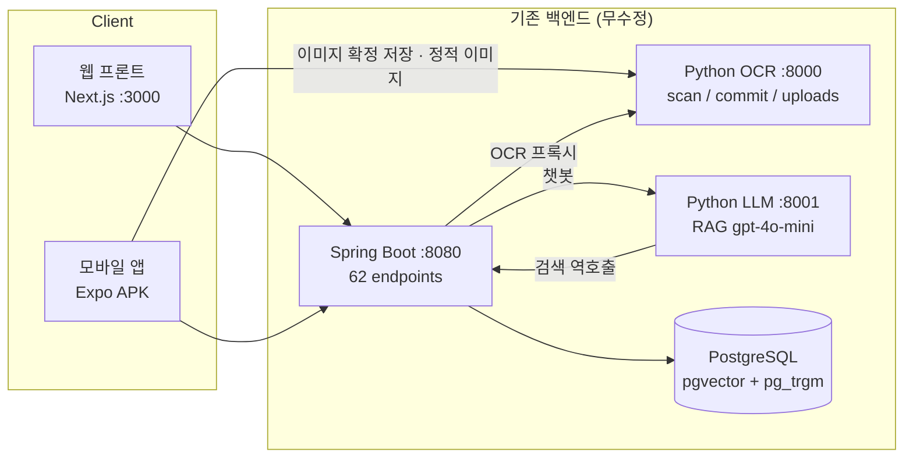

# PRD — MORA 모바일 앱

종이 기록(명함·포스터·영수증·티켓)을 카메라로 찍는 즉시 AI가 읽고 분류·저장·검색 가능한 데이터로 바꿔 주는 Android 앱. 기존 MORA 웹 서비스와 **백엔드·데이터베이스를 100% 공유**한다.

상위: [[Home]]
관련: [[Requirements]] · [[User Stories]] · [[Scope]] · [[Phases]] · [[ADR-001 Framework]] · [[ADR-002 Backend Connectivity]]

---

## 1. 제품 한 줄 정의

> **MORA 모바일** — 종이를 찍으면 끝. 명함·포스터·영수증·티켓을 카메라 한 번으로 구조화된 기록으로 바꾸고, 자연어로 다시 찾아내는 개인 문서 보관함.

원본 웹 서비스의 메타 카피를 그대로 계승한다.
- `title: 'MORA — 명함 스캔 & 검색'` (원본: `frontend/app/layout.tsx`)
- `description: '명함을 스캔하면 AI가 자동으로 정리하고, 언제든 검색할 수 있습니다.'` (원본: 동일 파일)
- 히어로 카피: `복잡한 기록 정리, MORA 하나로 충분합니다.` / `복잡한 입력 없이 사진만 올리세요.` (원본: `frontend/app/page.tsx`)

결정: 앱 스토어/설치 화면용 한 줄 소개는 위 히어로 카피를 축약해 **"찍으면 정리되는 기록 보관함"** 으로 통일한다. 이유 — 웹 카피가 "명함"에 치우쳐 있으나 실제 지원 문서는 4종이며, 모바일의 핵심 가치는 촬영 즉시성이기 때문.

---

## 2. 해결하는 문제

| # | 문제 | 현재 사용자의 대안 | MORA 모바일의 해법 | 근거 |
|---|---|---|---|---|
| P-1 | 받은 명함이 지갑·서랍·가방에 쌓이고, 필요할 때 이름조차 기억나지 않는다 | 사진첩에 찍어두고 방치 → 검색 불가 | 촬영 → OCR+NER → `name/company/position/phone/email` 구조화 → 하이브리드 검색 | 원본: `ocr/services.py` BUSINESS_CARD 12필드 파서, `CardService.hybridSearch` |
| P-2 | 행사 포스터의 마감일을 놓친다 | 사진만 찍고 캘린더에 옮기지 않음 | 포스터에서 `event_start_date/event_end_date` 추출 → 홈 마감 임박 카드 + Google Calendar 연동 | 원본: `DeadlineNotificationService`, `GoogleCalendarService` |
| P-3 | 영수증 정산을 월말에 몰아서 하다 원본을 잃어버린다 | 종이 영수증 보관 / 앱 여러 개 | 촬영 즉시 `store_name/purchase_date/total_amount` 저장, 검색으로 재조회 | 원본: `ocr` RECEIPT 파서, `ReceiptController` |
| P-4 | 티켓 정보(출발/도착/시간)가 문자·메일·앱에 흩어져 있다 | 캡처 후 앨범 검색 | 티켓 키워드 감지 → 7필드 구조화 → 홈 일정에 표시 | 원본: `ocr/routers/ocr.py` `TICKET_KEYWORDS` |
| P-5 | 정확한 파일명을 모르면 못 찾는다 | 앨범을 스크롤로 훑기 | pg_trgm Fuzzy(0.6) + pgvector(0.4) 하이브리드 검색 + RAG 챗봇 | 원본: `CardService.hybridSearch`, `llm/src/llm/openai_client.py` |
| P-6 | **웹앱은 데스크톱 전용이라 종이를 만나는 그 순간 쓸 수 없다** | 나중에 PC 앞에서 처리 → 대부분 처리 안 함 | 앱이 카메라와 같은 자리에 존재 | 원본: `frontend/app/dashboard/layout.tsx` `minWidth: 1200`, upload 화면에 `capture` 속성 없음 |

P-6이 이 프로젝트의 존재 이유다. 원본 웹은 파일 드래그앤드롭만 지원하고(`onDragOver`/`onDrop`), 카메라 직접 촬영 경로가 아예 없다.

---

## 3. 타깃 사용자 (페르소나 3)

### PS-1. 지훈 · 32세 · B2B 세일즈 (모바일 핵심)
- **맥락**: 컨퍼런스 부스에서 20분 사이에 명함 7장을 받는다. 명함을 주머니에 넣는 순간 이미 누가 누군지 헷갈린다.
- **결정적 순간**: 상대와 헤어진 직후 10초. 이때 찍지 않으면 영원히 안 찍는다.
- **요구 성능**: 앱 아이콘 탭 → 카메라 프리뷰까지 **2.5초 이내**, 촬영 → 저장까지 **20초 이내**, 연속 촬영 가능.
- **핵심 FR**: FR-036(카메라 즉시 진입·촬영), FR-039(압축), FR-051(연속 스캔), FR-064(명함 그룹)
- **실패 조건**: 로그인 재요구, 카메라 권한 재요청, 스캔 결과 대기 중 화면 멈춤.

### PS-2. 서연 · 27세 · 프리랜서 디자이너 (영수증 정산)
- **맥락**: 클라이언트 미팅 카페 영수증, 택시 영수증을 월말에 정산한다. 종이 영수증은 인쇄가 흐려지고 잃어버린다.
- **결정적 순간**: 계산 직후 카운터 앞. 한 손에 카드, 한 손에 폰.
- **요구 성능**: 한 손 조작, 하단 도달 가능한 주요 버튼, 어두운 실내에서도 촬영 성공.
- **핵심 FR**: FR-037(갤러리), FR-039(압축), FR-056(영수증 보관함 — 원본 웹에는 없는 신규 기능), FR-070(검색)
- **주의**: 원본 웹의 영수증 화면은 **전부 목업**이며 실 API 미연결. 모바일이 이 도메인의 첫 실사용 구현이 된다. (원본: `frontend/app/dashboard/storage/receipts/page.tsx` 파일 헤더 주석 `interim UI on mock data`)

### PS-3. 하은 · 21세 · 대학생 (포스터·티켓)
- **맥락**: 교내 게시판의 공모전 포스터, 예매한 공연 티켓. "신청 마감이 언제였더라"가 반복된다.
- **결정적 순간**: 게시판 앞 5초. 걸어가면서 찍는다 → 사진이 기울고 흔들린다.
- **요구 성능**: 기울어진 촬영본도 처리, 마감일 오인식 시 저장 전 수정 가능, 마감 임박 알림. **낮의 야외 게시판과 밤의 기숙사 침대 양쪽에서 읽혀야 한다** — 기기를 하루 종일 다크로 두는 사용자층이고, 앱만 흰 화면으로 튀면 야간에 앱을 열지 않는다.
- **핵심 FR**: FR-045(필드 편집), FR-046(bbox 근거 확인), FR-082(마감 임박 카드), FR-085(알림 목록), FR-011·FR-123(라이트/다크 3택)
- **주의**: 포스터 파서는 연도 없는 날짜를 **올해로 가정**한다(원본: `ocr` `_to_iso_datetime`). 연말/연초 오답 가능 → 저장 전 확인 UI 필수.

---

## 4. 웹 대비 모바일이 추가로 여는 가치

| # | 가치 | 웹에서 불가능했던 이유 | 모바일 구현 | 관련 FR |
|---|---|---|---|---|
| V-1 | **카메라 즉시성** | 웹 업로드는 `accept="image/*"`만 있고 `capture` 속성이 없음. 데스크톱 전제라 폰 카메라 경로 자체가 없음 | expo-camera 프리뷰 → 촬영 → 즉시 스캔. 하단 탭바 스캔 탭 | FR-035 ~ FR-039 |
| V-2 | **공유 시트 수신** | 브라우저는 다른 앱의 이미지를 받을 수 없음 | Android `ACTION_SEND`(`image/*`) 인텐트 필터 → 카톡/문자/갤러리에서 "MORA로 공유" | FR-052 |
| V-3 | **마감 리마인더 알림** | 웹은 알림 UI 자체가 존재하지 않음(`getNotifications` 등 5개 함수가 죽은 코드) | 알림 목록 화면 + 미읽음 배지 + 서버 저장 알림 설정. 백엔드는 매일 09:00 KST 배치로 이미 알림 row를 생성 중 | FR-085 ~ FR-089 |
| V-4 | **오프라인 열람** | 웹은 매 진입마다 네트워크 필수 | 목록·상세·이미지 캐시로 지하철/기내에서도 열람 가능(쓰기는 불가) | FR-101 |
| V-5 | **네이티브 딥링크 OAuth** | 웹은 `window.location.href` 전체 리다이렉트 + 쿼리스트링 토큰 노출 | 인앱 브라우저(Custom Tabs) + `mora://auth/callback` 딥링크 | FR-025 ~ FR-028 |
| V-6 | **햅틱·제스처** | 웹은 hover 전제 인터랙션 다수(hover 상태 state가 10곳 이상) | press/haptic/swipe-to-delete/pan-down-to-close | FR-104 ~ FR-107 |
| V-7 | **한 손 조작 IA** | 웹 헤더에 액션 7개(로고/검색/업로드/보관함/알림/프로필/로그아웃)가 몰려 있음 | 하단 탭 4개(홈·보관함·검색·설정) + 중앙 스캔 액션 = 5슬롯, 그리고 바텀시트. **원본 랜딩 목업이 이미 4탭 구조를 제시했고 여기에 웹 헤더의 통합검색바가 갈 자리를 더했다** | FR-009 |
| V-8 | **연속 스캔** | 웹은 저장 후 "다른 이미지 스캔" 버튼으로 전체 리셋 | 저장 후 카메라로 즉시 복귀, 세션 카운터 유지 | FR-051 |
| V-9 | **기기 테마를 따르는 다크모드** | 웹 설정에 `theme` 값은 있었지만 `data-theme` 속성만 세팅하고 **대응 스타일이 없어 무동작**이었다(=사실상 라이트 전용 데스크톱 앱) | `시스템 따름`(기본값)/`라이트`/`다크` 3택 + OS 테마 즉시 추종 + 기기 영속. 브랜드 hue를 보존한 다크 팔레트를 신규 설계 | FR-011, FR-123 ~ FR-129 / NFR-027, NFR-029 |

V-9가 웹 대비 가치인 이유는 **사용 맥락이 다르기 때문**이다. 데스크톱은 조명이 통제된 실내에 고정되어 있지만, 이 앱의 결정적 순간(§3)은 컨퍼런스 부스·카페 카운터·야간 게시판 앞이다. 기기 전역 다크를 켜 둔 사용자에게 앱만 흰 화면으로 튀는 것은 야간에 실질적인 사용 저지 요인이며, 원본 웹에는 이 문제 자체가 존재하지 않았다. 다만 **다크 팔레트에 참조할 원본이 0이라는 점은 정직하게 기록한다** — 이 가치는 이식이 아니라 신규 설계로 얻는 것이고, 그 비용은 Phase 1 ≈1.5배 · Phase 7 QA 2배다([[Design Tokens]] §10-7).

V-7의 근거는 원본 랜딩의 폰 목업이다. `PhoneDashboard` 컴포넌트 안에 `홈 / 업로드 / 보관함 / 설정` 4탭 바가 그려져 있다 (원본: `frontend/app/page.tsx`). 즉 팀은 이미 모바일 IA를 디자인해 두었고, 이 앱은 그 청사진의 구현이다. 다만 `업로드`는 화면이 아니라 **행동**이므로 중앙 액션으로 승격하고, 그 자리에 웹 헤더의 1급 기능이던 검색을 탭으로 올렸다([[ADR-003 Navigation]]).

---

## 5. 성공 지표

측정 시점 기준: 정식 배포(Phase 8 완료) 후 첫 4주.

| ID | 지표 | 정의 | 목표 | 계측 방법 |
|---|---|---|---|---|
| KPI-1 | **스캔 완료율** | (저장 성공 수) ÷ (촬영/선택 수) | ≥ 80% | 이벤트 `scan_started` / `scan_saved` 카운트 비 |
| KPI-2 | **스캔→저장 소요시간 (P50)** | 셔터 탭 ~ 저장 완료 토스트 | ≤ 20초 | 이벤트 타임스탬프 차 |
| KPI-3 | **스캔→저장 소요시간 (P90)** | 동일 | ≤ 45초 | 동일 |
| KPI-4 | **첫 스캔까지의 시간 (TTFS)** | 최초 앱 실행 ~ 첫 저장 성공 | ≤ 3분 (중앙값) | 온보딩 퍼널 이벤트 |
| KPI-5 | **검색 성공률** | (검색 후 30초 내 결과 탭한 세션) ÷ (검색 세션) | ≥ 60% | `search_submitted` → `search_result_opened` |
| KPI-6 | **크래시프리 세션율** | 크래시 없이 종료된 세션 비율 | ≥ 99.5% | 크래시 리포터(Sentry) |
| KPI-7 | **콜드스타트 시간 (P90)** | 프로세스 시작 ~ 첫 인터랙티브 프레임 | ≤ 2.5초 | `expo-performance` / 수동 계측 |
| KPI-8 | **OCR 필드 수정률** | 저장 전 사용자가 1개 이상 필드를 고친 스캔 비율 | ≤ 40% (낮을수록 파서 정확) | `field_edited` 이벤트 |
| KPI-9 | **재방문율 (D7)** | 설치 7일 후 재실행 사용자 비율 | ≥ 35% | 세션 이벤트 |
| KPI-10 | **APK 설치 성공률** | 실기기 설치 시도 대비 성공 | 100% (3기종 이상) | [[QA Checklist]] 수동 검증 |

결정: KPI-1의 분모를 "촬영 수"가 아니라 "촬영/선택 수"로 잡는다. 이유 — 갤러리 경로도 동일한 완료 퍼널을 타므로 분리하면 표본이 갈린다.

결정: 지표 계측은 **로컬 이벤트 카운터 + 크래시 리포터**로 시작하고, 서버 분석 파이프라인은 v1 범위 밖이다. 이유 — 백엔드 무수정 원칙(ADR-002)에 따라 분석 수집 엔드포인트를 추가할 수 없다. 자세한 제외 사유는 [[Scope]] 참조.

### 반(反)지표 (악화되면 안 되는 값)

| ID | 지표 | 상한 |
|---|---|---|
| GUARD-1 | 저장 실패율 (5xx/타임아웃) | ≤ 3% |
| GUARD-2 | 스캔 1건당 업로드 바이트 | ≤ 1.2MB (압축 후, [[Camera and Scan]] IMG-01~07) |
| GUARD-3 | ANR 비율 | ≤ 0.5% |
| GUARD-4 | APK 크기 | ≤ 80MB (universal APK) |
| GUARD-5 | **명도 대비 위반 토큰 조합 수 (라이트 + 다크 합산)** | **0건** — 두 테마 각각 본문 4.5:1 / 대형·비텍스트 3:1 (NFR-021, NFR-029) |
| GUARD-6 | **검색 1회 제출당 서버 검색기록 적립 건수** | **≤ 1건** (기본값 사용 시). `전체`를 명시 선택한 경우만 4건을 허용하고, 로컬 최근 검색어는 그 경우에도 1건 (FR-069, FR-130) |

**GUARD-4는 다크모드 편입에도 80MB로 유지한다.** 추가 에셋은 다크 스플래시 로고 1장(단색 PNG, 수 KB)뿐이고 토큰 2벌·CSS 변수 2벌은 텍스트다. 다크 전용 일러스트를 새로 그리는 선택지는 v1에서 취하지 않았다([[Scope]] D-18) — 다크에서 해당 이미지를 렌더하지 않는 쪽이 용량과 일정 모두에서 싸다.

**GUARD-5를 반지표로 세우는 이유** — 다크 팔레트는 참조할 원본이 없는 신규 설계이므로 "예쁜가"를 대조할 기준이 없다. 유일하게 객관적인 합격선이 대비비이며, 이 값은 계산으로 확정되므로 반지표로 상시 감시할 수 있다. HEX를 바꾸는 PR은 대비비를 재계산해 [[Design Tokens]] §10-3·§10-4 표를 갱신해야 통과한다.

---

## 6. 원본 웹앱과의 관계

### 6-1. 공유하는 것

| 자원 | 상태 | 근거 |
|---|---|---|
| Spring Boot 백엔드 (`:8080`) | **무수정 공유** — 62개 엔드포인트 그대로 사용 | [[API Contract]], 원본: `backend/src/main/java/com/mora/controller/` 14개 컨트롤러 |
| Python OCR 서버 (`:8000`) | **무수정 공유** — `/api/scan`(Spring 경유), `/api/commit`(직접), `/uploads/*`(정적 이미지) | 원본: `ocr/app.py` `MORA OCR Service v3.0` |
| Python LLM 서버 (`:8001`) | 간접 사용 — Spring `/api/chat` 경유만 | 원본: `llm/app.py` |
| PostgreSQL (pgvector/pg_trgm) | 동일 DB, 동일 테이블 | [[Data Model]] |
| 사용자 계정·JWT | 동일 계정. 웹에서 가입한 사용자가 앱에서 그대로 로그인 | 원본: `JwtUtil` HS256, `app.jwt-expiration` 24h |
| 저장된 문서 데이터 | **완전 동일**. 웹에서 저장한 명함이 앱에 즉시 보이고 그 반대도 성립 | 동일 DB |

### 6-2. 공유하지 않는 것 (앱 전용)

| 항목 | 이유 |
|---|---|
| 세션 저장소 | 웹 `localStorage` → 앱 `expo-secure-store`. 서로 무관 |
| OAuth 콜백 착지점 | 웹 `{FRONTEND_URL}/dashboard?token=…` → 앱 `mora://auth/callback?token=…`. [[ADR-002 Backend Connectivity]] 참조 |
| 설정 프리퍼런스 | 웹 `mora_settings_prefs` localStorage → 앱은 알림 설정을 **서버(API-39/40)** 에 저장. 웹이 안 쓰는 엔드포인트를 앱이 처음 사용한다 |
| 테마 | 웹은 `data-theme` 속성만 세팅하고 실제 다크 스타일이 없어 무동작 → 앱은 **라이트/다크 2벌을 v1에 출시**한다. 선택은 3택이며 서버가 아니라 기기(MMKV `theme.mode`)에 저장한다 — 테마는 계정 데이터가 아니라 기기·조명 환경의 문제이므로 웹과 동기화하지 않고, 앱 로그아웃·계정 전환에도 유지한다([[ADR-004 Styling]] §4, [[Design Tokens]] §10) |

### 6-3. 앱이 먼저 구현하는 기능 (웹에 없음)

백엔드에 API는 있으나 웹 프론트가 호출하지 않는 것들. 서버 수정 없이 앱에서 바로 쓸 수 있다.

| 기능 | 엔드포인트 | 웹 상태 |
|---|---|---|
| 영수증 목록 | API-49 `GET /api/receipts` | 웹은 목업 배열 3건 하드코딩 |
| 영수증 검색 | API-52 `GET /api/receipts/search` | `api.ts`에 함수는 있으나 검색 화면이 분기 자체를 빼먹음 (항상 0건) |
| 영수증 수정/삭제 | API-51 / API-53 | 버튼이 빈 `onClick` |
| 알림 목록·읽음·삭제 | API-32 ~ API-38 | 어떤 컴포넌트도 import하지 않는 죽은 코드. 헤더 벨 아이콘은 `onClick` 없음 |
| 알림 설정 서버 저장 | API-39 / API-40 | 웹은 localStorage에만 저장 |
| 홈 대시보드 서버 조립 | API-24 `GET /api/dashboard` | 웹은 목록 3개를 각각 불러 클라이언트에서 조립 |
| 최근 검색어 목록 | API-54 `GET /api/search-histories` | 래퍼 함수조차 없음 |
| 명함 그룹 이름 변경 | API-22 `PATCH /api/card-groups/{id}` | 래퍼 없음 |
| 무한 스크롤 페이지네이션 | 모든 목록 API의 `page`/`size` | 웹은 항상 첫 페이지만 조회, `totalPages` 미사용 → 문서 20개 초과 시 안 보임 |

### 6-4. 앱이 계승하지 않는 웹의 버그·미완성

[[Risks]]에 상세. 요약하면 — 웹 검색 화면의 영수증 분기 누락, 영수증 편집 저장 시 무한 로딩, 설정 화면의 하드코딩된 개인정보 fallback(`'leechoeun'`, `'mvp6276@gmail.com'`), 통계 하드코딩(`12`/`1/2`/`6분 전`), 앱 버전 하드코딩(`v1.2.3 (build 248)`)은 **전부 이식하지 않는다.**

### 6-5. 관계 다이어그램

---

## 7. 제품 원칙 (설계 판단이 갈릴 때의 기준)

1. **촬영까지의 마찰이 0에 수렴해야 한다.** 앱 실행 → 카메라까지 탭 1회. 로그인 상태 유지가 최우선 품질.
2. **저장 전 사용자 확인은 생략하지 않는다.** OCR 신뢰도는 검증되지 않았다(원본: `models/field_extractor/meta.json`의 `note` — "Synthetic test F1 != real-world F1"). 항상 편집 가능한 확인 단계를 거친다.
3. **서버를 고치지 않고 앱에서 흡수한다.** 이중 래핑, 날짜 배열 직렬화, id 타입 불일치, `data` 키 소실 — 전부 클라이언트 어댑터 계층에서 처리한다. [[Networking]] 참조.
4. **모바일 관용구를 따르되 브랜드 언어는 지킨다.** 색·타이포·아이콘은 원본을 계승([[Design Tokens]]), 레이아웃·인터랙션은 전면 재설계([[Mobile UX Guide]]). 원본에 없는 것을 새로 정할 때(다크 팔레트가 그 사례다)는 **브랜드 hue를 고정 제약으로 두고 자유도를 좁히고, 판정은 대비비로 한다** — 취향 논쟁이 들어설 자리를 만들지 않는다.
5. **네트워크는 항상 실패할 수 있다고 가정한다.** 모든 화면에 로딩·빈 상태·에러·재시도 4상태를 정의한다.
6. **테마는 사용자의 것이다.** 앱이 조명 환경을 대신 판단하지 않는다. 기본값은 `시스템 따름`이고, 명시 선택은 OS 변경에도 흔들리지 않으며 로그아웃·계정 전환에도 살아남는다. 화면 하나가 한 테마에서만 검수된 상태로 머지되지 않는다([[ADR-004 Styling]] §5-7). 같은 원칙이 검색 기본값에도 적용된다 — 앱이 매번 `명함`으로 되돌리지 않고 **마지막 선택을 기억한다**(FR-069).
