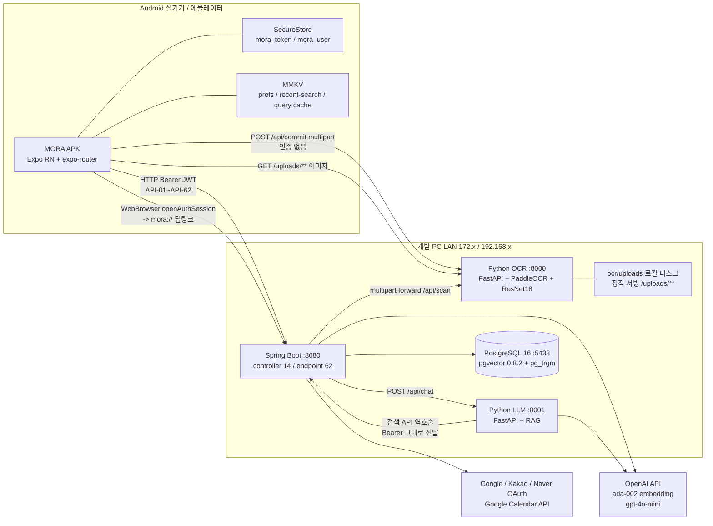
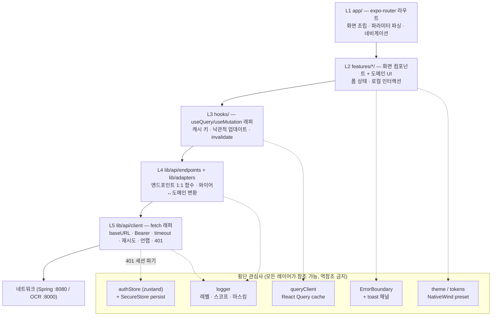
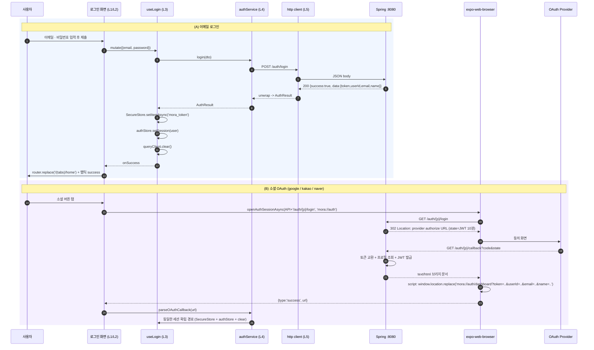
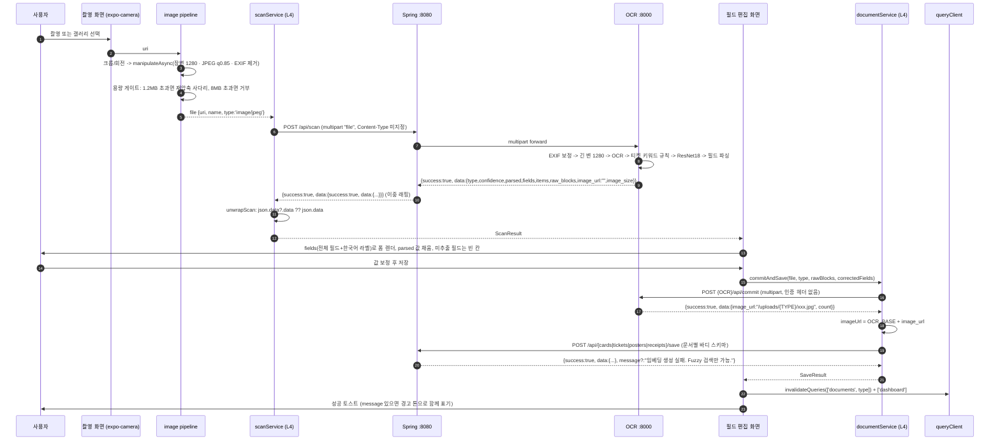
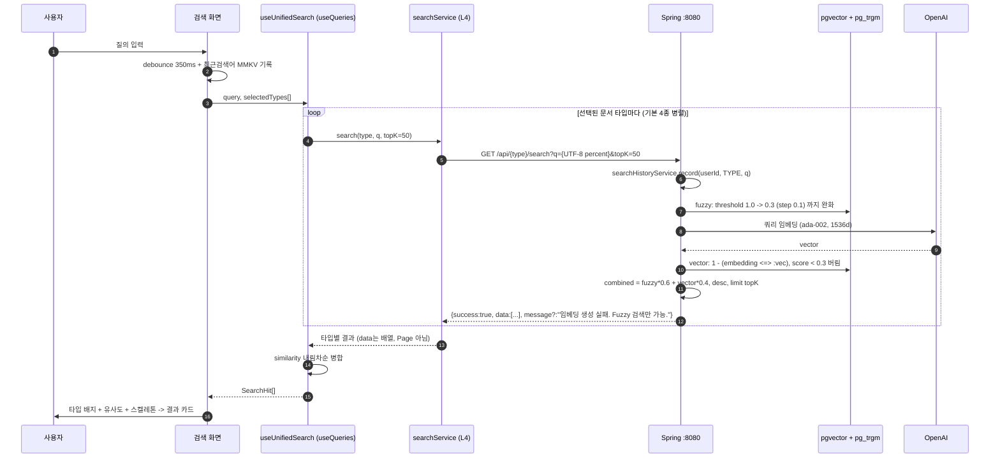

# Architecture

MORA 모바일 앱(Expo/APK)의 시스템 경계, 앱 내부 레이어, 핵심 데이터 흐름 3종, 웹앱과의 구조적 차이, 실패 도메인 격리 전략.

상위: [[Home]]
관련: [[Tech Stack]] · [[Directory Structure]] · [[Conventions]] · [[API Contract]] · [[Networking]] · [[Offline and State]] · [[Auth]] · [[Camera and Scan]] · [[ADR-001 Framework]] · [[ADR-002 Backend Connectivity]] · [[ADR-005 State and Data]]

---

## 1. 시스템 경계

### 1-1. 전체 시스템도

### 1-2. 서비스 · 포트 · 앱과의 계약

| ID | 서비스 | 포트 | 앱이 직접 호출? | 앱이 의존하는 것 | 근거 |
|---|---|---|---|---|---|
| SVC-1 | Spring Boot | `8080` | 예 | API-01~API-62 전부 | 원본: `backend/src/main/java/com/mora/`, `application.yml` `server.port: ${PORT:8080}` |
| SVC-2 | Python OCR | `8000` | 예 (2가지만) | API-63 `POST /api/commit`, API-64 `GET /uploads/**` 정적 이미지 | 원본: `ocr/app.py`, `app.mount("/uploads", StaticFiles(...))` |
| SVC-3 | Python LLM | `8001` | **아니오** | 반드시 Spring `POST /api/chat` 경유 | 원본: `llm/app.py`, `LlmService` |
| SVC-4 | PostgreSQL + pgvector | `5433`(host) | 아니오 | — | 원본: `spring.datasource.url ... localhost:5433/mora` |
| SVC-5 | OpenAI | — | 아니오 | 서버가 대행. 키 없으면 임베딩 skip | 원본: `EmbeddingService`, `openai_client.py` |

**결정:** 앱은 base URL을 **2개만** 안다 — `EXPO_PUBLIC_API_URL`(Spring), `EXPO_PUBLIC_OCR_URL`(이미지 + commit). 원본 웹의 `NEXT_PUBLIC_API_URL` / `NEXT_PUBLIC_OCR_URL` 2개 구조를 그대로 계승한다(원본: `frontend/lib/api.ts` 3~4행). LLM 포트(:8001)는 앱 코드 어디에도 등장하지 않는다.

**결정:** 두 값 모두 개발 PC의 **LAN IP**로 설정한다(예 `http://192.168.0.10:8080`). `localhost`는 폰 자신을 가리키므로 금지. Android 에뮬레이터만 `10.0.2.2` 허용. 상세는 [[APK Build]] · [[ADR-002 Backend Connectivity]].

### 1-3. 앱이 절대 하지 않는 일 (경계 불변식)

| # | 불변식 | 이유 |
|---|---|---|
| INV-1 | LLM 서버(:8001)를 직접 호출하지 않는다 | Spring이 `Authorization`을 통과시켜야 LLM이 검색 API를 역호출할 수 있다. 원본: `LlmService` |
| INV-2 | DB / OpenAI에 직접 접근하지 않는다 | 키가 앱 번들에 들어가면 APK 디컴파일로 유출 |
| INV-3 | 백엔드 소스를 수정하지 않는다 | 확정 의사결정 2. 환경변수(`FRONTEND_URL` 등) 변경만 허용 |
| INV-4 | 서버 에러 문자열을 그대로 UI에 노출하지 않는다 | 영/한 혼재 + mojibake 전례. 원본: `api.ts` runSearch 주석 "백엔드 인코딩 이슈가 있어도 깨지지 않도록" |
| INV-5 | 이미지 원본을 리사이즈 없이 업로드하지 않는다 | `spring.servlet.multipart.max-file-size: 10MB` |

---

## 2. 앱 내부 레이어

### 2-1. 레이어 다이어그램

### 2-2. 레이어 규칙표

| ID | 레이어 | 디렉토리 | 할 수 있는 것 | **금지** |
|---|---|---|---|---|
| LYR-1 | 라우트 | `app/` | 화면 import + 조립, `useLocalSearchParams`, 네비 옵션 | 비즈니스 로직, fetch 직접 호출, 200줄 초과 |
| LYR-2 | 기능 UI | `src/features/*/` | 화면·섹션 컴포넌트, 폼 로컬 상태, 훅 호출 | `fetch`/`services` 직접 import, 색상 HEX 하드코딩 |
| LYR-3 | 훅 | `src/features/*/hooks/`, `src/hooks/` | React Query 키 정의, mutation + invalidate, 파생 셀렉터 | JSX 반환, 화면 전용 문구 보유 |
| LYR-4 | 서비스 | `src/lib/api/endpoints/`, `src/lib/adapters/` | 엔드포인트 함수, 요청 바디 조립, 와이어↔도메인 변환 | `react`/`react-native` import, 토스트 띄우기, 캐시 접근 |
| LYR-5 | 트랜스포트 | `src/lib/api/` (`client`·`upload`·`unwrap`·`errors`·`env`·`session`) | baseURL 조립, 헤더 주입, 타임아웃/취소, 봉투 해석, 401 브로드캐스트 | 도메인 타입 인지, 화면 라우팅 직접 수행 |

**단방향 규칙:** 화살표 방향(L1→L5)으로만 import한다. L4가 L3를, L5가 L4를 import하면 순환이므로 lint(`import/no-restricted-paths`)로 차단한다. → [[Conventions]] CV-13

### 2-3. 횡단 관심사 상세

| 관심사 | 구현 | 저장소 | 비고 |
|---|---|---|---|
| 세션 | `authStore` (zustand) — `{ status, token, user }` | 토큰·유저는 **SecureStore**(`mora_token`, `mora_user` 키 이름 유지) | 원본 웹의 `localStorage` + `mora-session-change` DOM 이벤트를 store 구독으로 대체 |
| 서버 캐시 | `queryClient` (React Query) | 메모리 + MMKV persister(선택) | 키 규칙은 [[Offline and State]] |
| 오류 표면 | 화면 단위 `ErrorBoundary` + 전역 `Toast` | — | 파괴적 실패는 화면 대체, 회복 가능 실패는 토스트 |
| 로깅 | `logger.debug/info/warn/error` | 개발 콘솔 전용, 릴리스는 warn 이상 | 토큰/이메일 마스킹 필수 → [[Conventions]] CV-37 |
| 디자인 토큰 | NativeWind preset + `src/constants/tokens.ts` | — | HEX 직접 사용 금지 → [[Design Tokens]] |

---

## 3. 데이터 흐름 시퀀스

### 3-1. ① 로그인 (이메일 + 소셜 OAuth)

**근거와 결정**

| 항목 | 내용 |
|---|---|
| 원본 | `AuthController.buildOAuthSuccessHtml` — 콜백은 JSON도 302도 아닌 `text/html`. 스크립트가 `localStorage` 저장 시도 → `window.opener` 없으면 `{FRONTEND_URL}/dashboard?token=…&userId=…&email=…&name=…` 로 `location.replace` |
| 결정 | 백엔드 **코드 수정 없이** 환경변수 `FRONTEND_URL=mora://auth` 로 기동한 인스턴스를 앱 개발용으로 사용한다. 브리지 스크립트가 그대로 `mora://auth/dashboard?...` 로 이동 → `openAuthSessionAsync`의 redirect scheme 매칭으로 세션이 닫히며 URL이 앱에 반환된다 |
| 트레이드오프 | 같은 인스턴스로 웹 프론트를 동시에 쓸 수 없다. 웹 병행이 필요하면 2번째 Spring 인스턴스를 다른 포트로 띄운다 |
| 결정 | 콜백 URL에 대응하는 expo-router **라우트를 만들지 않는다**. `openAuthSessionAsync`가 URL 문자열을 반환하므로 그 자리에서 파싱한다(딥링크 라우팅 왕복 불필요) |
| 위험 | 토큰이 URL 쿼리스트링을 타므로 로그에 남으면 안 된다 → logger에서 `token=` 파라미터 강제 마스킹 (CV-37) |
| 만료 | JWT 24시간(`JWT_EXPIRATION:86400000`), **리프레시 토큰 없음**. 만료 시 재로그인이 유일 → [[Auth]] |

### 3-2. ② 카메라 스캔 → 분류 → 편집 → 저장

**근거와 결정**

| 항목 | 내용 |
|---|---|
| 원본 | `/api/scan` 응답 이중 래핑 — Spring이 Python `Map`을 다시 `ApiResponse.ok()`로 감쌈. `api.ts`는 `json.data?.data \|\| json.data`로 언랩 |
| 원본 | `image_url`은 스캔 단계에서 항상 `""`. 영구 URL은 `/api/commit` 응답에서만 나온다 |
| 원본 | 저장 스키마 비대칭 — 명함만 `{imageUrl, rawOcrText(개행 JOIN), name, company, position, phone, email}`, 나머지 3종은 `{docType, classificationConfidence, rawText[], parsedJson, rawJson, …}` |
| 원본 | 포스터/티켓/영수증의 `imageUrl`은 정식 컬럼이 없다. `parsedJson = JSON.stringify({...fields, imageUrl})` 안에만 존재 |
| 결정 | 압축 규격은 [[Camera and Scan]] IMG-01~07을 정본으로 한다: **캡처 장변 1600~2400 → 전송 장변 1280 / JPEG q0.85 / 목표 ≤1.2MB / 하드 상한 8MB / EXIF 제거**. 서버가 어차피 `MAX_IMAGE_SIDE=1280`으로 축소하므로 1280 초과 전송은 정확도 이득이 0이다 |
| 결정 | `/api/commit`은 인증이 없으므로(원본 보안 구멍) 앱에서도 그대로 호출하되, **저장 실패 시 commit만 성공하고 DB row가 없는 고아 이미지**가 남는다. 순서를 `commit → save`로 고정하고, save 실패 시 재시도에서 **commit을 다시 하지 않도록** 획득한 `imageUrl`을 화면 상태에 보존한다 |
| 결정 | `ETC` 분류는 저장 경로가 없다(원본 `SUPPORTED` 4종). 편집 화면에서 문서 유형 수동 변경 칩을 제공해 사용자가 4종 중 하나로 바꾸게 한다 |
| 결정 | `items`(영수증 품목)는 서버 파서 미구현으로 항상 `[]`. 앱은 품목 UI를 만들지 않는다 → [[Risks]] |

### 3-3. ③ 벡터 검색

**근거와 결정**

| 항목 | 내용 |
|---|---|
| 원본 | 검색 API 4종(API-19/47/52/61)은 `ApiResponse<List<T>>` → `data`가 **바로 배열**. 목록 API(API-14/43/49/57/32)는 `Page<T>` → `data.content` |
| 원본 | 하이브리드 가중치 `FUZZY_WEIGHT 0.6 / VECTOR_WEIGHT 0.4`, `VECTOR_MIN_SCORE 0.3`, 동적 임계값 1.0→0.3 |
| 원본 | 검색 호출 = `SearchHistory` 1건 적립(서버 자동) |
| 원본 | `ReceiptService`가 임베딩을 저장하지 않아 **영수증 벡터 검색은 영구히 0건**, fuzzy만 동작 |
| 결정 | 웹은 세그먼트로 1종만 조회했으나, 앱은 **4종 병렬 호출 후 클라이언트 병합**으로 통합 검색을 만든다(Phase 5). 타입 필터 칩으로 부분 호출도 지원 |
| 결정 | 검색어는 `encodeURIComponent`로 명시 인코딩하고, 실패 시 서버 `error` 문자열을 무시하고 상태코드 기반 자체 문구를 쓴다(원본 `runSearch` 관용구 계승) |
| 결정 | 최근 검색어는 서버 `GET /api/search-histories`(API-54)가 아니라 **로컬 MMKV**를 1차 소스로 쓴다. 서버 기록은 삭제(API-55)만 연결 — 오프라인에서도 뜨고 왕복이 없다 |

---

## 4. 웹앱과의 구조적 차이

| 축 | 웹 (Next.js App Router) | 모바일 (Expo) | 이식 작업 |
|---|---|---|---|
| 렌더링 | SSR/RSC, `'use client'` 경계 | **SSR 없음.** 전부 클라이언트 런타임 | `'use client'` 지시자 전량 삭제. 서버 컴포넌트(CTASection 등) 개념 소멸 |
| 라우팅 | 파일 기반 `app/**/page.tsx`, `useRouter` from `next/navigation` | expo-router 파일 기반, `useRouter` from `expo-router`, 그룹 `(tabs)`·`(auth)`, `presentation:'modal'` | 라우트 매핑표는 [[Navigation Map]] |
| 세션 저장 | `localStorage['mora_token' \| 'mora_user']` | **SecureStore**(토큰·유저) + **MMKV**(비민감 prefs) | 키 이름 유지, 접근은 전부 async |
| 세션 브로드캐스트 | `window.dispatchEvent(new Event('mora-session-change'))` + `useSyncExternalStore`(4개 window 이벤트) | zustand store 구독 | `storage`/`pageshow`/`focus` 이벤트 개념 없음. 포그라운드 복귀는 `AppState` |
| 이미지 | `next/image`, `` | **expo-image** (`source`, `placeholder`, `contentFit`, 디스크 캐시, `onError`) | 원격 URL은 `OCR_BASE` 접두 후 `expo-image`. 폴백 문구 `이미지가 없습니다` 유지 |
| 환경변수 | `process.env.NEXT_PUBLIC_*` (번들 인라인) | `process.env.EXPO_PUBLIC_*` (번들 인라인) + `app.config.ts`의 `extra` | **EAS 빌드 시점에 고정**된다. 런타임 변경 불가 → [[APK Build]] |
| 스타일 | Tailwind v4 `@theme inline` + 인라인 `style={{}}` 혼용(약 90% 인라인) | NativeWind v4 className 단일 경로 | 인라인 HEX 팔레트 5벌을 토큰 1벌로 통합 → [[Design Tokens]] |
| 폰트 | `next/font`(Patua One, Noto Sans KR), Pretendard는 선언만 하고 **미로드** | `expo-font` + 번들된 ttf | Pretendard를 실제로 번들해 원본 의도를 구현 |
| 스크롤/오버레이 | `position:fixed`, `z-index`, `backdropFilter`, hover 툴팁 | SafeArea, 하단 탭, 바텀시트, 제스처, 햅틱 | 드래그 챗봇 패널 → 전체화면 모달, hover 툴팁 → 삭제 |
| 리스트 | `
` + `map` | `FlashList` 가상화 + `ListEmptyComponent` + pull-to-refresh + 무한 스크롤 | 웹은 첫 페이지(size 20)만 가져오고 `totalPages` 미사용 → 앱에서 신규 구현 |
| 파일 업로드 | `FormData` + `File`(브라우저) | `FormData` + `{uri, name, type}`(RN) | `Content-Type`은 절대 수동 지정하지 않는다(boundary 자동) |
| CORS | 브라우저 preflight 대상 | **해당 없음** — 네이티브 fetch는 same-origin policy 미적용 | 서버 CORS 설정을 건드릴 필요 없음 |
| 평문 HTTP | 문제 없음 | **Android 9+ 기본 차단** | `usesCleartextTraffic` 예외 필요 → [[APK Build]] |
| OAuth 콜백 | 브라우저 리다이렉트 + 쿼리스트링 흡수 | `openAuthSessionAsync` + `mora://` 스킴 | §3-1 |

---

## 5. 실패 도메인과 격리 전략

### 5-1. 실패 도메인 표

| ID | 실패 도메인 | 죽으면 못 쓰는 기능 | 살아 있는 기능 | 앱의 격리 전략 |
|---|---|---|---|---|
| FD-01 | LAN 도달 불가 (PC 절전 / IP 변경 / 방화벽) | 전부 | 캐시된 목록·상세 열람 | React Query `persistQueryClient`(MMKV) + 전역 오프라인 배너 + "서버 주소 확인" 딥링크(설정 화면) |
| FD-02 | Spring `:8080` 다운 | 로그인·목록·저장·검색·챗봇 | 이미지 캐시 열람 | 지수 백오프 재시도 3회(멱등 GET만), 쓰기는 즉시 실패 + 재시도 버튼 |
| FD-03 | OCR `:8000` 다운 | 스캔, `/api/commit`, **모든 원격 이미지** | 로그인·목록(텍스트)·검색·챗봇 | 이미지 실패는 항상 플레이스홀더로 흡수(앱이 죽지 않는다). 스캔 진입 시 사전 헬스체크 `GET /` |
| FD-04 | LLM `:8001` 다운 | 챗봇만 | 그 외 전부 | 챗봇을 별도 라우트 + 자체 ErrorBoundary로 격리. FAB는 계속 노출, 실패 시 시트 안에서만 에러 |
| FD-05 | OpenAI 키 미설정 / 쿼터 | 신규 임베딩, 챗봇 답변 | 저장(성공), fuzzy 검색 | 저장 응답의 `message` 필드를 **부분 성공 경고 토스트**로 표시. 실패로 처리하지 않는다 |
| FD-06 | PostgreSQL / pgvector | 목록·저장·검색 | — | 500 계열은 "서버 처리 중 문제" 문구로 뭉뚱그림(INV-4) |
| FD-07 | JWT 24시간 만료 (리프레시 없음) | 인증 필요한 전부 | 랜딩·로그인 | L5에서 **401 또는 400** 감지 시 세션 파기 → `(auth)` 스택으로 replace + "세션이 만료되었습니다" 토스트. 원본 웹도 400을 세션만료로 취급 |
| FD-08 | 업로드 이미지 유실 (OCR 로컬 디스크) | 과거 문서 썸네일 | 텍스트 데이터 전부 | 이미지 없음 = 정상 상태로 설계. 카드 레이아웃이 이미지 부재로 무너지지 않도록 고정 비율 박스 |
| FD-09 | 기기 정책상 평문 HTTP 차단 | 전부 | — | 빌드 프로파일에 cleartext 예외 명시 + 첫 실행 시 헬스체크 실패를 "네트워크 설정" 안내로 전환 |
| FD-10 | 카메라/사진 권한 거부 | 스캔 | 그 외 전부 | 권한 거부를 화면 상태로 모델링(`denied` → 설정 앱 이동 CTA). 크래시 금지 |
| FD-11 | 대용량 이미지 (multipart 10MB 초과) | 해당 스캔 1건 | 그 외 | 업로드 전 클라이언트 압축 + 8MB 하드 가드로 사전 차단 |

### 5-2. 격리 원칙

1. **기능 단위 ErrorBoundary.** 탭 루트마다 하나, 챗봇·스캔은 추가로 하나. 한 기능의 렌더 예외가 앱 전체를 흰 화면으로 만들지 않는다.
2. **읽기와 쓰기의 재시도 정책을 분리.** GET은 자동 재시도(3회, 지수 백오프 300ms→1.2s→4s), POST/PUT/PATCH/DELETE는 자동 재시도 금지(중복 저장 위험 — 원본 `.hash_index.json`은 중복을 기록만 하고 차단하지 않는다).
3. **부분 성공은 실패가 아니다.** `success:true` + `message` 조합은 경고 토스트로만 표현하고 저장 완료 흐름을 그대로 진행한다(원본 `upload/page.tsx handleSave` 계승).
4. **이미지 실패는 조용히.** 어떤 이미지 실패도 에러 토스트를 띄우지 않는다.
5. **네트워크 상태는 하나의 전역 신호.** `expo-network`/React Query `onlineManager`를 단일 소스로 두고, 화면마다 개별 판단하지 않는다.
6. **타임아웃을 요청 종류별로 나눈다.** GET 10s / 쓰기 15s / 스캔·commit·챗봇 60s / 이미지 20s. 값의 정본은 [[API Contract]] §7과 [[Networking]] §6. 근거: 백엔드 `RestTemplate`에 타임아웃이 없어 앱이 상한을 정해야 하고, Hikari 풀이 3개뿐이라 늘어진 요청이 서버를 막는다.

---

## 6. 환경 구성

| 변수 | 예시 값 | 주입 시점 | 용도 |
|---|---|---|---|
| `EXPO_PUBLIC_API_URL` | `http://192.168.0.10:8080` | 번들 빌드 시 인라인 | Spring 전체 API |
| `EXPO_PUBLIC_OCR_URL` | `http://192.168.0.10:8000` | 동일 | `/api/commit`, `/uploads/**` 이미지 |
| `EXPO_PUBLIC_APP_ENV` | `dev` \| `lan` \| `prod` | 동일 | 로거 레벨, 개발자 메뉴 노출 |
| (백엔드) `FRONTEND_URL` | `mora://auth` | Spring 기동 시 | OAuth 브리지 착지 스킴. **백엔드 환경변수, 앱 아님** |

**결정:** 세 값은 `src/lib/api/env.ts` **한 파일에서만** 읽고 정규화(끝 슬래시 제거)한다. 나머지 코드는 `process.env`를 직접 읽지 않는다. 원본 웹은 `IMAGE_BASE`를 보관함 화면 4곳에서 중복 선언했다 — 그 실수를 반복하지 않는다. 구현은 [[API Contract]] §5-2.

---

## 7. 아키텍처 결정 요약 (ADR 링크)

| 결정 | 문서 |
|---|---|
| Expo(React Native) + expo-router | [[ADR-001 Framework]] |
| 백엔드 무수정 + LAN IP 직결, 클라우드는 후반 페이즈 | [[ADR-002 Backend Connectivity]] |
| 하단 탭 + 모달/바텀시트 내비게이션 | [[ADR-003 Navigation]] |
| NativeWind v4 단일 스타일 경로 | [[ADR-004 Styling]] |
| React Query(서버) + zustand(클라이언트) 이원화 | [[ADR-005 State and Data]] |
