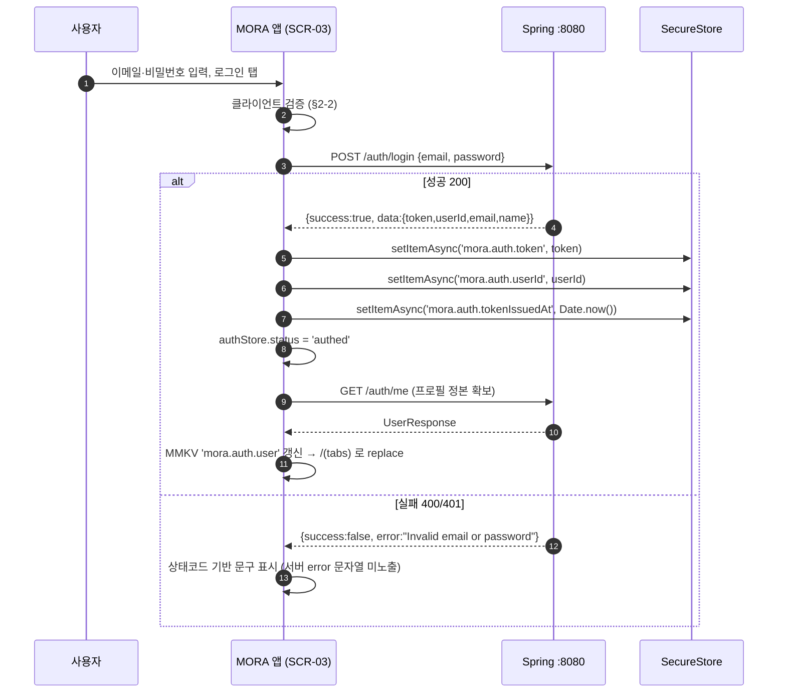
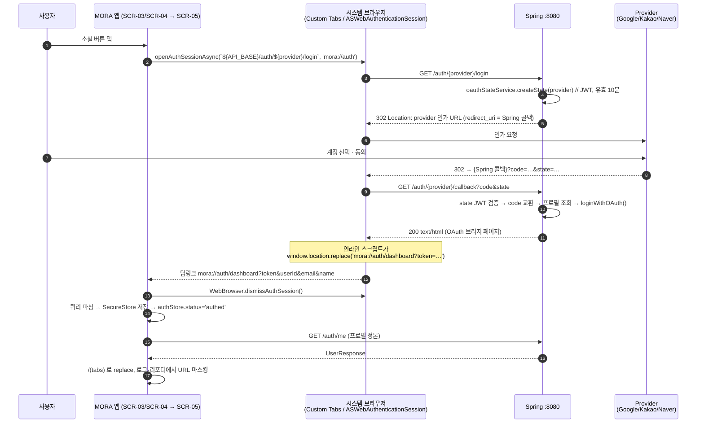

# Auth

이메일 로그인·회원가입, 소셜 OAuth 3종의 모바일 딥링크 흐름, SecureStore 토큰 관리, 401 처리와 인증 가드 라우팅.

상위: [[Architecture]]
관련: [[API Contract]] · [[Networking]] · [[Navigation Map]] · [[Screen Specs]] · [[Data Model]] · [[Risks]] · [[ADR-002 Backend Connectivity]]

---

## 1. 인증 모델 요약 (서버 현행, 수정 불가)

| 항목 | 값 | 근거 |
|---|---|---|
| 방식 | JWT Bearer, 서버 세션·쿠키 없음 (`SessionCreationPolicy.STATELESS`) | 원본: `backend/config/SecurityConfig.java` |
| 알고리즘 | HS256. 시크릿이 32바이트 미만이면 **0으로 zero-padding**, 초과면 절단 | 원본: `security/JwtUtil.java` |
| 클레임 | `sub`(userId), `email`, `user_id`, `iat`, `exp`. **롤/권한 클레임 없음** | 원본: `JwtUtil.generateToken` |
| 만료 | `JWT_EXPIRATION` 기본 **86,400,000ms = 24시간** | 원본: `application.yml` |
| 리프레시 토큰 | **없음.** 24시간 후 무조건 재로그인 | 코드에 발급/갱신 경로 부재 |
| 로그아웃 엔드포인트 | **없음.** 원본 주석 `// TODO: wire to /auth/logout endpoint` | 클라이언트 토큰 폐기만 가능 |
| 헤더 형식 | `Authorization: Bearer <jwt>` — **`Bearer ` 정확히 7자**(컨트롤러가 `substring(7)`) | 원본: 각 컨트롤러 `getUserId()` |
| 인가 위치 | Spring Security는 `anyRequest().permitAll()`. **401은 전부 컨트롤러 개별 코드**가 만든다 | 원본: `SecurityConfig` |
| `JwtFilter` 동작 | 토큰이 없거나 invalid여도 **필터를 통과시킨다.** SecurityContext만 비어 있음 | 원본: `security/JwtFilter.java` |
| 비밀번호 해시 | `BCryptPasswordEncoder()` 기본 강도 10 | 원본: `SecurityConfig` |

**결과적 함의**: 컨트롤러가 검사를 빼먹은 엔드포인트는 무방비다. 실제로 API-27/28/29/30(구글 캘린더 4종)이 그렇다 ([[API Contract]] §3-5, [[Risks]]).

---

## 2. 이메일 로그인 / 회원가입

### 2-1. 서버 검증 규칙 (코드 확인)

| 대상 | 서버 규칙 | 실패 시 |
|---|---|---|
| 회원가입 (API-01) | `email`, `password` **blank 아님**만 검사. 형식·길이·복잡도 검사 **전혀 없음** | 400 `"Email and password are required"` |
| 회원가입 — 중복 | `userRepository.existsByEmail` | 400 `"Email already exists"` |
| 회원가입 — 닉네임 | `SignupRequest`에 `name` 필드가 **없다.** 서버가 `email.split("@")[0]`로 자동 생성 | — |
| 로그인 (API-02) | blank 검사 → 이메일 조회 → 소셜 전용 계정 차단 → BCrypt 비교 | 400 `"Invalid email or password"` / `"This account requires social login"` |
| 비밀번호 변경 (API-05) | 소셜 계정 차단, 현재 비번 일치, **새 비번 8자 이상**, 현재와 달라야 함 | 400 각 문장 / **429** rate limit |
| 닉네임 변경 (API-04) | `trim()` 후 **2~20자**, `^[a-zA-Z0-9가-힣_.\-]+$` | 400 |
| 회원 탈퇴 (API-06) | 로컬 계정은 비밀번호 재확인, 소셜은 JWT만으로 삭제. 연관 데이터는 DB `ON DELETE CASCADE` | 400 `"비밀번호가 일치하지 않습니다."` |

원본: `backend/service/AuthService.java` (`validateSignupRequest`, `changePassword`, `changeName`, `deleteAccount`)

### 2-2. 앱 클라이언트 검증 (서버보다 엄격하게 선차단)

서버가 회원가입 시 아무 검증도 하지 않으므로 **앱이 유일한 방어선**이다.

| 필드 | 규칙 | 인라인 에러 문구 |
|---|---|---|
| 이메일 | `^[^\s@]+@[^\s@]+\.[^\s@]{2,}$`, 최대 254자, 소문자 정규화, 앞뒤 공백 제거 | `이메일 형식을 확인해 주세요.` |
| 비밀번호 (가입) | **8자 이상** 32자 이하. 서버 변경 규칙(8자)과 일치시켜, 가입 후 변경이 막히는 상황을 없앤다 | `비밀번호는 8자 이상이어야 합니다.` |
| 비밀번호 (가입) | 영문+숫자 각 1자 이상 권장 — **경고만**, 제출은 막지 않음 | `영문과 숫자를 함께 쓰면 더 안전합니다.` |
| 비밀번호 확인 (가입) | 일치 | `비밀번호가 일치하지 않습니다.` |
| 닉네임 (설정) | 2~20자, `^[a-zA-Z0-9가-힣_.\-]+$` | `2~20자, 한글·영문·숫자·_.- 만 사용할 수 있습니다.` |
| 새 비밀번호 (변경) | 8자 이상 + 현재 비번과 다름 | `8자 이상` / `현재 비밀번호와 다르게 설정해주세요.` |

**결정 — 회원가입 화면에 닉네임 입력 필드를 둔다.** 서버가 `name`을 무시하므로, 가입(API-01) 성공 직후 **API-04를 자동으로 한 번 더 호출**해 닉네임을 반영한다. 실패해도 가입은 성공 처리하고 설정 화면에서 재시도하도록 안내한다. 근거: 백엔드 수정 금지 + `email.split("@")[0]`이 그대로 노출되는 것이 상용 품질에 미달.

### 2-3. 이메일 로그인 흐름



- 로그인/회원가입 요청은 `auth: false`로 보낸다(토큰 미첨부). **토큰을 싣지 않은 요청의 401/400은 세션 만료가 아니라 자격증명 오류**이므로 세션 파기 훅을 타지 않는다(§5-1).
- 성공 직후 `/auth/me`(API-03)를 한 번 더 부르는 이유: `AuthResponse`에는 `picture`/`provider`/`createdAt`이 없어 설정 화면의 계정 종류 분기(로컬 vs 소셜)를 할 수 없다.

---

## 3. 소셜 OAuth (Google / Kakao / Naver)

### 3-1. 서버 흐름의 사실관계 (코드 근거)

1. **진입** `GET /auth/{provider}/login` → **302** + `Location: <provider 인가 URL>`. 인가 URL의 `redirect_uri`는 `app.oauth.{provider}.redirect-uri`, 즉 **Spring 서버 자신의 콜백 주소**다.
2. **state**는 서버가 만든 JWT다(`subject="oauth_state"`, `provider` 클레임, **유효기간 10분**, `app.jwt-secret` 재사용). 원본: `service/OAuthStateService.java`
3. **토큰 교환·프로필 조회는 전부 서버가 한다.** 앱은 provider와 직접 통신하지 않는다.

| provider | 토큰 엔드포인트 | 프로필 엔드포인트 | 특이사항 |
|---|---|---|---|
| google | `POST oauth2.googleapis.com/token` | `GET googleapis.com/oauth2/v2/userinfo` | scope `openid profile email` |
| kakao | `POST kauth.kakao.com/oauth/token` | `GET kapi.kakao.com/v2/user/me` | scope 미지정(콘솔 동의항목 의존). 이메일 미동의 시 `kakao_{id}@kakao.local` 가짜 이메일 생성 |
| naver | `POST nid.naver.com/oauth2.0/token` | `GET openapi.naver.com/v1/nid/me` | **네이버만 토큰 요청에도 `state` 재전송** |

4. **콜백 응답은 JSON도 302도 아니고 `text/html` 문서다** (`produces = TEXT_HTML_VALUE`). 그 HTML의 인라인 스크립트가 다음을 순서대로 시도한다:
   1. `localStorage.setItem('mora_token', ...)` — 앱 웹뷰/브라우저에서는 무의미
   2. `window.opener` 있으면 `postMessage({type:'MORA_OAUTH_LOGIN', ...})` 후 `window.close()`
   3. 없으면 **`window.location.replace(FRONTEND_URL + '/dashboard?token=…&userId=…&email=…&name=…')`**

   원본: `AuthController.buildOAuthSuccessHtml` (306~355행)

5. `FRONTEND_URL` 정규화는 **끝 슬래시 제거뿐**이다: `value.replaceAll("/+$", "")`. 원본: `AuthController.normalizeFrontendUrl`

### 3-2. 앱 스킴을 서버 "리다이렉트 URI 화이트리스트"에 추가해야 하는가 — 코드 기준 판정

**판정 1 — provider 콘솔에는 앱 스킴을 등록할 필요가 없다.**
근거: `GoogleOAuthService.getAuthorizationUrl()` / `KakaoOAuthService` / `NaverOAuthService`가 provider에 보내는 `redirect_uri`는 전부 `app.oauth.{provider}.redirect-uri`(= Spring 콜백 URL)이며, 앱이 provider와 직접 통신하는 경로가 코드 어디에도 없다. 따라서 provider 콘솔의 승인된 리디렉션 URI 목록에는 **Spring 콜백 URL만** 있으면 된다.

**판정 2 — 서버에는 "리다이렉트 URI 화이트리스트"라는 개념 자체가 없다.**
근거: `AuthController`에는 착지 URL을 검증·선택하는 코드가 없고, `app.frontend-url` 환경변수 값 하나를 문자열 연결해 쓴다(`'%s' + '/dashboard' + '?token=' + …`). 스킴 검사, 허용 목록 대조, 패턴 매칭이 전무하다. **따라서 앱 스킴을 "화이트리스트에 추가"할 대상이 없고, `FRONTEND_URL` 값을 앱 스킴으로 바꾸는 것이 유일한 제어점이다.**

**판정 3 — `FRONTEND_URL=mora://auth`로 두면 백엔드 코드 수정 없이 딥링크 복귀가 성립한다.**
`window.location.replace('mora://auth' + '/dashboard?token=...')` → `mora://auth/dashboard?token=…&userId=…&email=…&name=…`. 부수 효과로 구글 캘린더 콜백도 `mora://auth/dashboard/settings?calendar=connected&message=…`로 착지한다(`GoogleCalendarController.settingsRedirectUri`가 같은 `frontendUrl`을 쓴다). **앱이 이 두 딥링크 패턴만 처리하면 OAuth와 캘린더 연동이 동시에 해결된다.**
대가: 같은 서버 인스턴스를 쓰는 **웹 프론트의 소셜 로그인이 죽는다.**

**결정 — 개발 중에는 모바일 전용 서버 기동 프로파일을 쓴다.**
`FRONTEND_URL=mora://auth` 를 지정해 Spring을 띄우는 배치를 따로 둔다(웹 작업 시에는 기존 `start.bat`을 그대로 쓴다). 환경변수 변경일 뿐 백엔드 코드 수정이 아니므로 확정 의사결정 2를 위반하지 않는다. 클라우드 배포 페이즈에서 앱/웹을 동시 지원해야 하면, 그때 백엔드에 앱 전용 콜백 분기를 추가하는 것이 정석이다 — 그 판단은 [[ADR-002 Backend Connectivity]]의 후반 페이즈 항목으로 미룬다.

**결정 — 개발 중 소셜 OAuth 검증은 HTTPS 터널 뒤에서 수행한다.**
근거: Google OAuth 클라이언트의 승인된 리디렉션 URI는 `https://` 또는 `http://localhost`만 허용하므로 `http://192.168.0.10:8080/auth/google/callback`을 콘솔에 등록할 수 없다. 반면 폰 브라우저는 `localhost`를 자기 자신으로 해석하므로 `localhost` 등록도 무의미하다. 따라서 `cloudflared tunnel --url http://localhost:8080` 등으로 임시 HTTPS URL을 얻어 3개 provider의 `redirect_uri`를 그 URL로 통일한다.
**Phase 2의 기본 경로는 이메일 로그인이다.** LAN 평문으로 아무 제약 없이 동작한다. 소셜 3종은 터널 프로파일에서만 검증하고, QA 체크리스트에서도 별도 항목으로 분리한다 ([[QA Checklist]]).

**보안 주의** — 토큰이 **URL 쿼리스트링으로 전달된다.** 브라우저 히스토리·시스템 로그·`Linking` 이벤트 로그에 남을 수 있다. 앱은 다음을 지킨다:
- 딥링크 수신 즉시 토큰을 SecureStore로 옮기고 **URL 문자열을 어떤 로그에도 남기지 않는다**(로거에 `token=`, `code=`, `state=` 마스킹 규칙 추가).
- `WebBrowser` 세션은 토큰 수신 즉시 `dismissAuthSession()`으로 닫는다.
- Sentry 등 크래시 리포터의 breadcrumb URL 스크러빙을 켠다.

### 3-3. 앱 OAuth 흐름 (expo-auth-session + expo-web-browser)



실패 경로: `error` 파라미터 존재 / state 무효 → 서버가 **400 + 실패 HTML**을 반환한다. 이 HTML은 딥링크를 트리거하지 않으므로 앱에서는 사용자가 브라우저를 닫는 것으로 끝난다. `openAuthSessionAsync`가 `{type:'cancel'}` 또는 `{type:'dismiss'}`를 리턴하므로 앱은 이를 "취소 또는 실패"로 처리하고 `소셜 로그인에 실패했습니다. 다시 시도해 주세요.` 토스트를 띄운다.

### 3-4. 구현 스켈레톤

```ts
// app.json (또는 app.config.ts)
{ "expo": { "scheme": "mora" } }        // ★ mora://* 딥링크 수신의 전제
```

```ts
// src/features/auth/oauth.ts
import * as WebBrowser from 'expo-web-browser';
import * as Linking from 'expo-linking';
import { API_BASE } from '@/lib/api/env';

export type SocialProvider = 'google' | 'kakao' | 'naver';
const RETURN_URL = 'mora://auth';       // 서버 FRONTEND_URL 과 반드시 동일해야 한다

export type OAuthPayload = { token: string; userId: string; email: string; name: string };

/** 시스템 브라우저로 서버 OAuth 진입점을 열고, mora:// 딥링크로 돌아온 토큰을 파싱한다. */
export async function signInWithProvider(p: SocialProvider): Promise<OAuthPayload | null> {
  const result = await WebBrowser.openAuthSessionAsync(`${API_BASE}/auth/${p}/login`, RETURN_URL, {
    showInRecents: false,               // Android 최근앱 목록에 인증 화면을 남기지 않는다
    preferEphemeralSession: true,       // iOS: 기존 사파리 쿠키와 격리
  });
  if (result.type !== 'success') return null;      // cancel / dismiss / locked

  const { queryParams } = Linking.parse(result.url);   // mora://auth/dashboard?token=…
  const token = typeof queryParams?.token === 'string' ? queryParams.token : '';
  if (!token) return null;
  return {
    token,
    userId: String(queryParams?.userId ?? ''),
    email:  String(queryParams?.email ?? ''),
    name:   String(queryParams?.name ?? ''),
  };
}
```

```ts
// app/_layout.tsx 내부 — 콜드 스타트로 딥링크가 들어오는 경우까지 처리
useEffect(() => {
  const handle = (url: string) => {
    const { path, queryParams } = Linking.parse(url);
    if (queryParams?.token) { void auth.acceptOAuthToken(queryParams as any); return; }
    if (path?.endsWith('dashboard/settings') && queryParams?.calendar) {
      // 구글 캘린더 콜백도 같은 FRONTEND_URL 로 착지한다 (§3-2 판정 3)
      calendar.handleCallback(String(queryParams.calendar), String(queryParams.message ?? ''));
    }
  };
  void Linking.getInitialURL().then((u) => u && handle(u));
  const sub = Linking.addEventListener('url', (e) => handle(e.url));
  return () => sub.remove();
}, []);
```

`app/_layout.tsx` 최상단에 `WebBrowser.maybeCompleteAuthSession()`을 호출한다(웹 빌드 및 일부 Android 복귀 케이스 대응).

---

## 4. 토큰 저장과 세션 수명

### 4-1. 왜 SecureStore인가 — AsyncStorage 금지 근거

| 저장소 | 실제 저장 형태 | JWT 저장 적합성 |
|---|---|---|
| `AsyncStorage` | Android: 앱 내부 SQLite/파일에 **평문**. iOS: 파일에 평문 | **금지.** 루팅/탈옥 기기, `adb backup` 허용 빌드, 기기 백업 추출로 토큰이 그대로 유출된다. 암호화 계층이 전혀 없다 |
| MMKV (암호화 미설정) | 앱 샌드박스 내 mmap 파일. 평문 | 설정·캐시용으로만 사용 |
| **`expo-secure-store`** | Android: **Keystore**로 감싼 암호화 SharedPreferences / iOS: **Keychain** | **채택.** OS 키 저장소가 키를 보관하므로 파일만 뽑아도 복호화 불가 |

웹 원본은 `localStorage`에 `mora_token`/`mora_user`를 넣는다(원본: `frontend/lib/api.ts:6-9`). 모바일에서 그 구조를 그대로 옮기면 안 된다.

### 4-2. 저장 키와 코드

```ts
// src/features/auth/token-store.ts
import * as SecureStore from 'expo-secure-store';

const K = { token: 'mora.auth.token', userId: 'mora.auth.userId', issuedAt: 'mora.auth.tokenIssuedAt' } as const;
const OPTS: SecureStore.SecureStoreOptions = {
  keychainAccessible: SecureStore.WHEN_UNLOCKED_THIS_DEVICE_ONLY,  // 기기 백업으로 새 기기에 복사되지 않게
};

export async function saveSession(token: string, userId: string) {
  await Promise.all([
    SecureStore.setItemAsync(K.token, token, OPTS),
    SecureStore.setItemAsync(K.userId, userId, OPTS),
    SecureStore.setItemAsync(K.issuedAt, String(Date.now()), OPTS),
  ]);
}
export const readToken  = () => SecureStore.getItemAsync(K.token, OPTS);
export const readUserId = () => SecureStore.getItemAsync(K.userId, OPTS);
export async function readIssuedAt(): Promise<number> {
  const v = await SecureStore.getItemAsync(K.issuedAt, OPTS);
  return v ? Number(v) : 0;
}
export async function clearSession() {
  await Promise.all(Object.values(K).map((k) => SecureStore.deleteItemAsync(k, OPTS)));
}
```

- **생체인증 게이트(`requireAuthentication: true`)를 쓰지 않는다.** 근거: 앱 포그라운드 복귀·백그라운드 프리페치마다 지문 프롬프트가 뜨면 상용 UX가 무너진다. 앱 잠금이 필요하면 별도 기능으로 분리한다.
- **메모리 캐시를 둔다.** 매 요청마다 SecureStore를 읽으면 네이티브 브리지 왕복이 발생한다. `authStore`가 토큰을 메모리에 들고, `registerSession()`으로 `apiFetch`에 주입한다 ([[API Contract]] §5-4).

### 4-3. 자동 로그인 (부트스트랩)

```
스플래시 유지
 ├ 1. SecureStore에서 token / issuedAt / userId 읽기
 ├ 2. token 없음                    → status='guest' → (auth) 그룹
 ├ 3. issuedAt + 24h < now          → 만료 확정. clearSession() → status='guest' (네트워크 호출 안 함)
 ├ 4. 토큰 있음 → MMKV 'mora.auth.user' 스냅샷으로 status='authed' 선반영 (첫 화면 즉시 렌더)
 └ 5. 백그라운드로 GET /auth/me 검증
      ├ 200            → 프로필 갱신, MMKV 스냅샷 덮어쓰기
      ├ 401 / 400      → 세션 만료 처리 (§5)
      └ network/timeout → 세션 유지. 오프라인 배너 표시 ([[Offline and State]])
```

핵심 규칙 3가지:
1. **네트워크 실패를 로그아웃으로 해석하지 않는다.** LAN IP 오설정·서버 미기동이 흔한 개발 환경에서 사용자를 로그아웃시키면 원인 파악이 어려워진다.
2. **스플래시는 1~4단계까지만 잡는다.** 5단계는 화면을 그린 뒤 백그라운드로 돌린다.
3. `issuedAt`이 없거나 0이면(구버전 설치분) 검증 호출 결과로만 판정한다.

### 4-4. 앱 포그라운드 복귀 시 재검증

```ts
// src/features/auth/use-session-revalidate.ts
const REVALIDATE_AFTER = 5 * 60 * 1000;      // 마지막 검증 후 5분 경과 시에만
const WARN_BEFORE_EXPIRY = 60 * 60 * 1000;   // 만료 1시간 전 배너

useEffect(() => {
  const sub = AppState.addEventListener('change', async (state) => {
    if (state !== 'active' || auth.status !== 'authed') return;

    const issuedAt = await readIssuedAt();
    const age = Date.now() - issuedAt;
    if (issuedAt && age >= 24 * 60 * 60 * 1000) { auth.expireSession('exp'); return; }   // 선제 만료
    if (issuedAt && age >= 24 * 60 * 60 * 1000 - WARN_BEFORE_EXPIRY) auth.setExpiryWarning(true);

    if (Date.now() - auth.lastCheckedAt < REVALIDATE_AFTER) return;
    try { await refetchMe(); auth.markChecked(); }
    catch (e) { /* 401은 apiFetch가 이미 세션 만료 훅을 호출한다 */ }
  });
  return () => sub.remove();
}, [auth.status]);
```

**결정 — 만료 1시간 전 비차단 배너를 띄운다** (`로그인이 곧 만료됩니다. 저장하지 않은 스캔이 있다면 먼저 저장해 주세요.`). 근거: 리프레시 토큰이 없어 24시간 후 무조건 끊기는데, 스캔 편집 중에 끊기면 사용자가 작업물을 잃는다(draft는 MMKV에 남지만 사용자는 그 사실을 모른다).

### 4-5. 로그아웃 시 정리 목록

| # | 대상 | 방법 |
|---|---|---|
| 1 | SecureStore `mora.auth.token` / `.userId` / `.tokenIssuedAt` | `clearSession()` |
| 2 | 메모리 토큰 · `authStore` 상태 | `status='guest'`, 토큰 필드 null |
| 3 | React Query 전체 캐시 | `queryClient.clear()` |
| 4 | MMKV `cache` 인스턴스 (persist된 쿼리 캐시) | `cacheStorage.clearAll()` |
| 5 | MMKV `mora.auth.user` | `delete()` |
| 6 | MMKV `mora.scan.draft` | `delete()` — 다른 계정에 남의 스캔이 뜨면 안 된다 |
| 7 | MMKV `mora.search.recent` | `delete()` |
| 8 | `expo-image` 디스크·메모리 캐시 | `Image.clearDiskCache()` + `clearMemoryCache()` — 남의 문서 이미지 잔존 방지 |
| 9 | 진행 중 업로드/요청 | 전역 `AbortController` abort |
| 10 | 라우팅 | `router.replace('/(auth)/login')` |

유지: `mora.onboarding.seen`, `mora.settings.prefs`(테마·햅틱), `mora.env.override`(개발 빌드 LAN IP).
**회원 탈퇴(API-06) 시에는 `mora.onboarding.seen`까지 포함해 전부 삭제**한다.

서버에 로그아웃 엔드포인트가 없으므로 **발급된 JWT는 만료 전까지 서버에서 계속 유효하다.** 기기 분실 시 원격 무효화 수단이 없다 → [[Risks]] 등재.

---

## 5. 401 처리 정책

### 5-1. 판정 규칙

| 조건 | 판정 | 처리 |
|---|---|---|
| HTTP **401** + 요청에 토큰을 실었음 | 세션 만료 | 세션 파기 시퀀스 (§5-2) |
| HTTP **400** + 경로가 `/auth/me*` + 토큰 실음 | 세션 만료 | 동일. 근거: AuthController는 `RuntimeException`을 400으로 내리므로 만료 토큰이 400으로 나올 수 있다. 웹도 `res.status === 401 \|\| res.status === 400`으로 동일 처리한다 |
| HTTP 401/400 + **토큰 미첨부** (`auth:false`) | 자격증명 오류 | 로그인 폼 인라인 에러. 세션 파기 안 함 |
| HTTP 400 + 그 외 경로 | 도메인 실패 | 화면별 에러 처리 |
| HTTP **429** (API-05) | rate limit | `요청이 너무 잦습니다. 1분 후 다시 시도해 주세요.` 세션 유지 |

### 5-2. 세션 파기 시퀀스 (일괄 처리)

```ts
// src/features/auth/store.ts (발췌)
async function expireSession(reason: 'unauthorized' | 'exp') {
  if (get().status !== 'authed') return;                 // 중복 실행 방지
  set({ status: 'expiring' });

  const returnTo = router.canGoBack() ? currentPathname() : undefined;   // 재로그인 후 복귀 지점

  abortAllInFlight();                                    // 진행 중 요청·업로드 취소
  await clearSession();                                  // SecureStore
  queryClient.clear();
  cacheStorage.clearAll();
  storage.delete('mora.auth.user');
  storage.delete('mora.scan.draft');

  set({ status: 'guest', token: null, user: null });
  toast.info('로그인 세션이 만료되었습니다. 다시 로그인해 주세요.');
  router.replace({ pathname: '/(auth)/login', params: returnTo ? { returnTo } : {} });
}
```

- **동시 요청 다중 401 방지**: `notifySessionExpired()`가 3초 디바운스를 건다 ([[API Contract]] §5-4). 목록 5개가 동시에 401을 받아도 토스트와 라우팅은 1회만 실행된다.
- **`returnTo` 복귀**: 재로그인 성공 후 `returnTo`가 있으면 그 경로로, 없으면 홈으로 이동한다.
- **스캔 편집 중 만료**: draft는 위 시퀀스에서 삭제되지만, 편집 화면은 사라지기 전에 `저장하지 않은 스캔이 있습니다` 확인 다이얼로그를 띄운다(§4-4 배너와 짝). 사용자가 "유지"를 고르면 draft를 남기고 재로그인 후 복원한다.

### 5-3. 401을 세션 만료로 보지 않는 예외

| 엔드포인트 | 이유 |
|---|---|
| API-01/02 (`/auth/signup`, `/auth/login`) | 토큰 미첨부 요청. 자격증명 오류 |
| API-41 (`/api/scan`) | 비회원 스캔 허용 엔드포인트라 401 자체가 나오지 않는다. 401이 오면 프록시/게이트웨이 문제로 간주하고 네트워크 에러로 처리 |
| API-31 (`/api/chat`) | 컨트롤러에 401 반환 경로가 없다. 401이 올라오면 **하위 LLM 홉에서 Spring 검색 API를 재호출할 때 만료된 것**이므로 세션 만료로 처리한다 (웹도 동일) |

---

## 6. 인증 가드 라우팅 (expo-router)

### 6-1. 라우트 그룹 구조

라우트 경로의 진실 공급원은 [[Navigation Map]]과 [[Screen Specs]] §0-4다. 이 문서는 **가드가 걸리는 위치**만 정리한다.

| 가드 지점 | 파일 | 판정 | 동작 |
|---|---|---|---|
| 부팅 게이트 | `app/index.tsx` (SCR-01) | `status === 'loading'` | 스플래시 유지, UI 렌더 없음 |
| 부팅 게이트 | `app/index.tsx` | `status === 'guest'` | `<Redirect href="/(onboarding)" />` (미열람) 또는 `/(auth)/login` |
| 부팅 게이트 | `app/index.tsx` | `status === 'authed'` | `<Redirect href="/(tabs)" />` |
| 보호 영역 | `app/(tabs)/_layout.tsx` | `status !== 'authed'` | `<Redirect href="/(auth)/login" />` |
| 보호 영역 | `app/(tabs)/_layout.tsx` 밖의 인증 필요 스택(`app/scan/*`, `app/doc/*`, `app/settings/*`, `app/chat.tsx`, `app/notifications.tsx`, `app/calendar.tsx`, `app/groups.tsx`, `app/viewer.tsx`) | 동일 | 각 스택 루트 `_layout.tsx`에서 동일 가드 컴포넌트 재사용 |
| 역방향 가드 | `app/(auth)/_layout.tsx` | `status === 'authed'` | `<Redirect href="/(tabs)" />` |
| 역방향 가드 | `app/(onboarding)/_layout.tsx` | `status === 'authed'` | `<Redirect href="/(tabs)" />` |

**결정 — 가드는 `<AuthGate>` 컴포넌트 하나로 구현하고 각 보호 스택의 `_layout.tsx`에서 감싼다.** 화면마다 인증 체크를 흩뿌리지 않는다(원본 웹도 `dashboard/layout.tsx` 한 곳에서만 걸었다).

### 6-2. 가드 구현

```tsx
// app/_layout.tsx
export default function RootLayout() {
  const status = useAuth((s) => s.status);
  useEffect(() => { void bootstrapAuth(); }, []);                 // §4-3
  useEffect(() => { if (status !== 'loading') void SplashScreen.hideAsync(); }, [status]);
  if (status === 'loading') return null;                          // 스플래시가 떠 있는 구간
  return (
    <Providers>
      <Stack screenOptions={{ headerShown: false }}>
        <Stack.Screen name="index" />          {/* SCR-01 부팅 게이트 */}
        <Stack.Screen name="(onboarding)" />
        <Stack.Screen name="(auth)" />
        <Stack.Screen name="(tabs)" />
      </Stack>
    </Providers>
  );
}

// src/features/auth/AuthGate.tsx — 모든 보호 스택이 재사용하는 단일 가드
export function AuthGate({ children }: { children: React.ReactNode }) {
  const status = useAuth((s) => s.status);
  const pathname = usePathname();
  if (status === 'loading') return null;
  if (status !== 'authed') {
    return <Redirect href={{ pathname: '/(auth)/login', params: { returnTo: pathname } }} />;
  }
  return <>{children}</>;
}

// app/(tabs)/_layout.tsx — 보호 영역
export default function TabsLayout() {
  return (
    <AuthGate>
      <Tabs screenOptions={{ headerShown: false }}>{/* 탭 정의는 [[Navigation Map]] */}</Tabs>
    </AuthGate>
  );
}

// app/(auth)/_layout.tsx — 역방향 가드
export default function AuthLayout() {
  const status = useAuth((s) => s.status);
  if (status === 'authed') return <Redirect href="/(tabs)" />;
  return <Stack screenOptions={{ headerShown: false }} />;
}

// app/index.tsx (SCR-01) — 부팅 게이트, UI 없음
export default function Boot() {
  const status = useAuth((s) => s.status);
  const seenOnboarding = useSettings((s) => s.onboardingSeen);
  if (status === 'loading') return null;                       // 스플래시 유지 구간
  if (status === 'authed') return <Redirect href="/(tabs)" />;
  return <Redirect href={seenOnboarding ? '/(auth)/login' : '/(onboarding)'} />;
}
```

규칙 4가지:
1. **가드는 `AuthGate` 하나로 통일한다.** 개별 화면에 인증 체크를 흩뿌리지 않는다(원본 웹도 `dashboard/layout.tsx` 한 곳에서만 걸었다).
2. **`Redirect`를 쓰고 `router.replace`를 `useEffect`에서 부르지 않는다.** 첫 프레임에 보호된 화면이 잠깐 노출되는 것을 막는다.
3. `status === 'loading'` 동안에는 어떤 보호 화면도 렌더링하지 않는다(깜빡임 방지).
4. 딥링크로 보호된 경로에 직접 진입하면 `AuthGate`가 `returnTo`를 실어 로그인으로 보내고, 로그인 성공 후 그 경로로 복귀시킨다.

---

## 7. 보안 — 평문 HTTP 허용 범위

### 7-1. 문제

기본 URL이 `http://192.168.0.10:8080` / `:8000`이다. Android는 **API 28(Android 9)부터 cleartext HTTP를 기본 차단**한다. 아무 설정 없이 APK를 만들면 모든 요청이 `java.io.IOException: Cleartext HTTP traffic to 192.168.0.10 not permitted`로 실패한다.

### 7-2. 프로파일별 정책

| EAS 프로파일 | cleartext | 적용 방법 | 대상 |
|---|---|---|---|
| `development` | **허용** | `usesCleartextTraffic: true` | LAN IP 개발 |
| `preview` (내부 배포 APK) | **제한 허용** | network security config의 `domain-config`로 **사설 IP 대역만** 허용 | 팀 내 실기기 테스트 |
| `production` | **금지** | `usesCleartextTraffic: false`, HTTPS 전용 | 릴리스 APK |

`app.config.ts`에서 `process.env.APP_VARIANT` 값으로 `expo-build-properties` 플러그인 옵션을 분기한다. 구체적 설정 파일과 XML은 [[Networking]] §2에 둔다.

### 7-3. 릴리스 빌드 보안 체크리스트

| # | 항목 | 확인 |
|---|---|---|
| 1 | `usesCleartextTraffic`가 production에서 `false` | `apktool`로 `AndroidManifest.xml` 확인 |
| 2 | `network_security_config.xml`에 개발용 사설 IP 예외가 남아 있지 않음 | 병합된 매니페스트 확인 |
| 3 | JWT가 SecureStore에만 있고 MMKV/AsyncStorage/로그에 없음 | 코드 grep + 로그 캡처 |
| 4 | 로거·크래시 리포터가 `token=`/`code=`/`state=`/`Authorization` 값을 마스킹 | 로거 유닛 테스트 |
| 5 | `console.log`가 릴리스에서 제거됨 (`babel-plugin-transform-remove-console`) | 번들 검사 |
| 6 | 딥링크 파라미터를 신뢰하지 않음 — `token`만 취하고 `userId/email/name`은 `/auth/me`로 덮어씀 | 코드 리뷰 |
| 7 | `preferEphemeralSession: true`, `showInRecents: false` 적용 | 코드 리뷰 |
| 8 | 스크린샷 방지(Android `FLAG_SECURE`)는 **적용하지 않음** — 문서 뷰어 앱이라 사용자 스크린샷 수요가 정상 | 의도적 결정 |
| 9 | `android:allowBackup="false"` 설정 | 토큰·draft가 `adb backup`으로 새어 나가지 않게 |
| 10 | 구글 캘린더 무방비 API(API-27~30) 호출 시 userId를 `/auth/me` 응답에서만 취득 | 코드 리뷰 |

세부 절차와 서명 검증은 [[APK Build]], 잔여 위험 목록은 [[Risks]].
