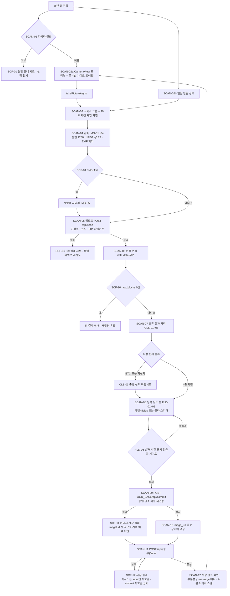
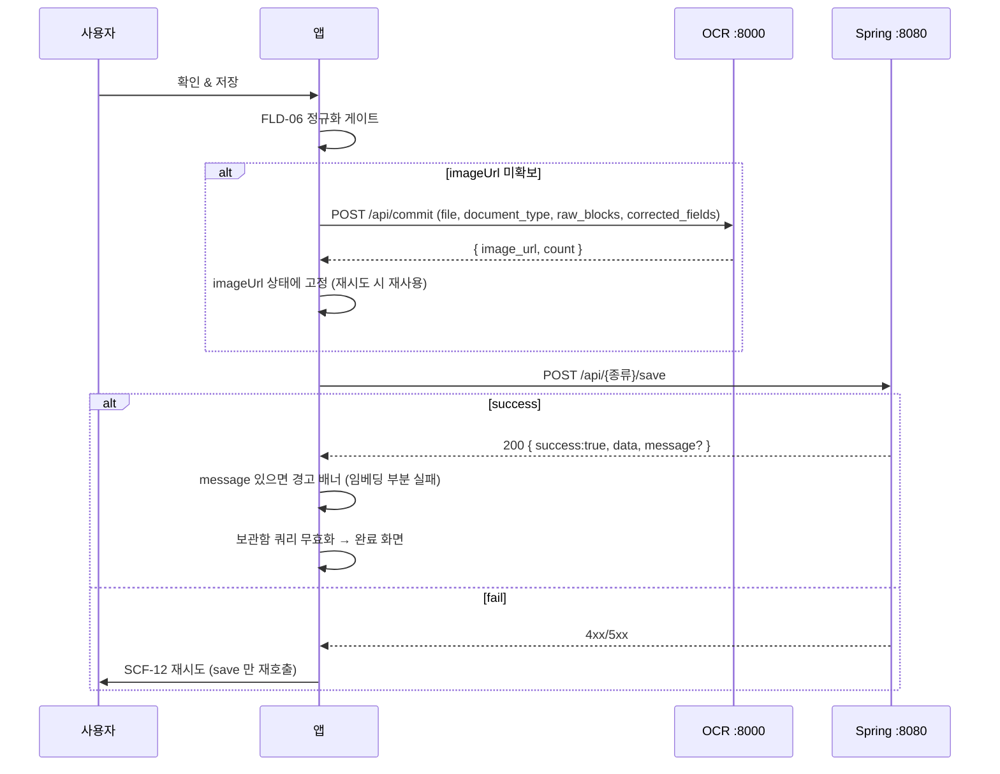

# Camera and Scan

MORA 모바일의 핵심 기능인 "촬영 → OCR → 분류 → 필드 편집 → 저장" 전체 파이프라인의 구현 규격. 수치·문구·실패 처리까지 확정한다.

상위: [[Architecture]]
관련: [[API Contract]] · [[Data Model]] · [[Screen Specs]] · [[Offline and State]] · [[Networking]] · [[Phases]] · [[Risks]]

---

## 0. 이 문서의 ID 체계

| 접두사 | 대상 | 예 |
|---|---|---|
| `SCAN-##` | 파이프라인 단계 | SCAN-04 압축 |
| `IMG-##` | 이미지 전처리 규격 결정 | IMG-01 최대 장변 |
| `CLS-##` | 분류 결과 처리 정책 | CLS-02 중신뢰 확인 바 |
| `FLD-##` | 필드 편집/검증 규칙 | FLD-06 날짜 정규화 게이트 |
| `SCF-##` | 실패 케이스 | SCF-03 저장공간 부족 |

기능요구(`FR-###`)·비기능요구(`NFR-###`)·화면(`SCR-##`)·컴포넌트(`CMP-##`)는 각각 [[Requirements]] · [[Screen Specs]] · [[Component Library]]가 소유한다. API ID(`API-##`)는 [[API Contract]]와 동일 번호를 쓴다.

---

## 1. 서버 계약 요약 (이 파이프라인이 의존하는 사실)

| 사실 | 값 | 근거 |
|---|---|---|
| 스캔 엔드포인트 | `POST {API_BASE}/api/scan` (API-41), multipart part 이름 `file`, **인증 불필요** | 원본: `backend/.../controller/OcrController.java` |
| 스캔 부작용 | **없음.** 임시파일로 처리 후 `finally`에서 삭제. 응답 `image_url`은 **항상 `""`** | 원본: `ocr/routers/ocr.py` |
| 스캔 응답 래핑 | **이중 래핑** `{success, data:{success, data:{...}}}` | 원본: `backend/.../service/OcrService.java` + `frontend/lib/api.ts:83-99` |
| 서버 이미지 정규화 | EXIF 회전 보정 → RGB 변환 → 긴 변 `MAX_IMAGE_SIDE = 1280` 초과 시 LANCZOS 축소 → `quality=90, optimize=True` 재저장 | 원본: `ocr/routers/ocr.py normalize_uploaded_image()` |
| Spring 업로드 한도 | `spring.servlet.multipart.max-file-size: 10MB` / `max-request-size: 10MB` | 원본: `backend/src/main/resources/application.yml` |
| 한도 초과 응답 | `@ControllerAdvice`가 없어 `ApiResponse` 포맷이 **아닌** Spring 기본 에러 JSON | 원본: 04-api 함정 12 |
| 커밋 엔드포인트 | `POST {OCR_BASE}/api/commit` — **Spring 우회, 인증 없음**, parts: `file`, `document_type`, `raw_blocks`(JSON 문자열), `corrected_fields`(JSON 문자열) | 원본: `ocr/routers/ocr.py commit_document()` |
| 커밋 부작용 | `ocr/uploads/{TYPE}/{uuid}.jpg` 영구 저장 + `ner_dataset` 라벨 누적. 응답 `{image_url, count}`, `image_url`은 **상대경로** | 원본: 동일 |
| 저장 엔드포인트 | 명함 API-13 `/api/cards/save` · 포스터 API-42 · 영수증 API-48 · 티켓 API-56. 전부 **200** 반환(201 아님) | 원본: 각 Controller |
| 저장 스키마 비대칭 | 명함만 `imageUrl` 정식 컬럼 + `rawOcrText`(개행 JOIN 문자열). 나머지 3종은 `docType + classificationConfidence + rawText[] + parsedJson + rawJson` 5종 세트, imageUrl은 `parsedJson` 안에 매립 | 원본: `frontend/lib/api.ts:172-267` |
| 서버 타임아웃 | Spring `RestTemplate`에 connect/read 타임아웃 **미설정(무제한)**, Hikari pool max 3 | 원본: `backend/.../config/RestTemplateConfig.java` |

**결정:** 백엔드는 무수정이므로 위 계약을 그대로 수용한다. 앱은 **base URL 2개**(`API_BASE`=:8080, `OCR_BASE`=:8000)를 모두 알아야 한다. 상세는 [[ADR-002 Backend Connectivity]].

---

## 2. 파이프라인 전체 (SCAN-01 ~ SCAN-12)



### 2-1. 단계별 책임

| ID | 단계 | 구현 위치(예정) | 실패 시 |
|---|---|---|---|
| SCAN-01 | 권한 확인 | `hooks/useCameraPermission.ts` | SCF-01 |
| SCAN-02a | 촬영 | `app/(app)/scan/camera.tsx` | SCF-02 |
| SCAN-02b | 앨범 선택 | 동일 화면의 앨범 버튼 | SCF-02 |
| SCAN-03 | 크롭/회전 | `app/(app)/scan/adjust.tsx` | 되돌아가 재촬영 |
| SCAN-04 | 압축 | `features/scan/prepareImage.ts` | SCF-03 / SCF-04 |
| SCAN-05 | 스캔 업로드 | `features/scan/uploadScan.ts` | SCF-06~09 |
| SCAN-06 | 응답 언랩 | `features/scan/unwrapScan.ts` | SCF-09 |
| SCAN-07 | 분류 확정 | `features/scan/classify.ts` | CLS-03로 폴백 |
| SCAN-08 | 동적 폼 | `app/(app)/scan/review.tsx` | — |
| SCAN-09 | 커밋 | `features/scan/commitImage.ts` | SCF-11 |
| SCAN-10~11 | 저장 | `features/scan/saveDocument.ts` | SCF-12 |
| SCAN-12 | 완료 | `app/(app)/scan/done.tsx` | — |

디렉터리 규약 정본은 [[Directory Structure]].

---

## 3. SCAN-01 권한 정책

| 권한 | 요청 시점 | API | 미허용 시 동작 |
|---|---|---|---|
| 카메라 | 스캔 탭에서 **촬영 버튼을 처음 누를 때** (탭 진입 즉시 아님) | `expo-camera` `useCameraPermissions()` | SCF-01 시트 → `Linking.openSettings()` |
| 사진 라이브러리 읽기 | 앨범 버튼 탭 시 | `expo-image-picker` `launchImageLibraryAsync` | SCF-02 |
| 사진 라이브러리 쓰기 | **요청하지 않음** | — | — |
| 마이크 | **요청하지 않음** | — | — |

**결정 (권한 최소화):** 촬영본을 기기 앨범에 저장하지 않는다 → `expo-media-library`를 의존성에 넣지 않고 `WRITE_EXTERNAL_STORAGE` / `NSPhotoLibraryAddUsageDescription`을 선언하지 않는다. 이유: 앱의 저장소는 서버(`ocr/uploads/`)이고, 앨범 쓰기 권한은 스토어 심사·사용자 신뢰 비용만 늘린다.

**결정 (iOS 사진 접근):** `expo-image-picker`는 iOS 14+에서 PHPicker를 사용하므로 라이브러리 읽기 권한 프롬프트가 뜨지 않는다. 그래도 `NSPhotoLibraryUsageDescription` 문자열은 심사 대비로 app.json에 넣는다. 문구는 [[APK Build]]에 고정한다(Android APK가 1차 산출물이지만 문자열은 공용).

Android 권한 선언 (app.json `android.permissions`): `CAMERA`, `READ_MEDIA_IMAGES`(API 33+), `INTERNET`. `READ_EXTERNAL_STORAGE`는 `maxSdkVersion 32`로 제한.

---

## 4. SCAN-02a expo-camera 설정

```tsx
<CameraView
  ref={cameraRef}
  style={StyleSheet.absoluteFill}
  facing="back"              // 문서 촬영은 항상 후면
  ratio="4:3"                // Android 전용 prop. 센서 네이티브 비율 = 최대 화각
  pictureSize={pictureSize}  // 아래 4-2 선택 규칙
  flash={flash}              // 'off' | 'on' | 'auto'  (기본 'off')
  enableTorch={torch}        // 저조도 보조광. flash와 분리 제공
  autofocus="on"             // 연속 AF
  zoom={0}
  animateShutter={false}     // 셔터 애니메이션 대신 자체 햅틱 사용
  onCameraReady={handleReady}
/>
```

촬영:

```ts
const photo = await cameraRef.current.takePictureAsync({
  quality: 0.9,        // 캡처 단계는 넉넉히. 최종 압축은 SCAN-04가 담당
  skipProcessing: false, // Android 회전 보정을 위해 반드시 false
  exif: false,         // GPS/기기정보 제거 (개인정보). 회전은 픽셀에 이미 반영됨
  base64: false,       // 메모리 폭증 방지. 업로드는 uri 기반
});
// photo: { uri, width, height }
```

### 4-1. 설정 근거

| 항목 | 값 | 근거 |
|---|---|---|
| `facing` | `back` 고정 | 문서 스캔에 전면 카메라 용례 없음 |
| `ratio` | `4:3` | 센서 네이티브 비율. `16:9`는 상하를 크롭해 A4 포스터가 프레임을 벗어남 |
| `flash` 기본 | `off` | 원본 업로드 팁 원문: `빛 반사나 그림자가 없는 정면 촬영을 권장합니다.` 코팅 명함/감열 영수증은 플래시가 반사로 OCR을 망친다 |
| `exif` | `false` | 서버가 어차피 `exif_transpose` 후 재저장하므로 EXIF 보존 이득 0. GPS 유출만 남음 |
| `base64` | `false` | 1280px JPEG base64는 문자열로 힙에 상주 → Android 저사양 기기 OOM 위험 |
| `autofocus` | `on` + 탭 포커스 | 근접 촬영(명함 10~20cm)에서 초점 실패가 가장 흔한 OCR 실패 원인 |

### 4-2. `pictureSize` 선택 규칙 (결정)

`getAvailablePictureSizesAsync()` 결과에서 **4:3 비율이면서 장변이 1600~2400px 구간에 있는 가장 작은 값**을 고른다. 없으면 `undefined`(플랫폼 기본).

이유: 최종 전송 장변이 1280px(IMG-01)이므로 12MP(4032px) 원본을 캡처하면 디스크 쓰기 + 디코드 + 리사이즈에 저사양 기기 기준 1~2초를 그냥 버린다. 1600~2400px은 크롭(SCAN-03)으로 최대 40%를 잘라내도 1280px을 확보할 수 있는 하한선이다.

### 4-3. 촬영 가이드 오버레이 프레임

프레임은 **화면 폭의 88%**를 기준 폭으로 잡고 문서 종류별 종횡비로 높이를 계산한다. 사용자가 상단 세그먼트로 종류를 미리 고르면 그에 맞는 프레임을, 고르지 않으면 `자동`을 쓴다.

| 모드 | 종횡비 (가로:세로) | 프레임 형태 | 근거 |
|---|---|---|---|
| `자동` (기본) | 프레임 없음, 4모서리 마커만 | 전체 화각 | 서버가 분류하므로 강제하지 않는다 |
| 명함 | `1.75 : 1` (가로) | 가로 카드 | 표준 명함 90×50mm = 1.8:1. 여백 고려 1.75 |
| 영수증 | `1 : 2.2` (세로) | 세로 긴 띠 | 감열지 영수증은 폭 58~80mm에 길이 가변. 2.2는 잘리는 하단을 사용자가 인지하게 하는 하한 |
| 포스터 | `1 : 1.414` (세로) | A4/A3 세로 | ISO 216 √2 비율 |
| 티켓 | `1.6 : 1` (가로) | 가로 카드 | 항공 탑승권/KTX 승차권 실측 대역. 다만 모바일 티켓 캡처는 세로가 많아 **프레임 밖 촬영을 막지 않는다** |

오버레이 스펙 (색상 토큰은 [[Design Tokens]]):

- 프레임 라인: 2px, `point #0077B6`, 모서리 12px 굵은 L자 마커 4개
- 프레임 밖: `rgba(15,23,42,0.45)` 마스크
- 하단 힌트 텍스트 1줄 (모드별): 예 `명함을 프레임에 맞춰 정면에서 촬영하세요`
- **가이드는 크롭을 강제하지 않는다.** 전체 화각을 캡처하고 프레임은 안내용. 이유: 서버가 EXIF/리사이즈만 하지 perspective 보정을 하지 않으므로, 잘못 자른 이미지는 복구 불가.

---

## 5. SCAN-03 크롭 · 회전

**결정:** v1은 **직사각 크롭 + 90° 단위 회전**만 제공한다. 4점 자유 사각형 원근 보정(perspective dewarp)은 v1 범위 밖.

이유:
1. Expo 관리형 워크플로에 원근 보정 기본 제공이 없다. `react-native-document-scanner-plugin` 등은 네이티브 모듈 + config plugin이 필요해 Phase 0의 "빈 껍데기 APK 관통"을 깨뜨릴 위험이 있다.
2. 서버 OCR(`PaddleOCR`)은 `use_doc_unwarping=False`, `use_doc_orientation_classify=False`로 켜져 있어 어차피 왜곡 보정을 하지 않는다 — 클라이언트가 보정해도 서버가 활용하는 구조가 아니다. 정면 촬영 유도(가이드 프레임)가 비용 대비 효과가 크다.
3. 재검토 트리거: 실사용 스캔의 **재촬영률 > 25%** 또는 명함 OCR 필드 누락률이 목표치를 넘으면 Phase 7에서 원근 보정 도입을 재검토한다.

UI: 크롭 화면은 상단 이미지 + 하단 액션(`회전`, `초기화`, `다시 촬영`, `사용하기`). 크롭 박스 기본값은 SCAN-02a에서 쓴 가이드 프레임 영역, `자동` 모드면 전체.

---

## 6. SCAN-04 이미지 전처리 규격 (IMG-01 ~ IMG-06)

### 6-1. 확정 수치

| ID | 항목 | 값 | 근거 |
|---|---|---|---|
| IMG-01 | 최대 장변 | **1280 px** | 서버가 `MAX_IMAGE_SIDE = 1280`으로 즉시 축소한다. 1280을 넘겨 보내면 **OCR 정확도 이득이 정확히 0**이고 전송 바이트/시간만 늘어난다. 원본: `ocr/routers/ocr.py` |
| IMG-02 | 최소 장변 | **1024 px** | 이 아래로 줄이면 감열 영수증 8~10pt 글자가 PaddleOCR 인식 하한에 걸린다. 재압축 사다리의 바닥값으로만 사용 |
| IMG-03 | 포맷 | **JPEG** | 서버가 `.convert("RGB")` 후 JPEG로 재저장한다. PNG/HEIC를 보내면 서버 디코드 비용만 추가 |
| IMG-04 | 품질 | **0.85** | q0.9는 q0.85 대비 파일이 ~35% 커지는데 서버가 다시 q90으로 재인코딩하므로 최종 화질 차이가 사라진다. q0.75 이하에서는 8pt 한글 획이 블록 아티팩트로 뭉개진다 |
| IMG-05 | 목표 용량 | **≤ 1.2 MB** | 1280×960 q0.85 실측 대역(0.3~0.9MB)의 상단 여유값. LAN(Wi-Fi) 기준 업로드 1초 이내 |
| IMG-06 | 하드 상한 | **8 MB** | Spring `max-request-size: 10MB`에서 멀티파트 헤더·boundary·필드 오버헤드 여유 2MB를 뺀 값. 초과 시 SCF-04 |
| IMG-07 | 메타데이터 | EXIF/GPS **전부 제거** | `exif: false` + manipulator가 메타를 승계하지 않음 |

### 6-2. 재압축 사다리 (IMG-05 초과 시)

| 회차 | 장변 | 품질 | 통과 조건 |
|---|---|---|---|
| 1 | 1280 | 0.85 | ≤ 1.2 MB |
| 2 | 1280 | 0.70 | ≤ 2.5 MB |
| 3 | 1024 | 0.70 | ≤ 8 MB |
| 실패 | — | — | SCF-04 |

3회차까지도 8MB를 넘는 경우는 실질적으로 발생하지 않지만(1024px q0.7은 통상 200KB 이하), 파노라마·스크린샷 합성 이미지 같은 이상값을 위해 게이트를 남긴다.

### 6-3. 구현

```ts
// features/scan/prepareImage.ts
import { manipulateAsync, SaveFormat } from 'expo-image-manipulator';
import * as FileSystem from 'expo-file-system/legacy';

export type PreparedImage = { uri: string; name: string; type: 'image/jpeg'; bytes: number };

const LADDER = [
  { side: 1280, compress: 0.85, limit: 1.2 * 1024 * 1024 },
  { side: 1280, compress: 0.70, limit: 2.5 * 1024 * 1024 },
  { side: 1024, compress: 0.70, limit: 8.0 * 1024 * 1024 },
] as const;

export async function prepareImage(
  uri: string,
  width: number,
  height: number,
): Promise<PreparedImage> {
  for (const step of LADDER) {
    // 장변 기준 리사이즈: 가로가 길면 width, 세로가 길면 height 를 지정한다.
    const resize = width >= height ? { width: step.side } : { height: step.side };
    const skipResize = Math.max(width, height) <= step.side; // 확대 금지

    const out = await manipulateAsync(
      uri,
      skipResize ? [] : [{ resize }],
      { compress: step.compress, format: SaveFormat.JPEG },
    );
    const info = await FileSystem.getInfoAsync(out.uri, { size: true });
    const bytes = info.exists ? (info.size ?? 0) : 0;
    if (bytes > 0 && bytes <= step.limit) {
      return { uri: out.uri, name: 'scan.jpg', type: 'image/jpeg', bytes };
    }
  }
  throw new ScanError('IMAGE_TOO_LARGE'); // → SCF-04
}
```

**결정 (SDK API 고정):** `expo-image-manipulator`는 SDK 53+에서 컨텍스트 API(`ImageManipulator.manipulate(...).renderAsync()`)를 도입하며 `manipulateAsync`를 deprecated 표시했고, `expo-file-system`은 SDK 54에서 신규 API로 교체되며 업로드 태스크가 `expo-file-system/legacy`로 이동했다. **Expo SDK 버전을 [[Tech Stack]]에서 하나로 고정하고, 이 문서의 임포트 경로는 그 버전에 맞춰 Phase 0에서 1회 확정한다.** 알고리즘(사다리·수치)은 API 버전과 무관하게 유효하다.

**결정 (동일 파일 재사용):** `prepareImage()` 결과 URI는 `/api/scan`과 `/api/commit`에 **같은 파일을 그대로** 보낸다. 재압축 금지. 이유: 두 요청의 이미지가 달라지면 `ner_dataset`에 저장되는 학습 라벨과 실제 OCR 입력이 어긋난다.

---

## 7. SCAN-05 / SCAN-09 멀티파트 업로드 (RN 특이사항)

### 7-1. 웹 `File`과 다른 점 — 반드시 지켜야 할 5가지

| # | 웹 | React Native | 위반 시 증상 |
|---|---|---|---|
| 1 | `formData.append('file', fileObject)` — `File`은 Blob 상속 | `File`/디스크 `Blob`이 **없다.** `{ uri, name, type }` 객체를 append | Android에서 `[object Object]` 문자열이 전송됨 |
| 2 | `name`은 `File.name`에서 자동 | `name`을 **직접 넣어야 함** | Spring `ByteArrayResource.getFilename()`이 null → OCR이 `suffix`를 못 구해 임시파일 확장자가 비고 PIL 저장이 실패 |
| 3 | `type`은 브라우저가 추론 | `type`을 **직접 넣어야 함** | `application/octet-stream`으로 전송 → 서버 측 이미지 판정 실패 위험 |
| 4 | `Content-Type` 미지정이 관용 | 동일하게 **절대 지정 금지** | boundary 없는 헤더가 덮여 415/500 |
| 5 | 업로드 진행률 = `XHR.upload.onprogress` | `fetch`는 **업로드 진행률을 노출하지 않는다** | 진행률 UI 불가 |

추가로 **URI 스킴 정규화**: `expo-image-picker`가 Android에서 `content://` URI를 돌려주는 경로가 있다. `manipulateAsync`를 항상 통과시키면 결과가 캐시 디렉터리의 `file://` URI로 정규화되므로 이 문제가 자연 소멸한다. (SCAN-04를 건너뛰는 경로를 만들지 말 것.)

### 7-2. 권장 구현 — `createUploadTask` (진행률 + 취소)

```ts
// features/scan/uploadScan.ts
import * as FileSystem from 'expo-file-system/legacy';

export function createScanUpload(img: PreparedImage, token: string | null) {
  const task = FileSystem.createUploadTask(
    `${API_BASE}/api/scan`,
    img.uri,
    {
      httpMethod: 'POST',
      uploadType: FileSystem.FileSystemUploadType.MULTIPART,
      fieldName: 'file',              // Spring @RequestParam("file") 과 정확히 일치
      mimeType: img.type,
      // Content-Type 은 넣지 않는다. boundary 는 런타임이 생성한다.
      headers: token ? { Authorization: `Bearer ${token}` } : {},
      sessionType: FileSystem.FileSystemSessionType.BACKGROUND, // iOS 백그라운드 지속
    },
    (p) => onProgress(p.totalBytesSent / Math.max(1, p.totalBytesExpectedToSend)),
  );
  return {
    start: () => task.uploadAsync(),   // { status, body } 반환. body 는 문자열
    cancel: () => task.cancelAsync(),
  };
}
```

`/api/commit`은 추가 폼 필드가 있으므로 `parameters`를 쓴다. **값은 전부 문자열이어야 한다.**

```ts
// features/scan/commitImage.ts
const task = FileSystem.createUploadTask(
  `${OCR_BASE}/api/commit`,
  img.uri,
  {
    httpMethod: 'POST',
    uploadType: FileSystem.FileSystemUploadType.MULTIPART,
    fieldName: 'file',
    mimeType: img.type,
    parameters: {
      document_type: documentType,                    // 'BUSINESS_CARD' | 'POSTER' | 'RECEIPT' | 'TICKET'
      raw_blocks: JSON.stringify(rawBlocks),          // FastAPI Form(str) — JSON 문자열
      corrected_fields: JSON.stringify(editedFields), // 동일
    },
    // 인증 헤더 없음: /api/commit 은 인증을 검사하지 않는다 (04-api §6-3)
  },
  onCommitProgress,
);
```

### 7-3. 폴백 — `fetch` + `FormData` (진행률 불필요한 경로)

```ts
const form = new FormData();
form.append('file', {
  uri: img.uri,        // 반드시 file:// 절대경로
  name: img.name,      // 확장자 포함
  type: img.type,      // 'image/jpeg'
} as unknown as Blob);  // RN 타입 정의가 Blob 을 요구하므로 캐스팅이 필요하다

const res = await fetch(`${API_BASE}/api/scan`, {
  method: 'POST',
  body: form,
  headers: { ...(token ? { Authorization: `Bearer ${token}` } : {}) }, // Content-Type 없음
  signal: controller.signal,
});
```

### 7-4. 타임아웃 (결정)

| 요청 | 타임아웃 | 근거 |
|---|---|---|
| `POST /api/scan` | **60 s** | 서버 `RestTemplate`이 타임아웃 무제한(함정 21). PaddleOCR 첫 요청은 모델 lazy 로드까지 포함해 수십 초가 걸릴 수 있다 |
| `POST /api/commit` | **45 s** | 이미지 저장 + 라벨 파일 쓰기. OCR 추론 없음 |
| `POST /api/{종류}/save` | **20 s** | OpenAI 임베딩 호출 포함. 실패해도 서버가 부분성공으로 200을 준다 |

타임아웃은 자체 타이머로 구현하고 만료 시 업로드 태스크를 `cancelAsync()`한다. 네트워크 계층 공통 규약은 [[Networking]].

---

## 8. SCAN-05 업로드 UX

| 항목 | 규격 |
|---|---|
| 진행률 | 0~100% 결정형 프로그레스. **업로드 완료(100%) 후에는 인디터미네이트 상태로 전환**하고 `문서를 읽는 중...` 표기 — 서버 OCR 추론 시간은 진행률로 표현할 수 없다 |
| 단계 표기 | `업로드 중 {n}%` → `문서를 읽는 중...` → `정보를 정리하는 중...` (마지막은 응답 파싱/폼 생성 200ms 이상일 때만) |
| 취소 | 상시 노출. 탭 시 `cancelAsync()` + 화면 유지(파일은 보존) → 즉시 재시도 가능 |
| 취소 확인 | 없음. 스캔은 부작용이 없으므로(§1) 즉시 취소해도 안전 |
| 재시도 | **자동 재시도 없음.** 실패 시트의 `다시 시도` 버튼만. 이유: `/api/commit`·`/save`는 멱등키가 없어 자동 재시도가 중복 문서를 만든다. 스캔만 자동 재시도를 허용하면 사용자 모델이 일관되지 않는다 |
| 백그라운드 전환 | 업로드 태스크는 iOS `BACKGROUND` 세션에서 계속된다. Android는 보장하지 않는다. **UI 규칙: 앱 복귀 시 태스크가 살아 있으면 진행률을 이어서 표시하고, 죽었으면 SCF-08로 전환** |
| 백그라운드 30초 초과 | 태스크를 취소하고 재시도 화면으로 전환. 이유: OCR 응답을 놓친 채 오래 대기하면 사용자가 중복 스캔을 시도한다 |
| 화면 잠금 방지 | 업로드~응답 구간에서 `expo-keep-awake` 활성화 |
| 햅틱 | 촬영 시 `impactAsync(Medium)`, 스캔 성공 `notificationAsync(Success)`, 실패 `notificationAsync(Error)` |

**중요 — 이미지가 2번 올라간다.** 한 문서를 저장하려면 `POST /api/scan`(스캔)과 `POST /api/commit`(저장 확정)에서 같은 파일을 각각 전송한다(원본: `frontend/lib/api.ts:172-178` 주석 원문 "확인&저장 확정 시점에만 이미지+라벨을 영구 저장하고 image_url 을 확보한다"). 백엔드 무수정 전제이므로 v1은 이 구조를 유지하되:

- IMG-01~04 압축으로 1회 전송량을 1MB 내외로 낮춰 총비용을 억제한다.
- 커밋은 **저장 버튼을 누른 시점에 1회만** 호출한다(폼 편집 중 프리커밋 금지).
- 재시도 시 커밋을 다시 부르지 않는다(SCAN-10 참조).
- 완화 불가한 잔여 비용은 [[Risks]]에 등록하고, 서버 변경이 가능해지는 시점의 개선안("scan이 임시 토큰을 발급하고 commit이 승격")을 함께 기록한다.

---

## 9. SCAN-07 분류 결과 처리 (CLS-01 ~ CLS-06)

### 9-1. 응답 언랩 (SCAN-06)

```ts
// 이중 래핑 방어. json.data.data 우선, 없으면 json.data
const inner = json?.data?.data ?? json?.data ?? {};
const result = {
  type:       (inner.type || 'ETC') as DocumentType,
  confidence: typeof inner.confidence === 'number' ? inner.confidence : 0,
  parsed:     inner.parsed ?? {},          // 값이 추출된 필드만 (snake_case)
  fields:     inner.fields ?? {},          // 전체 필드 → 한국어 라벨 맵
  rawBlocks:  (inner.raw_blocks ?? []) as RawBlock[],
  rawTexts:   (inner.raw_blocks ?? []).map((b: RawBlock) => b.text),
  imageUrl:   inner.image_url || '',       // 스캔 단계에서는 항상 ''
  imageSize:  inner.image_size ?? null,
};
```

응답 키는 **snake_case 그대로** 통과한다(`raw_blocks`, `image_url`, `image_size`). Spring이 `Map`을 재직렬화할 뿐 변환하지 않는다.

### 9-2. 신뢰도 임계값 정책 (결정)

서버는 `CONFIDENCE_THRESHOLD = 0.8`을 선언만 하고 **사용하지 않는다**(원본: `ocr/routers/ocr.py`, 05-domain §7.1-6). 따라서 저신뢰 게이트는 **클라이언트가 소유**한다.

| ID | 조건 | 화면 동작 |
|---|---|---|
| CLS-01 | `confidence ≥ 0.80` 이고 `type ∈ 4종` | 확정. 상단에 `{라벨} · 자동 분류됨` 배지. 폼 즉시 진입 |
| CLS-02 | `0.55 ≤ confidence < 0.80` | 폼 상단에 확인 바 노출: `이 문서가 맞나요?` + 종류 칩 4개(현재 값 선택 상태). 저장은 막지 않음 |
| CLS-03 | `confidence < 0.55` | 폼 진입 **전에** 종류 선택 바텀시트를 띄운다. 기본 선택 = 서버 추정치. 사용자가 고르기 전까지 폼 비활성 |
| CLS-04 | `type === 'ETC'` | **저장 불가.** 4종 중 선택을 강제한다. 근거: `saveCard`의 화이트리스트가 `['TICKET','POSTER','BUSINESS_CARD','RECEIPT']`이고 ETC는 `지원하지 않는 문서 유형입니다.`로 거부된다. `DOCUMENT_FIELDS["ETC"] = {}`라 폼도 비어 있다 |
| CLS-05 | `type === 'TICKET'` **이고** `confidence === 1.0` | 신뢰도 수치를 **표시하지 않고** `키워드로 추정됨` 배지로 대체. 근거: 티켓은 이미지 분류 모델에 클래스가 없고, `TICKET_KEYWORDS` 2개 매칭 시 `confidence = 1.0`을 하드코딩한다. 실제 신뢰도가 아니다 |
| CLS-06 | `rawBlocks.length === 0` | SCF-10. 분류 결과와 무관하게 빈 결과로 처리 |

`0.80`은 서버가 죽은 상수로 남긴 값을 그대로 승계해 팀 내 기준을 하나로 유지하기 위함이고, `0.55`는 3클래스 소프트맥스에서 "무작위(0.33)보다는 확실하지만 사람이 확인해야 하는 구간"의 하한으로 정한다. 실측 데이터가 쌓이면 [[QA Checklist]]의 오분류 로그를 근거로 조정한다.

### 9-3. 오분류 시 종류 변경 흐름

1. 사용자가 확인 바의 칩 또는 폼 헤더의 종류 셀렉터를 탭한다.
2. 새 종류의 필드 스키마로 폼을 재생성한다. **입력값은 아래 규칙으로 승계한다** (웹 `handleTypeChange` 로직을 그대로 이식).

```ts
// 우선순위: ① 현재 입력값 유지 ② COMMON_FIELD_MAP 별칭에서 승계 ③ OCR parsed 값 ④ ''
const COMMON_FIELD_MAP: Record<string, string[]> = {
  mobile_phone:  ['contact_phone', 'office_phone'],
  contact_phone: ['mobile_phone', 'office_phone'],
  office_phone:  ['mobile_phone', 'contact_phone'],
  email:         ['contact_email'],
  contact_email: ['email'],
  website:       ['website_url'],
  website_url:   ['website'],
};
```

3. 종류를 바꿔도 `confidence` 값은 그대로 두되, 배지는 `직접 지정함`으로 바뀐다. 저장 시 `classificationConfidence`에는 **서버가 준 원래 값**을 보낸다(사용자 선택으로 1.0을 조작하지 않는다 — 학습 데이터 오염 방지).
4. 종류 변경은 커밋 전에만 가능하다. `document_type`은 `/api/commit`의 저장 경로(`uploads/{TYPE}/`)와 NER 라벨 디렉터리를 결정하므로, 커밋 이후 변경은 고아 파일을 만든다.

---

## 10. SCAN-08 필드 편집 화면 (FLD-01 ~ FLD-09)

### 10-1. 폼 생성 규칙

| ID | 규칙 |
|---|---|
| FLD-01 | 라벨 소스: `Object.keys(fields).length > 0 ? fields : DOCUMENT_FIELD_SCHEMAS[type]`. 서버 `fields`가 정본, 비면 앱 내장 스키마로 폴백 |
| FLD-02 | 렌더 순서 = 스키마 키 선언 순서(삽입 순서 보존). 알파벳 정렬 금지 |
| FLD-03 | 초기값 = `parsed[key] ?? ''`. `parsed`에는 **값이 추출된 필드만** 들어온다(서버 `_aggregate`의 빈값 드롭 정책) |
| FLD-04 | 필드 키는 **snake_case (OCR 스키마)**. 저장 직전에만 camelCase(Spring DTO)로 매핑한다. 두 계층을 섞지 않는다 |
| FLD-05 | 키보드/입력기는 아래 10-2 표로 결정 |
| FLD-06 | 날짜·시간·금액은 **정규화 게이트**를 통과해야 저장 가능 (10-4) |
| FLD-07 | 미인식 필드는 삭제하지 않고 빈 입력으로 노출한다 (10-3) |
| FLD-08 | 원본 OCR 블록 칩은 **접힌 상태**가 기본. 펼치면 블록 탭 → 이미지 bbox 하이라이트 |
| FLD-09 | 저장 페이로드 매핑표는 [[Data Model]]이 정본. 이 화면은 `Record<string,string>`만 다룬다 |

앱 내장 폴백 스키마 (원문 그대로 이식):

```ts
export const DOCUMENT_FIELD_SCHEMAS: Record<DocumentType, Record<string, string>> = {
  BUSINESS_CARD: {
    name: '이름', english_name: '영문 이름', company_name: '회사명',
    department: '부서', job_title: '직책', mobile_phone: '휴대폰',
    office_phone: '유선 전화', fax: '팩스', email: '이메일',
    address: '주소', website: '웹사이트', zip_code: '우편번호',
  },
  POSTER: {
    title: '제목', organizer_name: '주최자', event_start_date: '행사 시작일',
    event_end_date: '행사 종료일', contact_phone: '연락처 전화',
    contact_email: '연락처 이메일', location: '장소', website_url: '웹사이트 URL',
  },
  RECEIPT: { store_name: '업체 이름', purchase_date: '구매일자', total_amount: '합계금액' },
  TICKET: {
    transport_type: '교통수단', departure_location: '출발지',
    departure_date: '출발일', departure_time: '출발 시간',
    arrival_location: '도착지', arrival_date: '도착일', arrival_time: '도착 시간',
  },
  ETC: {},
};
export const TYPE_LABELS: Record<DocumentType, string> = {
  BUSINESS_CARD: '명함', POSTER: '포스터', RECEIPT: '영수증', TICKET: '티켓', ETC: '기타',
};
```

### 10-2. 필드 키 → 입력 컴포넌트 매핑

| 필드 키 패턴 | 컴포넌트 | `keyboardType` | 비고 |
|---|---|---|---|
| `*_date` (`event_start_date`, `purchase_date`, `departure_date`, `arrival_date`) | DateField(바텀시트 date picker) | — | 값은 항상 `YYYY-MM-DD` 문자열로 보관 |
| `*_time` (`departure_time`, `arrival_time`) | TimeField(바텀시트 time picker) | — | 값은 항상 `HH:MM` |
| `total_amount` | AmountField | `numeric` | 표시는 `12,500`, 전송은 숫자 |
| `mobile_phone`, `office_phone`, `contact_phone`, `fax` | TextField | `phone-pad` | 하이픈 자동 삽입 없음(OCR 원문 존중) |
| `email`, `contact_email` | TextField | `email-address` | `autoCapitalize="none"`, `autoCorrect={false}` |
| `website`, `website_url` | TextField | `url` | `autoCapitalize="none"` |
| `zip_code` | TextField | `number-pad` | 최대 5자 |
| `address`, `description` | TextField multiline (3행) | `default` | 서버 응답이 여러 줄 병합 결과일 수 있음 |
| `transport_type` | ChipSelect + 직접입력 | — | 후보 6종: `KTX` `SRT` `ITX` `무궁화` `고속버스` `비행기` (서버 `TRANSPORT_NORMALIZE` 최종값) |
| 그 외 | TextField | `default` | |

키보드 회피는 `KeyboardAvoidingView` + `KeyboardAwareScrollView` 조합. 바텀시트 내부 입력은 시트 전용 TextInput을 써야 포커스가 어긋나지 않는다 — 컴포넌트 정본은 [[Component Library]].

### 10-3. 미인식 필드 처리

- 값이 빈 문자열인 필드는 **숨기지 않는다.** placeholder `인식되지 않음 · 직접 입력`, 라벨 왼쪽에 `faint #94A3B8` 4px 점.
- 폼 상단 요약 칩: `{총 N개 중 M개 인식됨` / 미입력 K개`. 탭하면 첫 빈 필드로 스크롤.
- 저장 시 빈 필드는 **빈 문자열 그대로 전송**한다(웹과 동일: `fields.title || ''`). 서버가 null과 ''를 구분하지 않으므로 무해하다.
- 필수 필드는 **정의하지 않는다.** 이유: 서버 DTO에 `@NotNull`이 없고, OCR 실패로 이름 하나 못 읽은 명함도 이미지와 원문(`rawOcrText`)만으로 가치가 있다. 대신 아래 경고를 표시한다.
- **소프트 경고 (저장 차단 안 함):** 종류별 대표 필드가 비면 저장 버튼 위에 1줄 안내.
  - 명함 → `name` 비었을 때: `이름이 비어 있습니다. 그대로 저장할까요?`
  - 포스터 → `title` 비었을 때: `제목이 비어 있습니다. 그대로 저장할까요?`
  - 영수증 → `total_amount` 비었을 때: `합계금액이 비어 있습니다. 그대로 저장할까요?`
  - 티켓 → `departure_location`/`arrival_location` 둘 다 비었을 때: `출발지·도착지가 비어 있습니다. 그대로 저장할까요?`

### 10-4. 유효성 검증 (FLD-06)

두 등급으로 나눈다.

**A등급 — 저장 차단 (Blocking).** 서버가 문자열을 `LocalDate`/`LocalTime`/`BigDecimal`로 변환하므로 형식이 틀리면 500이 난다.

| 필드 | 요구 형식 | 검증 |
|---|---|---|
| `event_start_date`, `event_end_date`, `purchase_date`, `departure_date`, `arrival_date` | `YYYY-MM-DD` 또는 빈 문자열 | 정규식 + 실제 날짜 유효성 |
| `departure_time`, `arrival_time` | `HH:MM` 또는 빈 문자열 | 00–23 / 00–59 |
| `total_amount` | 숫자화 가능 또는 빈 문자열 | `parseMoney` 결과가 유한수 |

> **왜 이게 실제 위험인가.** OCR 파서는 날짜를 ISO로 통일해 주지 않는다. `event_start_date`/`event_end_date`만 `_clean_event_date()`가 ISO로 정규화하고, `purchase_date`는 `_clean_purchase_date()`가 라벨만 떼고 `'06-02 21:13'` 같은 문자열을 그대로 돌려주며, `departure_date`/`arrival_date`는 `YYYY.MM.DD` 또는 `MM.DD` 형태다. 이 값을 그대로 `/save`에 보내면 서버 날짜 파싱이 실패한다. **클라이언트가 ISO-8601로 정규화하는 것이 유일한 방어선이다.**

정규화 보조 규칙:
- `MM.DD`처럼 연도가 없으면 **오늘 연도**를 채우고 필드에 `연도를 확인하세요` 힌트를 띄운다(서버 포스터 파서와 동일한 휴리스틱).
- `2026.05.16`, `2026/05/16`, `26.5.16` → `2026-05-16`으로 자동 변환 시도. 실패하면 값을 지우지 말고 그대로 두고 date picker를 열도록 유도한다(원문 보존 우선).
- 금액: `parseMoney` 재구현 — `value.replace(/[^\d.-]/g, '')` 후 `Number()`. `"12,500원"` → `12500`. 결과가 `NaN`이면 A등급 실패.

**B등급 — 경고만 (Non-blocking).** 저장은 허용하고 필드 하단에 노란 힌트만 표시.

| 필드 | 경고 조건 |
|---|---|
| `email`, `contact_email` | `@` 없음 또는 도메인부에 `.` 없음 |
| `mobile_phone`, `office_phone`, `contact_phone`, `fax` | 숫자 8자리 미만 |
| `website`, `website_url` | 스킴 없고 `.`도 없음 |
| `zip_code` | 5자리 숫자가 아님 |

이유: OCR 원문이 형식에서 벗어나도 사람에게는 유효한 정보인 경우가 많다(내선 번호, 사내 URL 등). B등급을 차단하면 저장 이탈만 늘어난다.

---

## 11. SCAN-09 ~ SCAN-11 저장 시퀀스와 보상



### 11-1. 보상 트랜잭션 규칙 (결정)

원본 웹은 저장 실패 시 아무 보상도 하지 않는다. `/api/commit`이 이미 이미지와 NER 라벨을 남긴 뒤 Spring 저장이 실패하면 고아 데이터가 생긴다(04-api 함정 7). 서버에 롤백 API가 없으므로 앱이 할 수 있는 최선은 **고아를 늘리지 않는 것**이다.

| 규칙 | 내용 |
|---|---|
| R1 | 커밋 성공 시 `image_url`을 화면 상태에 고정한다. **저장 재시도 때 커밋을 다시 호출하지 않는다.** (웹은 매 저장 시도마다 재커밋 → 시도 N회 = 고아 이미지 N-1장) |
| R2 | 커밋 실패는 치명적이지 않다. 사용자에게 `이미지 없이 저장할까요?`를 묻고, 계속하면 `imageUrl = ''`로 저장한다. 웹은 실패를 조용히 무시하는데(`if (committed.success)`만 검사), 앱은 명시적으로 알린다 |
| R3 | 종류(`document_type`) 변경은 커밋 전까지만 허용 (§9-3) |
| R4 | 저장 성공 후 화면을 벗어나면 스캔 초안(zustand)을 파기한다. 파기 전에는 앱을 재시작해도 초안이 남아 이어서 저장할 수 있다 — [[Offline and State]] |

### 11-2. 부분 성공 처리

응답이 `{ success: true, data: {...}, message: "..." }`이면 **저장은 성공했고 벡터 임베딩만 실패**한 것이다(`ServiceResult.withMessage`). 완료 화면에 경고 배너로 `message`를 그대로 노출한다. 배너 색은 warn 계열(`bg #FFFBEB`, `border #FDE68A`, `text #92400E`) — 원본 업로드 화면과 동일.

참고: 영수증은 임베딩을 아예 생성하지 않으므로(`ReceiptService.save()`가 `embeddingService`를 호출하지 않음) 이 `message`가 오지 않는다. 영수증 벡터 검색이 항상 0건인 것은 서버 사양이며 앱 버그가 아니다 — [[Risks]]에 기록.

---

## 12. 갤러리 다중 선택 · 연속 스캔 정책

**결정: v1은 "1장 = 1문서" 단일 스캔만 지원한다.** `launchImageLibraryAsync({ allowsMultipleSelection: false })` 고정.

이유 3가지:
1. **서버 계약.** `/api/scan`은 `@RequestParam("file") MultipartFile` 단일 파일만 받는다. 배치는 클라이언트 루프가 되고, N장이면 왕복이 2N회(scan + commit)로 늘어난다. Hikari pool이 3이라 동시 요청도 못 늘린다.
2. **트랜잭션 비원자성.** 저장이 commit→save 2단계이고 보상이 없다. 5장 중 3장 성공/2장 실패 상태를 사용자에게 설명하고 복구시키는 UX는 v1 예산을 초과한다.
3. **필드 편집이 필수다.** 서버 파서가 빈값을 드롭하는 정책이라(`_aggregate`) 자동 추출만으로 저장하면 누락 필드가 그대로 남는다. 문서마다 확인 화면을 거쳐야 하는데, 5장 연속 폼은 이탈률이 높다.

**대신 제공하는 것 — 연속 스캔 루프.** 저장 완료 화면의 주 버튼을 `다른 이미지 스캔`(원문 카피 그대로)으로 두고, 탭하면 카메라 화면으로 **직행**한다(탭 루트로 돌아가지 않는다). 카메라 상단에 `이번 세션 {n}장 저장됨` 카운터를 표시한다. 명함 여러 장을 연달아 등록하는 실사용 시나리오는 이 루프로 충분히 커버된다.

**재검토 트리거:** (a) 사용자가 한 세션에 5장 이상 저장하는 비율이 20%를 넘거나, (b) 백엔드에 배치 스캔 엔드포인트가 생기면, Phase 7에서 "큐 기반 배치 스캔"(선택 → 일괄 스캔 → 문서별 검토 큐)을 재검토한다.

---

## 13. 실패 케이스 표 (SCF-01 ~ SCF-13)

문구 열의 `원문`은 웹 코드에 실재하는 문구를 그대로 재사용한 것이고, `결정`은 이 문서에서 새로 정한 것이다.

| ID | 상황 | 감지 | 사용자에게 보이는 문구 | 표현 | 액션 |
|---|---|---|---|---|---|
| SCF-01 | 카메라 권한 거부 | `useCameraPermissions()` `granted === false` | `카메라 권한이 필요합니다`<br/>`문서를 촬영하려면 설정에서 카메라 접근을 허용해 주세요.` (결정) | 바텀시트 | `설정 열기` / `앨범에서 선택` / `닫기` |
| SCF-02 | 앨범 권한 거부 · 선택 취소 | picker `canceled === true` 또는 권한 거부 | `사진 접근 권한이 필요합니다` (결정) | 바텀시트 | `설정 열기` / `카메라로 촬영` |
| SCF-03 | 저장공간 부족 | manipulate/`getInfoAsync` 실패, `ENOSPC`, `exists === false` | `기기 저장 공간이 부족해 사진을 준비하지 못했습니다.`<br/>`공간을 확보한 뒤 다시 시도해 주세요.` (결정) | 전체 시트 | `다시 시도` / `취소` |
| SCF-04 | 압축 후에도 8MB 초과 | IMG 사다리 3회차 실패 | `이미지가 너무 큽니다. 다른 사진을 선택해 주세요.` (결정) | 토스트 + 시트 | `다시 촬영` |
| SCF-05 | 10MB 초과가 서버까지 도달 | 응답이 `success` 키 없는 Spring 기본 에러 JSON, status 400/413 | `이미지가 너무 커서 업로드하지 못했습니다.` (결정) | 시트 | `다시 촬영` |
| SCF-06 | 서버 다운 · LAN IP 불일치 | fetch reject / `Network request failed` | `백엔드 서버에 연결할 수 없습니다.` (원문)<br/>부제: `PC와 같은 Wi-Fi에 연결되어 있는지 확인해 주세요.` (결정) | 시트 | `다시 시도` / `서버 주소 확인` → 개발 설정 |
| SCF-07 | OCR 서버(:8000) 다운 | `/api/commit` fetch reject | `OCR 서버에 연결할 수 없습니다.` (원문) | 시트 | `이미지 없이 저장` / `다시 시도` / `취소` |
| SCF-08 | OCR 타임아웃 (60s) · 백그라운드 30s 초과로 태스크 소실 | 자체 타이머 만료 | `문서를 읽는 데 시간이 너무 오래 걸립니다.`<br/>`잠시 후 다시 시도해 주세요.` (결정) | 시트 | `다시 시도` / `취소` |
| SCF-09 | 스캔 5xx | `res.status >= 500` | `서버 에러 (500)` (원문 `서버 에러 (${res.status})`) | 시트 | `다시 시도` |
| SCF-10 | 빈 결과 (`raw_blocks` 0건 또는 `parsed` 전부 공백) | 응답 파싱 후 | `이미지에서 글자를 찾지 못했습니다.`<br/>`더 밝은 곳에서 글자가 선명하게 보이도록 다시 촬영해 주세요.` (결정) | 전체 화면 상태 | `다시 촬영` / `그래도 직접 입력` (빈 폼 진입) |
| SCF-11 | 커밋 실패 (이미지 영구 저장 실패) | `/api/commit` 4xx/5xx | `이미지 저장 실패 (500)` (원문 `이미지 저장 실패 (${res.status})`)<br/>부제: `이미지 없이 정보만 저장할 수 있습니다.` (결정) | 다이얼로그 | `이미지 없이 저장` / `다시 시도` / `취소` |
| SCF-12 | 문서 저장 실패 | `/save` 4xx/5xx 또는 `success:false` | `저장 실패 (500)` (원문 `저장 실패 (${res.status})`) | 시트 | `다시 시도`(save만) / `임시 보관` |
| SCF-13 | 세션 만료 | `/save` 401 또는 400 | `로그인 세션이 만료되었습니다. 다시 로그인해 주세요.` (원문) | 전역 처리 | 스캔 초안 보존 후 로그인 화면 → 복귀 시 저장 재개 |

공통 규칙:
- **서버 에러 문자열을 화면에 그대로 노출하지 않는다.** 백엔드 에러 메시지에 한글/영문이 혼재하고 인코딩 깨짐 전례가 있다(04-api 함정 3 — 검색 API만 서버 문구를 무시하도록 특수 처리되어 있음). 앱은 **HTTP status + `success` 불리언**만으로 분기하고 문구는 위 표에서 고른다.
- `ETC`로 저장을 시도하면 서버 이전에 클라이언트가 막는다: `지원하지 않는 문서 유형입니다.` (원문). 실제로는 CLS-04가 먼저 걸려 이 문구를 볼 일이 없어야 정상이다.
- 모든 실패 시트는 **파일을 파기하지 않는다.** 재시도 시 SCAN-04 결과를 재사용한다.

---

## 14. 성능 예산 (NFR 후보)

| 지표 | 목표 | 측정 지점 |
|---|---|---|
| 카메라 화면 진입 → 프리뷰 첫 프레임 | ≤ 600 ms | `onCameraReady` |
| 셔터 탭 → 크롭 화면 표시 | ≤ 800 ms | `takePictureAsync` resolve + 네비게이션 |
| 크롭 완료 → 압축 완료 | ≤ 700 ms (1280px 기준) | `prepareImage` |
| 업로드 바이트 | ≤ 1.2 MB (p95) | IMG-05 |
| 업로드 완료 → 폼 표시 (LAN, 서버 워밍업 후) | ≤ 3 s | 응답 파싱 완료 |
| 스캔 세션 피크 메모리 | ≤ 250 MB | Android 프로파일러 |

측정 절차와 합격 기준은 [[QA Checklist]]에 둔다.

---

## 15. Phase 매핑

| 단계 | Phase | 비고 |
|---|---|---|
| SCAN-01~04, IMG-01~07 | **Phase 3 — 스캔 파이프라인** | 권한/촬영/크롭/압축 |
| SCAN-05~08, CLS-01~06, FLD-01~09 | **Phase 3** | 업로드·분류·동적 폼 |
| SCAN-09~12, SCF-01~13 | **Phase 3** | 저장·완료·실패 처리 |
| bbox 오버레이(FLD-08 펼침 상태), 핀치 줌 | **Phase 7 — 상용 품질 마감** | 우선순위 낮음 |
| 원근 보정, 배치 스캔 | **Phase 7 (조건부)** | §5 / §12의 재검토 트리거 충족 시 |
